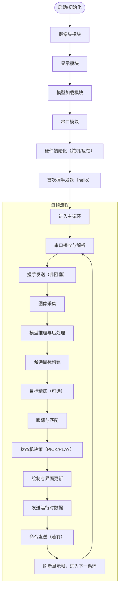
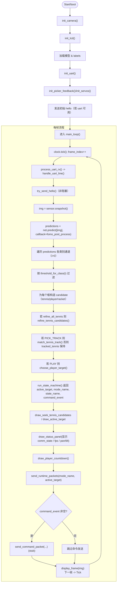

# FOMO — `main.py` 完整执行流程手册（重写）

本文档按从高到低、由整体到细节的顺序，完整、逐步地描述 `ei-tennis-openmv-v6/main.py` 的执行流程、关键数据流与各函数职责，便于阅读、测试与维护。

目标受众：开发者、调试人员、需要理解系统运行时行为的测试人员。

内容结构：

- 一览（高层架构）
- 全局状态与主要数据结构
- 启动/初始化序列（boot）
- 主循环（frame-by-frame）逐步详解
- 主要子模块与函数职责速览
- 模式/子状态机详解（PICK/PLAY 及其子态）
- 错误点与运行时风险
- 测试与验证清单
- Mermaid 流程图（整合版）
- 可选改进建议

---

## 一览（高层架构）

系统由三部分组成：

- 硬件接口层：摄像头（sensor）、LCD（display）、UART（串口通信）、舵机/Timer（Pin/Timer）、picker 反馈（GPIO）。
- 感知与推理层：加载 TFLite 模型（`ml.Model`），执行 `predict()`，并通过 `fomo_post_process()` 转换输出为候选目标（tennis/player/racket）。
- 应用逻辑层：目标筛选/精炼/跟踪、状态机（PICK/PLAY）、UI 绘制（各种 draw_* 函数）、与主机通信（send_runtime_packets、send_command_packet）。

程序的控制中心是 `main_loop()`：每帧执行非阻塞串口处理、可能的握手重发、图像采集与推理、目标决策、绘制与发送。

---

## 全局状态与主要数据结构

- 布尔/配置：`ENABLE_UART`, `ENABLE_SERVOS` 等。
- 串口相关：`uart`（UART 对象或 None）、`uart_rx_buffer`（接收缓冲字符串）、`UART_RX_BUFFER_MAX`。
- 通信握手：`COMM_NO_LINK=0`、`COMM_LINKED=1`、`COMM_OK=2`、`comm_state`、`last_hello_ms`、`HELLO_INTERVAL_MS`。
- 视觉目标与跟踪：
  - `tennis_candidates`（列表）、`player_candidates`、`racket_candidates`。
  - `tracked_tennis`（当前锁定的网球目标 dict 或 None）。
  - `tracked_player`（当前锁定的玩家目标）。
  - `scan_ranked_tennis`（保存的扫描候选列表）、`best_scan_tennis`。
- 状态机变量：`mode`（MODE_PICK / MODE_PLAY）、`pick_substate`、`play_substate`。
- 舵机控制：`pan_angle`, `tilt_angle`, `p1`/`p9` 引脚与 Timer、`servo_init_frames_remaining`。
- 计数与事件：`balls_served`, `balls_picked`, `picker_feedback_state`、`picker_uart_done_pending`。

---

## 启动与初始化（`boot()`）详解

1. 初始化摄像头：`init_camera()` 设置像素格式、分辨率、关闭自动白平衡等，并跳帧以稳定图像。
2. 初始化 LCD：`init_lcd()`，建立 `display.SPIDisplay`。
3. 检查模型和标签：使用 `uos.stat(MODEL_PATH)`，从 `labels.txt` 读取类别名。
4. 加载模型：`net = ml.Model(MODEL_PATH, load_to_fb=...)`。若内存不足或文件缺失，调用 `halt_with_error()` 停止并显示错误。
5. 初始化 UART：`init_uart()`（基于 `ENABLE_UART`），若异常则将 `uart=None` 并继续运行（通信变为不可用）。
6. 初始握手提示：若 `uart` 存在，`boot()` 发送一次 `hello` 并尝试记录 `last_hello_ms`。
7. 初始化 picker/servos：`init_picker_feedback()`、`init_servos()`（若启用）并可能初始化 PWM。
8. 初始化扫描队列：`begin_scan_round()`，设置 PICK 的初始子态与数据结构。
9. 显示启动完成：`show_message("Model OK", "Running...")`。

注意：`boot()` 负责保证关键硬件/模型可用性；其异常处理策略是对关键失败（文件/模型加载）停止运行，对可选硬件（UART/servo）采用降级（设为 None）并继续。

---

## 主循环（`main_loop()`）逐步详解（推荐按此顺序阅读）

每帧（一次循环）主要分为三类阶段：输入处理（串口、传感器）、感知与决策（推理、后处理、状态机）、输出与展示（绘制、发送）。下面按顺序展开：

1) 时间/循环管理

- `clock.tick()` 跟踪帧时间，`frame_index += 1`。

2) 串口接收与解析（非阻塞）

- `process_uart_rx()`：
  - 检查 `uart.any()`，若有数据则 `uart.read(waiting)`。
  - 将字节转换为文本（`uart_bytes_to_text()`），追加到 `uart_rx_buffer` 并裁剪到 `UART_RX_BUFFER_MAX`。
  - 按行分割（以 '\n' 为界），对每行调用 `handle_uart_line(line)`。
- `handle_uart_line(line)`：
  - 去除空白后将文本转换为大写 `upper`。
  - 优先处理握手关键字：若 `upper == 'HI'` 或以 `HI ` 开头，设 `comm_state = COMM_LINKED` 并 return；若 `OK` 则设 `COMM_OK` 并 return。
  - 否则解析事件（如 `SERVED`, `PICKED` 等）并更新计数器。

3) 非阻塞握手发送

- `try_send_hello()`：若 `uart` 可用且 `comm_state == COMM_NO_LINK`，根据 `last_hello_ms` 与 `HELLO_INTERVAL_MS` 决定是否发送 `hello`。
- 仅在未连接状态下发送，不会阻塞、不会等待回包。

4) 图像获取与推理

- `img = sensor.snapshot()` 获取一帧图像。
- `predictions = net.predict([img], callback=fomo_post_process)` 执行推理；`fomo_post_process()` 将模型输出（热图）转换为每个类别的检测框列表。

5) 候选构建与精炼

- 遍历 `predictions`（跳过索引 0），按 `threshold_for_class(i)` 过滤置信度。
- 根据标签名称判断目标类型（tennis/player/racket），为每个检测创建 candidate 字典，包含位置、尺寸、score、row/col、估算的 `dist_cm`（对 tennis 使用 `estimate_distance()`）。
- 如果满足条件并启用了精炼，调用 `refine_tennis_candidates()` 或对特定目标调用 `refine_tennis_target()`。精炼可能使用颜色阈值、Hough 圆检测等，返回更准确的半径/直径与距离估计。

6) 跟踪与匹配

- 在 PICK_TRACK 阶段会调用 `match_tennis_track()`，否则使用 `choose_nearest_tennis()` 决定是否切换目标。
- `match_tennis_track()` 维护 `tracked_tennis`：若为空则创建新的 track，否则基于距离门(`gate`)匹配并更新 tracked 位置、radius、miss 计数等。

7) 状态机决策（`run_state_machine()`）

- 该函数接收当前图像、候选与跟踪目标，返回 `active_target`, `mode_name`, `state_name`, `racket_present`, `racket_target`, `command_event`。
- 其内部按 `mode`（PICK/PLAY）与子态（PICK_SCAN/RETURN/CONFIRM/TRACK）进行：
  - PICK_SCAN：执行全局扫描（`update_global_scan()`）或云台扫描（`update_scan_motion()`），收集候选进入 `scan_ranked_tennis`，达到条件进入 PICK_RETURN 或切换到 PLAY。
  - PICK_RETURN：移动云台到保存位置 `best_scan_tennis`，到位进入 CONFIRM。
  - PICK_CONFIRM：等待目标稳定存在一段时间 (`PICK_CONFIRM_DURATION_MS`)，确认后转入 PICK_TRACK 并记录开始时间。
  - PICK_TRACK：执行目标追踪（`update_servo_tracking()`），等待 picker 完成或超时，完成后触发采集并重置到扫描。
  - PLAY：检测 player 与 racket，管理 player lock、倒计时显示与舵机跟踪。

8) 绘制与 UI

- `draw_seek_tennis_candidates()`：在 SEEK/SCAN 阶段绘制候选圈。
- `draw_active_target()`：绘制锁定目标的圆/矩形、交叉、偏移、距离与标签。
- `draw_status_panel()`：显示顶部状态（现在包括 comm_state 三态）、FPS、mode、capture、pan/tilt、confirm/track 倒计时等。
- `draw_player_countdown()`：PLAY 下显示大数字倒计时。

9) 通信输出

- `send_runtime_packets(mode_name, active_target)`：基于 `active_target` 发送 CSV 风格的运行时数据（mode,row,col,distance）。
- 若 `command_event` 非空，调用 `send_command_packet(cmd,arg,mode_name,state_name)`，目前为简单文本发送；如需应答/确认请扩展。

10) 显示帧并循环

- `display_frame(img)` 将画面写入 LCD，循环回到下一帧。

错误与异常：主循环将捕获异常、在屏幕上显示错误信息，并在短暂停顿后继续或进入死循环（取决于异常点）。

---

## 主要子模块与函数职责速览（按功能分组）

- 硬件/系统：`init_camera`, `init_lcd`, `init_uart`, `init_servos`, `init_picker_feedback`, `P1_ISR`, `P9_ISR`。
- 串口处理：`uart_bytes_to_text`, `process_uart_rx`, `handle_uart_line`, `parse_uart_event_count`, `uart_write_line`, `try_send_hello`。
- 模型后处理：`fomo_post_process`, `make_grayscale_image`。
- 目标估计/精炼：`estimate_tennis_diameter`, `estimate_color_blob`, `estimate_hough_circle`, `refine_tennis_target`, `refine_tennis_candidates`, `estimate_distance`。
- 跟踪/分配：`match_tennis_track`, `choose_nearest_tennis`, `choose_player_target`, `choose_racket_target`, `ensure_target_id`。
- 状态机/动作：`run_state_machine`, `begin_scan_round`, `select_scan_candidate`, `remember_scan_target`, `update_global_scan`, `update_return_to_saved_target`。
- 绘制/UI：`draw_grid`, `draw_active_target`, `draw_status_panel`, `draw_player_countdown`, `draw_seek_tennis_candidates`。
- 辅助：`send_runtime_packets`, `send_command_packet`（stub）、`read_picker_feedback`。

---

## 模式与子态快速参考

- MODE_PICK：用于扫描并拾取 tennis，子态含 `PICK_SCAN`, `PICK_RETURN`, `PICK_CONFIRM`, `PICK_TRACK`。
- MODE_PLAY：用于比赛跟踪，子态 `PLAY_TRACK_PLAYER` 与等待发球等。

状态转换要点：

- 从 `PICK_SCAN` 到 `PICK_RETURN`：当扫描列表有可选目标并选择后。
- `PICK_RETURN` 到 `PICK_CONFIRM`：云台回到保存位置并落锁开始确认计时。
- `PICK_CONFIRM` 到 `PICK_TRACK`：确认计时结束，开始跟踪并准备采集。
- `PICK_TRACK` 完成后回到 `PICK_SCAN`（触发采集并清理状态）。
- 长时间无球会触发 `enter_play_mode()` 切换到 PLAY 模式。

---

## 关键风险点与建议（运行时注意）

1. 模型加载/内存：`ml.Model` 可能因内存不足失败，须在目标板上验证模型大小与内存占用。
2. 串口协议不一致：当前解析假设握手单独成行；若主机合并多信息于同一行，请改 `handle_uart_line` 实现复合解析。
3. 舵机/Timer 兼容性：定时器回调与 Pin 控制在不同固件版本上可能表现不同，若遇到白屏或卡顿，先禁用 `ENABLE_SERVOS` 做隔离测试。
4. 异常捕获范围：网络/串口写入在本实现中捕获并忽略异常，但应记录日志或上报以便定位硬件问题。

---

## 测试与验证清单

基础验证：

- 启动设备，确认屏幕提示无致命错误。
- 未连主机时顶部显示 `no link`。
- 主机发送 `HI` 后顶部显示 `linked`。
- 主机发送 `OK` 后顶部显示 `ok`。

推理/功能测试：

- 在 PICK_SCAN 阶段放置网球目标，观察候选在画面上显示并最终进入 PICK_TRACK。
- 触发 picker 的反馈（或模拟 `PICKED` uart 行），观察 `balls_picked` 增加并触发采集流程。

压力测试：

- 长时间运行，观察内存/帧率是否稳定，确认无内存泄漏或定时器异常。

协议兼容：

- 测试主机发送复合行（如 `HI,SERVED:1`），确认 `handle_uart_line()` 是否需改造。

---

## 全局流程图（Mermaid，可在支持 Mermaid 的渲染器查看）

---

## 可选改进（优先级建议）

1. 强化 `handle_uart_line()` 的复合行解析（高优先）：兼容 `HI,SERVED:1` 之类的复合行。
2. 为 `send_command_packet()` 实现确认/ACK 与重试（中优先）。
3. 为关键错误引入持久化日志（低优先），以便离线分析崩溃与硬件异常。

---

我已把重写后的完整手册保存到：

`D:\副桌面文件夹\论文\fomo\manual.md`

下一步我可以：

- 将 Mermaid 图导出为 PNG/SVG 并保存到仓库；
- 针对某个子函数（例如 `fomo_post_process` 或 `match_tennis_track`）生成更细化的流程图；
- 或把手册导出为 PDF。

请告诉我你的优先项。

---

## 面向甲方的逐步详尽说明（非常细化，含时间与帧数说明）
下面以“白话、步骤化”的方式，从开机到各个动作触发的时序、频率和判定条件逐条说明，便于甲方非技术人员理解系统在每一步在做什么。

注：文中多数“每帧”操作频率依赖设备帧率（camera fps），若帧率为 15 fps，则 1 帧 ≈ 66 ms；若为 10 fps，则 1 帧 ≈ 100 ms。我们同时给出帧数和以 15 fps 为例的近似秒数以便理解。

1) 启动（上电或重启）
  - 系统先启动摄像头与显示，加载模型文件和标签；若模型文件缺失或内存不足，会在屏幕上报错并停止。
  - 若串口可用，设备会立即向主机发送一次 `hello`（称为“首次 hello”）。这一步是立刻进行的，不受帧循环节拍限制。

2) 主循环开始（每帧循环）
  - 系统每帧都会执行一次主循环，主要步骤包括：读取串口、（必要时）重发 hello、拍一帧图像、做模型推理、生成候选目标、状态机决策、绘制界面并发送运行数据。
  - 串口读取：每帧都会检查串口缓冲区并把完整文本行处理一次；因此串口消息被处理的频率等同于设备帧率（例如 15 fps 时大约每 66 ms 检查一次）。

3) 握手（hello / HI / OK）
  - 首次 hello：在启动阶段立即发送一次 `hello`，提示主机设备上线。
  - 重发逻辑：如果主机一直没有回复 `HI`，设备会每 5000 ms（5 秒）再次发送 `hello`，直到收到 `HI` 为止。这个 5 秒间隔恒定不受帧率影响。
  - 收到 `HI`：设备在处理到包含 `HI` 的串口行时立即把通信状态标记为 `linked`，并停止继续发送 `hello`（因已建立链路）。
  - 收到 `OK`：若随后收到 `OK`，设备将通信状态标记为 `ok`，表示主机确认通信成功并可以正常交互。

4) 舵机初始化（若启用）
  - 在初始序列中，舵机会有一个“初始化保持期”为 `SERVO_INIT_HOLD_FRAMES = 28` 帧。
  - 28 帧意味着：若帧率 15 fps，则约 28/15 ≈ 1.9 秒；若 10 fps，则约 2.8 秒。在这段时间内系统会把舵机移动到初始角度并按阶段开启 PWM 输出。

5) 扫描与候选收集（PICK_SCAN）
  - 系统在扫描阶段会左右摆动云台并记录在不同视角下检测到的候选（scan_ranked_tennis）。
  - 如果多次扫描都没有发现候选（由 SCAN_EMPTY_ROUNDS_TO_PLAY = 2 控制），系统会在第 2 个空扫描回合后自动切换到 PLAY 模式（即不再持续扫描，进入玩家跟踪模式）。

6) 目标返回与确认（PICK_RETURN → PICK_CONFIRM）
  - 当从扫描列表选择了一个候选后，系统会把云台移动回该候选的保存位（PICK_RETURN）。
  - 一旦云台到位，系统记录当前时间并进入确认期（PICK_CONFIRM），要求目标在画面中稳定存在一定时间才能确认。确认时长为 `PICK_CONFIRM_DURATION_MS = 2000 ms`（即 2 秒）。
  - 也就是说，目标必须在确认期内持续被检测到并满足位置条件，超过 2 秒后才进入 PICK_TRACK（开始正式跟踪并准备采集）。

7) 跟踪阶段（PICK_TRACK）
  - 一旦进入 PICK_TRACK，系统开始对目标做舵机追踪并计时，最长跟踪时长为 `PICK_TRACK_DURATION_MS = 20000 ms`（即 20 秒）。
  - 如果 picker（取球器）在跟踪期间发出完成信号（或通过 UART 收到 PICKED），系统会提前结束跟踪并执行采集流程；如果 20 秒到达仍无完成信号，则认为超时并回到扫描。

8) PLAY 模式下玩家与球拍出现判断
  - 系统通过检测“玩家”与“球拍”来判定是否进入准备状态。`PLAY_RACKET_CONFIRM_FRAMES = 2` 表示连续检测到球拍至少 2 帧就认为球拍出现（若帧率 15 fps，则约 0.13 秒就能判定）。
  - 当玩家锁定并且球拍出现后，会开始一个玩家倒计时（PLAYER_DETECT_COUNTDOWN_MS，文中默认 5000 ms 即 5 秒）来决定是否进入发球等待或其他子态（此值写在代码中，文档需说明实际数值）。

9) 串口发送运行数据
  - 系统每帧都会根据当前 `active_target` 调用 `send_runtime_packets`，把 `mode,row,col,distance` 等信息以 CSV 形式发送给主机；因此主机能以帧级频率接收到设备的运行状态（帧率取决于设备实际推理速度）。

10) UI 更新频率
  - 屏幕的绘制在每帧末尾执行一次，包括：网格、候选、锁定目标标注、顶部状态栏（包含通信状态）、以及 PLAY 的倒计时数字等。

11) 出错与显示
  - 若主循环中出现未捕获异常，设备会在 LCD 上显示 `RUN FAIL` 与异常文本，并在短暂停顿后继续或停住（视错误类型）。

12) 典型时间线示例（假设帧率约 15 fps，用于帮助非技术人员理解）
  - 0.0 s：设备上电，立即发送一次 `hello`。
  - 0.0–2.0 s（约 28 帧）：舵机完成初始化到位（若启用）。
  - 0.0–持续：每帧（约每 66 ms）检查串口、采集图像、进行推理与渲染。
  - 若主机未回复：每 5.0 s 再次发送 `hello`，直至收到 `HI`。
  - 当选择目标并回位：目标必须维持至少 2.0 s（PICK_CONFIRM）才能确认并进入跟踪阶段。
  - 跟踪最多进行 20.0 s（PICK_TRACK），直到 picker 完成或超时。

13) 关键术语白话解释（给甲方人员）
  - 帧（frame）：设备拍摄并处理的一张图片；帧率越高，处理越频繁，系统更“及时”。
  - 扫描回合（scan round）：系统左右摆动云台一次并记录候选位置的周期。
  - 确认期（confirm）：系统要求目标在一定时间内稳定出现，避免误触发。
  - 跟踪期（track）：系统使用舵机跟随目标并等待采集执行或超时。

14) 给甲方的操作建议
  - 测试握手：上电后若设备屏幕顶部显示 `no link`，说明主机未回应。让主机发送 `HI` 与 `OK` 检查状态变更。
  - 测试采集流程：把目标放入视野，观察界面上从候选→回位确认（需 2s）→进入跟踪并最终触发采集。
  - 如需更快确认：可以讨论把 `PICK_CONFIRM_DURATION_MS` 调小，但这会增加误触发风险。

---

以上为非常细化的逐步说明，我已把它追加到手册文件中。若你需要，我可以把这段内容按 PPT 的形式生成若干页幻灯片，便于直接给甲方展示；或把关键时间点绘制为时间线图（PNG）。

- 计时：`clock.tick()`，`frame_index += 1`。
- 串口读：`process_uart_rx()` 读取 `uart.any()`，将数据解码追加到 `uart_rx_buffer`，按行分发到 `handle_uart_line()`。
  - `handle_uart_line()`：优先检查 `HI` / `OK` 更新 `comm_state`；其余按事件类型更新 `balls_served`、`balls_picked` 等。
- 握手发送：`try_send_hello()` 在 `comm_state==NO_LINK` 时按 `HELLO_INTERVAL_MS` 重发 `hello`。
- 采集帧：`img = sensor.snapshot()`。
- 网格：`draw_grid()`（仅绘制 UI 帮助线）。
- 推理：`predictions = net.predict([img], callback=fomo_post_process)`。
  - `fomo_post_process()` 把模型输出热图转为候选框列表（按类别通道返回列表）。
- 构建候选（遍历预测结果）
  - 忽略 `i==0` 的背景通道。
  - 根据 `threshold_for_class(i)` 过滤置信度。
  - 根据标签字符串判断 `is_tennis` / `is_player` / `is_racket`。
  - 对每个检测框计算中心 `cx,cy`、网格 `row,col`、估算 `radius`/`dist_cm`（仅 tennis 使用距离估计），并加入对应候选数组。
- 目标精炼（可选）
  - 若 `refine_all_tennis` 条件满足（配置与状态），对所有 tennis 候选调用 `refine_tennis_target()`（内部会调用 `estimate_tennis_diameter()` 和 Hough / 色块等策略），以获得更准确的 `radius` 与 `dist_cm`。
- 匹配/跟踪
  - 如果处于 PICK_TRACK 阶段会调用 `match_tennis_track()` 将检测候选与 `tracked_tennis` 匹配并更新 track（或创建新 track）。
  - `choose_player_target()` 在 PLAY 模式下选择合适的 player 并维护 `tracked_player`。
- 状态机
  - `run_state_machine()` 根据 `mode` 与子状态（PICK/PLAY、PICK_SCAN/PICK_RETURN/PICK_CONFIRM/PICK_TRACK 等）进行决策：
    - PICK_SCAN：执行扫描逻辑（`update_global_scan()` 或 `update_scan_motion()`），收集候选并决定是否进入 RETURN/CONFIRM。
    - PICK_RETURN：移动云台返回保存位置，若到位进入 CONFIRM。
    - PICK_CONFIRM：在目标稳定存在一段时间后转至 PICK_TRACK 并开始计时采集与拍照流程。
    - PICK_TRACK：追踪目标直到 picker 完成或超时，之后触发采集并回到扫描。
    - PLAY：跟踪玩家与球拍，管理 player 锁定计时与倒计时显示。
- 绘制
  - `draw_seek_tennis_candidates()`（显示候选圈）、`draw_active_target()`（显示锁定目标信息）、`draw_status_panel()`（显示 fps、mode、capture、pan/tilt、comm_state 等）、`draw_player_countdown()`（PLAY 下的倒计时）。
- 发送运行时数据
  - `send_runtime_packets(mode_name, active_target)`：将 `mode,row,col,distance` 发到主机（CSV 格式）。
- 发送命令（可选）
  - 若 `command_event` 非空，调用 `send_command_packet(...)`（目前为简单格式化实现）。
- 显示帧：`display_frame(img)` 并进入下一帧循环。

3) 关键函数与潜在异常点

   - `ml.Model(...)`：模型文件不存在或内存不足会触发异常，`boot()` 捕获并 halt。
   - `net.predict()`：若模型或输入格式异常会抛出异常，主循环捕获后显示错误并 sleep 若干 ms。
   - `uart.read()` / `uart.write()`：串口异常会被封装的写函数捕获并打印异常，读操作在 `process_uart_rx()` 内部尝试/忽略异常。
   - 舵机/Timer：`init_servos()`、`start_pan_pwm()` 调用可能受硬件限制影响，异常应在硬件上调试。
4) MODE 与子状态快速路线图

   - 初始：`begin_scan_round()` 设置 PICK 扫描队列。
   - PICK_SCAN → 如果收集到有效候选并回到保存位 → PICK_RETURN → 到位 → PICK_CONFIRM → 确认足够时间 → PICK_TRACK → picker 完成或超时 → 返回 PICK_SCAN。
   - 如果长时间空闲并达到阈值，自动切换到 PLAY 模式。

---

## 完整流程图（更细粒度，涵盖推理、候选构建与状态机）

---

已把以上内容追加到本手册。如果你还希望：

- 我把每个子函数（如 `fomo_post_process`, `match_tennis_track`, `refine_tennis_target`）分别拆成小流程图并保存图片，或
- 生成一份 PDF 手册包含流程图并打包，
  请告诉我你的优先项，我会继续处理。
