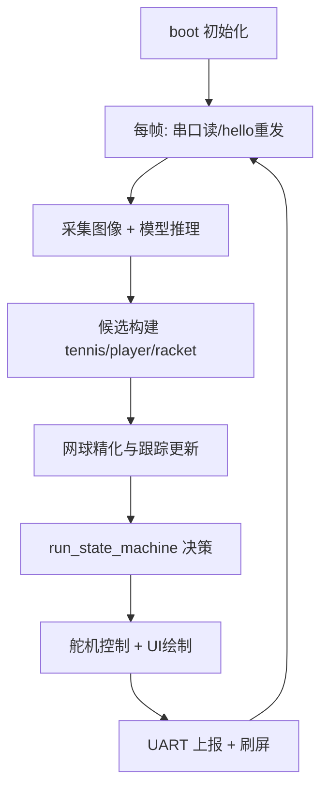

# FOMO `main.py` 代码逻辑说明手册（工程版）

## 目录

- 1. 系统目标与总体结构
- 2. 启动阶段（`boot()`）
- 3. 每帧主循环（`main_loop()`）
- 4. 输入数据如何变成目标（候选到锁定）
  - 4.1 候选构建
  - 4.2 网球精化
  - 4.3 跟踪匹配
- 5. 状态机说明（`run_state_machine()`）
- 6. 通信逻辑（UART）
- 7. 舵机控制与运动策略
- 8. 关键变量读写关系
- 9. 常见问题与定位路径
- 10. 最小联调检查清单
- 11. 总流程图（Mermaid）
- 12. 结论
- 13. 状态转移表
- 14. 关键调用链
- 15. UART 协议样例
- 16. 参数调优优先级

本文档用于把 `ei-tennis-openmv-v6/main.py` 的运行逻辑讲清楚，重点回答三个问题：

1. 每一帧到底做了什么。
2. 状态为什么会切换。
3. 关键变量是怎么被读写并影响行为的。

适用对象：开发、联调、测试、项目汇报。

---

## 1. 系统目标与总体结构

系统在 OpenMV 上运行，目标是：

- 检测并跟踪网球（PICK 模式主目标）。
- 在无球场景切到球员/球拍跟踪（PLAY 模式）。
- 通过 UART 和上位机/执行机构进行握手与运行数据交互。
- 通过舵机控制实现云台扫描、回位、确认、跟踪。

整体分成四层：

- 感知层：`sensor.snapshot()` + `ml.Model.predict()` + `fomo_post_process()`。
- 目标层：候选构建、筛选、精化、track 匹配。
- 决策层：`run_state_machine()`（PICK/PLAY 与子状态）。
- 执行层：舵机控制、UI 绘制、UART 上报。

---

## 2. 启动阶段（`boot()`）做了什么

`boot()` 的顺序很关键，失败策略也不同：

1. `init_camera()`：相机基础配置。
2. `init_lcd()`：显示初始化。
3. 检查模型文件和标签文件。
4. `ml.Model(...)` 加载模型。
5. `init_uart()` 初始化串口（失败可降级为 `uart=None`）。
6. 发送一次 `hello`（若串口可用）。
7. `init_picker_feedback()` 初始化反馈输入。
8. `init_servos()` 初始化舵机（如果启用）。
9. `begin_scan_round()` 设置初始扫描状态。

失败处理原则：

- 模型/关键文件失败：`halt_with_error()`，直接停机等待人工处理。
- 可选硬件失败（如 UART 初始化异常）：记录异常并继续运行。

---

## 3. 每帧主循环（`main_loop()`）逻辑总线

每帧处理顺序固定，建议按这个顺序看代码：

1. 时基更新：`clock.tick()`，`frame_index += 1`。
2. 串口输入：`process_uart_rx()`。
3. 握手维护：`try_send_hello()`。
4. 图像采集：`img = sensor.snapshot()`。
5. 推理后处理：`net.predict(..., callback=fomo_post_process)`。
6. 候选构建：按类别生成 `tennis/player/racket` 候选列表。
7. 目标精化：按条件执行 `refine_tennis_candidates()` 或 `refine_tennis_target()`。
8. 跟踪维护：`match_tennis_track()` / `choose_player_target()`。
9. 状态决策：`run_state_machine(...)`。
10. UI 绘制：候选、锁定目标、状态面板、倒计时。
11. 数据发送：`send_runtime_packets(...)` 与可选 `send_command_packet(...)`。
12. 刷屏：`display_frame(img)`。

这条链路是“感知 -> 决策 -> 执行”的闭环。

---

## 4. 输入数据如何变成目标（候选到锁定）

### 4.1 候选构建

`fomo_post_process()` 输出的是按类别通道分组的检测框列表。
主循环中会做三步过滤：

1. 跳过背景通道（`i == 0`）。
2. 用 `threshold_for_class(i)` 做置信度过滤。
3. 按标签名归类为 tennis/player/racket。

每个候选对象通常包含：

- 空间信息：`x, y, w, h, cx, cy`
- 置信信息：`score`
- 距离相关：`dist_cm`（tennis）
- 网格位置：`row, col`
- 类型：`kind`

### 4.2 网球精化（核心价值）

网球不是直接用检测框半径，而是进一步融合两种测量：

- 颜色斑块法：`estimate_color_blob()`
- Hough 圆法：`estimate_hough_circle()`

融合在 `estimate_tennis_diameter()` 中完成，然后再经：

- `fuse_tennis_radius()` 得到半径
- `update_trimmed_tennis_measure()` 做滑窗截尾均值
- `estimate_corrected_distance_cm()` 做距离校正

这一步的目的：降低抖动、降低高光误判、提高距离稳定性。

### 4.3 跟踪匹配

`match_tennis_track()` 的核心逻辑：

- 无候选：老化 `miss`，超阈值丢失 track。
- 有候选但无 track：创建新 track。
- 有候选且有 track：按门限和代价函数找最优匹配并平滑更新。

关键字段：

- `miss`：连续未匹配计数。
- `id`：目标身份标识。
- `radius/dist_cm`：控制与策略切换的核心量。

### 4.4 模块实现流程（实现细节）

下面按模块给出实现流程、关键函数、数据流与常见边界条件，便于工程实现与联调。

- 感知层（Perception）实现流程：
  - 函数/入口：`capture_frame()` -> `run_inference(img)` -> `fomo_post_process(raw_out)`。
  - 数据结构：`RawDet`（网格索引、bbox、score、class），`Candidate`（x,y,w,h,cx,cy,score,kind,row,col）。
  - 细节：确保 `sensor.snapshot()` 返回的图像尺寸、色域与训练时一致；推理前做归一化或 ROI 裁剪以节省时间。
  - 边界：若 `net.predict` 超时或返回空，返回空候选列表并在上层计数连续空帧。

- 候选构建（Candidate Builder）实现流程：
  - 函数：`build_candidates(detections)`。
  - 步骤：按通道过滤置信度 -> 转为 `Candidate` -> 计算 `cx,cy` 与 `grid row/col` -> 根据类别映射到 `tennis/player/racket`。
  - 优化建议：先按 score 排序并只保留 top-K（例如 K=8）以减少后续计算成本。

- 网球精化（Tennis Refinement）实现流程：
  - 主函数：`refine_tennis_target(candidate)`。
  - 内部调用：`estimate_color_blob(img, bbox)`、`estimate_hough_circle(img, bbox)` -> `fuse_tennis_radius(color_r, hough_r, weight)` -> `update_trimmed_tennis_measure(track, radius)` -> `estimate_corrected_distance_cm(track)`。
  - 流程要点：所有图像处理步骤都应限制在 bbox 扩展窗口（例如 1.2x）内，避免全图操作。
  - 异常处理：当 Hough 无圆，会以颜色法为主，并把置信度降低以便后续 track 判别。

- 跟踪匹配（Tracking）实现流程：
  - 主函数：`match_tennis_track(candidates, tracks)`。
  - 算法：计算代价矩阵（位置距离 + 半径差 + score 惩罚）-> Hungarian 或贪心分配 -> 更新 track（位置、radius、miss、history）-> 创建/删除 track。
  - 平滑：使用指数移动平均或卡尔曼滤波更新 `cx,cy,radius`，并维护 `history` 用于截尾均值。
  - 删除条件：`miss >= TRACK_MAX_MISS` 或 `age > MAX_AGE && low_confidence`。

- 状态机（Decision / State Machine）实现流程：
  - 主函数：`run_state_machine(context)`，输入 `tracked_tennis`、`scan_ranked_tennis`、`comm_state`、`picker_feedback`。
  - 输出：`mode_name, state_name, active_target, command_event`。
  - 实现要点：把每个子状态封装成小函数（例如 `state_pick_scan_step()`、`state_pick_return_step()`），并只在主循环中按固定顺序调用；状态切换由明确的 guard 条件触发，并记录时间戳用于超时判断。

- 舵机控制（Servo）实现流程：
  - 函数：`compute_servo_commands(target_pose, servo_state)` -> `apply_pan_delta()`/`apply_tilt_delta()` -> `write_servo()`。
  - 控制要点：先在控制层做限幅与死区判断，再写入硬件；写入频率受 UART/主循环周期限制（例如 20–30 Hz）。

- 通信（UART）实现流程：
  - 收：`process_uart_rx(line)` 解析握手/事件；必须容错换行符和空行。
  - 发：`send_runtime_packets(frame_info)`，根据 `comm_state` 节点决定是否立即发送或降频发送（例如当 `comm_state != COMM_OK` 时降低发送率）。
  - 要点：串口发包加上简单 checksum（可选）并保留重发策略；下行事件应立刻影响 `picker_feedback_state`。

- UI 与绘制：
  - 函数：`draw_candidates(img, candidates)`、`draw_tracks(img, tracks)`、`draw_status_panel(img, state)`。
  - 要点：绘制仅用于调试，若渲染耗时过高需提供 `debug` 开关。

每个模块均应返回明确的状态码/异常（例如 `OK`、`TIMEOUT`、`NO_DATA`），以便上层统一处理。

---

## 5. 状态机说明（`run_state_machine()`）

状态机输出六元组：

- `active_target`
- `mode_name`
- `state_name`
- `racket_present`
- `racket_target`
- `command_event`

### 5.1 顶层模式

- `MODE_PICK`：找球、确认、跟踪、触发拾取。
- `MODE_PLAY`：跟踪 player/racket。

### 5.2 PICK 子状态

1. `PICK_SCAN`
- 行为：扫描环境，累积 `scan_ranked_tennis`。
- 转移：有候选 -> `PICK_RETURN`；连续空扫描超阈值 -> 切 `PLAY`。

2. `PICK_RETURN`
- 行为：云台回到最佳候选的保存姿态。
- 转移：回位到阈值范围 -> `PICK_CONFIRM`。

3. `PICK_CONFIRM`
- 行为：在当前视角验证目标稳定存在。
- 转移：确认时间达到 `PICK_CONFIRM_DURATION_MS` -> `PICK_TRACK`。

4. `PICK_TRACK`
- 行为：持续跟踪，等待 picker 完成信号或超时。
- 转移：收到反馈或超时 -> 触发采集闪烁并回到扫描。

### 5.3 PLAY 子状态（当前主实现）

- 以 player 为主目标进行跟踪。
- 通过连续帧确认 racket 是否存在。
- 用于展示与联动，不承担 PICK 采集流程。

### 5.4 状态机伪代码与实现建议

下面给出一个简化伪代码示例，便于工程实现时直接映射到函数：

```python
def run_state_machine(ctx):
  if ctx.mode == MODE_PICK:
    if ctx.state == PICK_SCAN:
      state_pick_scan_step(ctx)
    elif ctx.state == PICK_RETURN:
      state_pick_return_step(ctx)
    elif ctx.state == PICK_CONFIRM:
      state_pick_confirm_step(ctx)
    elif ctx.state == PICK_TRACK:
      state_pick_track_step(ctx)
  elif ctx.mode == MODE_PLAY:
    state_play_step(ctx)

def state_pick_scan_step(ctx):
  update_scan_candidates(ctx)
  if has_valid_scan_candidate(ctx):
    ctx.state = PICK_RETURN
    ctx.pick_confirm_start_ms = now()
  elif ctx.scan_empty_rounds >= SCAN_EMPTY_ROUNDS_TO_PLAY:
    ctx.mode = MODE_PLAY

def state_pick_confirm_step(ctx):
  if is_candidate_stable(ctx):
    if now() - ctx.pick_confirm_start_ms >= PICK_CONFIRM_DURATION_MS:
      ctx.state = PICK_TRACK
      ctx.pick_track_start_ms = now()
  else:
    try_next_scan_candidate(ctx)
```

实现建议：
- 把 `ctx`（上下文）设计为一个小 struct，包含所有会被读写的关键变量，便于单元测试和快照回放。
- 把每个子状态的逻辑限制为 < 30 行代码，复杂逻辑拆成小函数（例如稳定性判断、候选选择、回位检查）。
- 所有基于时间的判断统一使用 `now_ms()`，并在单元测试时可注入模拟时间。

---

## 6. 通信逻辑（UART）

### 6.1 握手链路

状态值：

- `COMM_NO_LINK`
- `COMM_LINKED`
- `COMM_OK`

规则：

- 启动先发一次 `hello`。
- `NO_LINK` 状态下每 `HELLO_INTERVAL_MS` 重发。
- 收到 `HI` -> `LINKED`；收到 `OK` -> `OK`。

### 6.2 上行数据

`send_runtime_packets()` 发送运行帧数据，格式近似：

- `mode,row,col,distance`

如当前目标不是有效 tennis，会发送默认值（例如 `-1/0.0`）。

### 6.3 下行事件

`handle_uart_line()` 解析：

- 握手：`HI`、`OK`
- 事件：`SERVED`、`PICKED`、`PICKUP`、`COLLECT` 等

计数由 `parse_uart_event_count()` 从行内提取（提取失败按 1 处理）。

---

## 7. 舵机控制与运动策略

- 初始化阶段：`update_servo_init()` 让 pan/tilt 平滑回初值。
- 跟踪阶段：`update_servo_tracking()` 用 PID 输出驱动角度变化。
- 扫描阶段：`update_global_scan()` 或 `update_scan_motion()` 控制扫描轨迹。
- 角度写入统一经 `apply_pan_delta()`、`apply_tilt_delta()`，内部有步长和边界限制。

可认为舵机逻辑有三条保护：

1. 死区（误差太小不动）。
2. 单步限幅（防抖、防突变）。
3. 角度边界（防机械撞限）。

---

## 8. 关键变量读写关系（建议重点关注）

- `tracked_tennis`
  - 写：`match_tennis_track()`、状态切换流程
  - 读：`run_state_machine()`、绘制与上报

- `scan_ranked_tennis` / `best_scan_tennis`
  - 写：`remember_scan_target()`、`select_scan_candidate()`
  - 读：`PICK_RETURN` / `PICK_CONFIRM`

- `pick_confirm_start_ms` / `pick_track_start_ms`
  - 写：状态进入时设置，离开时清零
  - 读：确认/超时判断

- `comm_state`
  - 写：`handle_uart_line()`、启动/重试逻辑
  - 读：`try_send_hello()`、状态面板显示

- `capture_cmd` / `capture_flash_frames`
  - 写：状态机触发采集阶段
  - 读：状态面板与对外联动

---

## 9. 常见问题与定位路径

1. 画面有框但始终不进入 TRACK
- 先看：`PICK_CONFIRM_DURATION_MS` 是否过长。
- 再看：`choose_confirmed_scan_target()` 是否持续匹配失败。

2. 目标抖动明显
- 看：`TRACK_SMOOTH_*`、`SERVO_DEADBAND`、`TRACK_*_MAX_STEP`。
- 看：是否开启精化与滑窗截尾均值。

3. 距离忽大忽小
- 看：`estimate_tennis_diameter()` 中颜色/Hough 融合。
- 看：`update_trimmed_tennis_measure()` 与 `correct_tennis_distance()`。

4. 一直显示 no link
- 看：上位机是否按行发送 `HI`/`OK`。
- 看：波特率、端口和换行符是否一致。

---

## 10. 最小联调检查清单

1. 启动后能看到实时画面和 FPS。
2. 未接主机时显示 `no link`。
3. 主机发 `HI` 后变 `linked`，发 `OK` 后变 `ok`。
4. 放球后在 PICK 中出现候选并完成 `SCAN -> RETURN -> CONFIRM -> TRACK`。
5. 模拟 picker 完成（GPIO 或 UART）后能回到扫描。

---

## 11. 总流程图（Mermaid）



---

## 12. 结论（对“代码逻辑是否讲清楚”的判断标准）

若读者能回答下面三问，说明已掌握核心逻辑：

1. 为什么某一帧会从 `PICK_CONFIRM` 进入 `PICK_TRACK`。
2. 哪些变量决定“目标是否还被认为是同一个”。
3. 串口 `HI/OK` 与运行状态显示之间的对应关系。

本手册已经按“数据流 + 状态流 + 控制流”三条线给出对应答案，可直接用于开发联调和对外讲解。

---

## 13. 状态转移表（可直接用于评审）

### 13.1 PICK 模式状态转移

| 当前状态 | 进入条件 | 退出条件 | 下一状态 | 关键变量 |
| --- | --- | --- | --- | --- |
| `PICK_SCAN` | 启动后默认进入，或 TRACK 完成回退 | 扫描完成且有候选 | `PICK_RETURN` | `scan_ranked_tennis`, `best_scan_tennis` |
| `PICK_SCAN` | 同上 | 连续空扫描达到阈值 | `MODE_PLAY` | `scan_empty_rounds`, `SCAN_EMPTY_ROUNDS_TO_PLAY` |
| `PICK_RETURN` | 选择了候选目标 | 云台回位到目标姿态 | `PICK_CONFIRM` | `pan_angle`, `tilt_angle`, `best_scan_tennis` |
| `PICK_CONFIRM` | 已回位并开始确认计时 | 持续确认达到时长 | `PICK_TRACK` | `pick_confirm_start_ms`, `PICK_CONFIRM_DURATION_MS` |
| `PICK_CONFIRM` | 同上 | 当前候选确认失败且有下一个候选 | `PICK_RETURN` | `scan_candidate_index` |
| `PICK_TRACK` | 确认通过后进入 | picker 完成或跟踪超时 | `PICK_SCAN` | `pick_track_start_ms`, `PICK_TRACK_DURATION_MS`, `picker_feedback_state` |

### 13.2 PLAY 模式主流程

| 当前状态 | 行为重点 | 关键判据 |
| --- | --- | --- |
| `PLAY_TRACK_PLAYER` | 跟踪 player 目标，辅助判断 racket | `is_live_target(player_target)` 与 `racket_present` |

---

## 14. 关键调用链（从入口到行为）

### 14.1 启动链路

`boot()` -> `init_camera()` -> `init_lcd()` -> 模型/标签检查 -> `ml.Model(...)` -> `init_uart()` -> `init_picker_feedback()` -> `init_servos()` -> `begin_scan_round()`

### 14.2 每帧计算链路

`main_loop()`
-> `process_uart_rx()` / `try_send_hello()`
-> `sensor.snapshot()`
-> `net.predict(..., callback=fomo_post_process)`
-> 候选构建
-> `refine_tennis_candidates()` 或 `refine_tennis_target()`
-> `match_tennis_track()` / `choose_player_target()`
-> `run_state_machine()`
-> `draw_*` + `send_runtime_packets()` + `display_frame()`

### 14.3 网球测量链路

`refine_tennis_target()`
-> `estimate_tennis_diameter()`
-> `estimate_color_blob()` + `estimate_hough_circle()`
-> `fuse_tennis_radius()`
-> `update_trimmed_tennis_measure()`
-> `estimate_corrected_distance_cm()`

---

## 15. UART 协议样例（联调直接可用）

### 15.1 下位机接收（上位机发送给设备）

- 握手：
  - `HI`
  - `OK`
- 事件：
  - `SERVED:1`
  - `PICKED:1`
  - `PICKUP 2`

### 15.2 下位机发送（设备发给上位机）

- 运行包样例：
  - `SEEK,3,7,142.5`
  - `PLAY,-1,-1,0.0`

解释：

- 第 1 列是模式名（如 `SEEK`/`PLAY`）。
- 第 2、3 列是网格位置（无有效 tennis 则为 `-1,-1`）。
- 第 4 列是距离（cm）。

---

## 16. 参数调优优先级（建议按顺序调）

### 第 1 组：先保稳定

1. `PICK_CONFIRM_DURATION_MS`
2. `SERVO_DEADBAND`
3. `TRACK_PAN_MAX_STEP`, `TRACK_TILT_MAX_STEP`

目标：先让系统“不乱动、不误触发”。

### 第 2 组：再提灵敏度

1. `THRESH_TENNIS`, `THRESH_PLAYER`, `THRESH_RACKET`
2. `TRACK_GATE_MIN`, `TRACK_MAX_MISS`
3. `PLAY_RACKET_CONFIRM_FRAMES`

目标：在不牺牲稳定性的前提下提高响应速度。

### 第 3 组：最后修距离与形态

1. `DISTANCE_SCALE`
2. `COLOR_TOL_*`
3. `HOUGH_INTERVAL`, `EDGE_*`, `GLARE_*`

目标：改善距离估计和高光场景表现。

---

## 17. 故障定位决策树（实战版）

1. 现象：屏幕始终 `no link`
- 检查上位机是否按行发送 `HI` 和 `OK`
- 检查串口参数：端口、波特率、换行

2. 现象：能检出但不进入 TRACK
- 检查 `PICK_CONFIRM_DURATION_MS`
- 检查 `choose_confirmed_scan_target()` 是否持续失败
- 检查候选是否频繁跳变（看 `scan_ranked_tennis` 变化）

3. 现象：舵机跟踪抖动
- 增大 `SERVO_DEADBAND`
- 降低 `TRACK_*_MAX_STEP`
- 检查 PID 参数是否过大

4. 现象：距离估计明显漂移
- 检查 `DISTANCE_SCALE`
- 检查 `refined_diameter` 历史是否稳定
- 检查强光条件下 `GLARE_*` 阈值是否合理

5. 现象：状态频繁在 PICK/PLAY 之间来回
- 检查 `SCAN_EMPTY_ROUNDS_TO_PLAY`
- 检查现场是否长期“看不到有效 tennis”

---

## 18. 文档使用建议

- 对研发联调：优先看第 3、4、5、8、13、17 节。
- 对答辩汇报：优先看第 1、3、5、10、11、12 节。
- 对现场调参：优先看第 9、16、17 节。

## 19. 模块接口与数据结构（工程接口清单）

- 核心数据结构（示例，Python 风格）：

```python
class Candidate:
  x: int; y: int; w: int; h: int
  cx: float; cy: float; score: float
  kind: str  # 'tennis'/'player'/'racket'
  row: int; col: int

class Track:
  id: int; kind: str
  cx: float; cy: float; radius: float
  dist_cm: float; score: float
  miss: int; age: int
  history: list  # recent measures for smoothing

class ServoState:
  pan_angle: float; tilt_angle: float
  pan_target: float; tilt_target: float

class CommState:
  state: str  # COMM_NO_LINK / COMM_LINKED / COMM_OK
  last_hi_ms: int; last_ok_ms: int

class Context:
  frame_index: int
  candidates: list[Candidate]
  tracks: list[Track]
  servo: ServoState
  comm: CommState
  mode: str; state: str
```

- 主要函数签名（建议）：
  - `capture_frame() -> img`
  - `run_inference(img) -> raw_detections`
  - `build_candidates(raw_detections) -> list[Candidate]`
  - `refine_tennis_target(img, candidate, track) -> updated_track`
  - `match_tennis_track(candidates, tracks) -> tracks`
  - `run_state_machine(ctx) -> (mode,state,event)`
  - `compute_servo_commands(ctx) -> (pan_cmd, tilt_cmd)`
  - `process_uart_rx(line) -> event`

- 常见调用链示例（每帧）：
  - `img = capture_frame()`
  - `raw = run_inference(img)`
  - `cands = build_candidates(raw)`
  - `tracks = match_tennis_track(cands, ctx.tracks)`
  - `for t in tracks: if t.kind=='tennis': refine_tennis_target(img, best_candidate_for(t), t)`
  - `mode,state,event = run_state_machine(ctx)`
  - `pan,tilt = compute_servo_commands(ctx)`
  - `write_servo(pan, tilt)`
  - `send_runtime_packets(ctx)`

## 20. 调试与单元测试建议

- 为关键模块（candidate builder、refiner、tracker、state machine）编写单元测试，使用静态图片与人工标注作为回归集。
- 对状态机做状态覆盖测试：模拟各种输入序列（无球、短时球、遮挡、picker 信号）检查状态转移与超时逻辑。
- 在开发阶段打开详细日志（`LOG_LEVEL=DEBUG`），并记录 `ctx` 快照以便离线分析。

---

已完成以上扩展；如需我把某个模块的完整参考实现（可运行的 Python 模块）写出来，我可以继续实现并附带单元测试。
