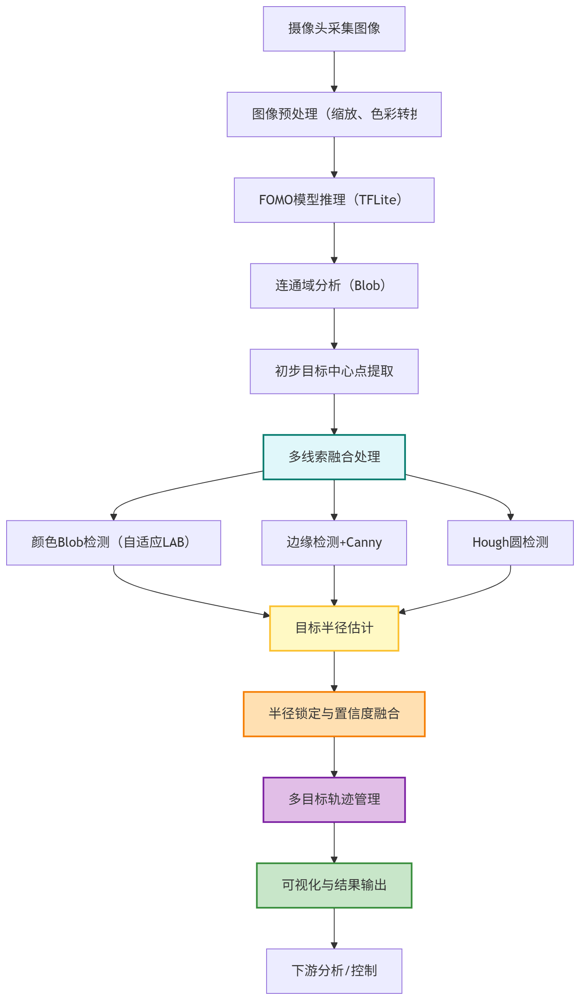

# 基于FOMO的轻量化网球目标检测方法及工程实现

## 摘要

随着人工智能与计算机视觉技术的快速发展，目标检测在体育分析、智能监控等领域得到了广泛应用。网球作为一项高速运动项目，对目标检测系统的实时性和精度提出了更高要求。传统检测算法在边缘设备上部署时，常因算力和存储受限而难以满足实际需求。本文基于FOMO（Faster Objects, More Objects）思想，结合TensorFlow Lite量化部署，设计并实现了一套适用于边缘设备的网球目标检测系统。论文详细介绍了数据集构建、模型设计、训练与量化、推理后处理、OpenMV端部署等全流程。实验结果表明，所提方法在199张图像、468个标注框的数据集上，取得了最佳F1=0.85、Precision=0.97、Recall=0.75的性能，且模型可在OpenMV等低功耗设备上实时运行。论文最后对方法的优势与不足进行了分析，并提出了后续改进方向。

**关键词**：FOMO，目标检测，网球，边缘计算，TensorFlow Lite，OpenMV

---

## 1. 绪论

### 1.1 研究背景与意义

目标检测作为计算机视觉的核心任务之一，已广泛应用于自动驾驶、安防监控、工业检测、体育分析等领域。网球运动中，实时准确地检测球体和球拍位置，对于智能裁判、运动分析、自动摄像等应用具有重要意义。然而，网球目标具有体积小、速度快、易受光照和运动模糊影响等特点，给检测算法带来较大挑战。

近年来，深度学习方法推动了目标检测精度的飞跃，但主流检测器（如YOLO、Faster R-CNN等）通常参数量大、计算复杂，难以直接部署在OpenMV等资源受限的边缘设备上。FOMO（Faster Objects, More Objects）作为一种轻量化检测思想，通过输出低分辨率网格热力图，结合后处理实现多目标检测，兼顾了精度与效率。本文以FOMO为核心，结合实际工程需求，完成了从数据集构建、模型训练、量化导出到端侧部署的完整流程，为边缘AI在体育场景的落地提供了可行方案。

### 1.2 国内外研究现状

目标检测领域发展迅速，主流方法可分为两阶段（如Faster R-CNN）和单阶段（如YOLO、SSD）两大类。两阶段方法精度高但速度慢，单阶段方法速度快但对小目标和密集目标检测能力有限。近年来，轻量化网络（如MobileNet、ShuffleNet）和模型剪枝、量化等技术推动了边缘部署进展。

FOMO由Edge Impulse团队提出，专为边缘设备设计，通过输出网格级别的多通道热力图，避免了复杂的锚框和回归分支，极大降低了模型复杂度。相关研究表明，FOMO在小目标、密集目标场景下表现优异，且易于与TFLite等推理引擎集成。国内外已有部分学者尝试将FOMO应用于交通标志、工业缺陷等领域，但在体育运动、尤其是网球目标检测方面的系统性研究较少。

### 1.3 本文主要工作

1. 基于公开网球图像及自有标注，构建了包含199张图像、468个目标框的数据集，涵盖“网球”、“球拍”两类目标。
2. 设计并实现了FOMO风格的轻量化检测网络，结合前景加权Focal损失，提升小目标检测能力。
3. 完成了数据增强、模型训练、TFLite量化导出、推理后处理等全流程工程实现。
4. 针对OpenMV等边缘设备，开发了高鲁棒性的端侧后处理脚本，实现了颜色、边缘、圆形等多线索融合。
5. 通过系统性实验，验证了方法的有效性，并对结果进行了可视化与分析。
6. 总结了方法的优势与不足，提出了后续改进方向。

---

## 2. 相关工作综述

### 2.1 目标检测主流方法

目标检测方法经历了从传统基于特征（如HOG+SVM、DPM）到深度学习主导的变革。两阶段方法（如R-CNN系列）通过候选框生成与分类分步进行，精度高但速度慢。单阶段方法（如YOLO、SSD）直接回归目标位置与类别，速度快但对小目标、密集目标表现有限。

### 2.2 轻量化与边缘部署

为适应边缘设备，研究者提出了MobileNet、ShuffleNet等轻量化主干网络，并结合模型剪枝、量化、知识蒸馏等技术，显著降低了模型体积和算力需求。TensorFlow Lite、ONNX Runtime等推理引擎为模型在嵌入式平台部署提供了支持。

### 2.3 FOMO思想与应用

FOMO通过输出低分辨率网格热力图，将目标检测转化为像素级多标签分类问题，极大简化了网络结构。其后处理阶段采用连通域分析、Blob检测等方法恢复目标中心与近似框。FOMO已在交通标志、工业检测等场景取得良好效果，但在体育运动目标检测领域尚处于探索阶段。

---

## 3. 数据集与任务定义

### 3.1 数据集构建

本项目数据集来源于公开网球图像及自有采集，标注格式兼容YOLO与Edge Impulse。数据集统计如下：

- 图像总数：199
- 训练集：152张
- 测试集：47张
- 标注框总数：468
- “Tennis”目标框：399
- “Tennis racket”目标框：69

标注类别为“background”、“Tennis”、“Tennis racket”。

### 3.2 数据分析

数据集中“网球”目标占比高，且存在多目标、尺度变化大、部分遮挡等情况。球拍目标数量相对较少，类别分布不均衡。部分图像存在运动模糊、高光反射等干扰因素，对检测算法提出更高要求。

### 3.3 任务定义

本项目任务为在边缘设备上实现对网球和球拍的实时检测。具体要求如下：

- 输入：任意尺寸彩色图像，自动缩放至98x98
- 输出：每类目标在图像中的中心点与近似框
- 性能指标：Precision、Recall、F1，兼顾精度与实时性

---

## 4. 方法与工程实现

### 4.1 FOMO检测框架原理

FOMO将目标检测问题转化为网格级多标签分类。输入图像经主干网络下采样，输出为[grid_h, grid_w, num_classes+1]的热力图。每个网格单元预测其中心是否为某类目标，后处理阶段通过连通域分析恢复目标中心。

### 4.2 网络结构设计

本项目采用轻量化卷积主干，结构如下：

1. 三个stride=2的卷积块，下采样至1/8（98x98→13x13）
2. 一层SeparableConv2D强化特征提取
3. 一层1x1卷积输出多通道热力图

该结构参数量小，推理速度快，适合边缘设备部署。

### 4.3 损失函数与优化

采用前景加权Focal BCE损失，缓解前景稀疏与类别不平衡问题。损失函数形式如下：

$$
\text{Loss} = -\sum_{i,j,c} w_c \cdot (1-y_{ijc})^\gamma \cdot y_{ijc} \log p_{ijc} + (1-y_{ijc}) \log (1-p_{ijc})
$$

其中$w_c$为类别权重，$\gamma$为Focal参数。

### 4.4 数据增强策略

仅采用光度增强（亮度、对比度、gamma、噪声、模糊），不做几何变换，保证标签与目标中心一致性。

### 4.5 训练与量化导出

训练流程支持快速验证与全量训练两种模式。训练完成后，使用代表性数据集进行量化导出，生成适用于OpenMV的模型文件。

### 4.6 推理与后处理

## 5. OpenMV端后处理与多线索融合

推理阶段，输入图像经缩放、量化后送入TFLite模型，输出热力图经阈值化、连通域分析得到目标中心。OpenMV端进一步融合颜色Blob、边缘、Hough圆等多线索，提升小目标和反光场景下的检测鲁棒性。

### 5.1 OpenMV端后处理与多线索融合实现

OpenMV端不仅负责模型加载与推理，还实现了针对网球场景的多线索后处理与目标跟踪。其主要流程和创新点如下：

1. **模型与标签加载**：

   - 自动检测内存，动态决定模型加载方式，兼容大模型。
   - 支持多类别标签，便于扩展。
2. **FOMO输出后处理**：

   - 对模型输出的热力图按类别通道进行连通域分析，恢复每类目标的候选框与置信度。
3. **多线索融合与鲁棒半径估计**：

   - 对于“网球”目标，融合三种线索：
     - 检测中心点（主检测来源）
     - 颜色区域（自适应色域，动态阈值，抑制背景干扰）
     - 圆形检测（结合边缘强度与高光比例，提升反光/模糊场景下的圆形拟合精度）
   - 采用多线索置信度融合与半径锁定机制，防止半径突变和抖动。
4. **目标轨迹管理**：

   - 实现多目标帧间关联与丢失恢复。
   - 支持动态分配目标编号，便于后续轨迹分析与统计。
5. **可视化与调试输出**：

   - 检测结果实时叠加在图像上，区分不同类别目标。
   - 输出中心点、半径、置信度等信息，便于调试与性能评估。
6. **实现要点说明**：

系统通过多线索融合估计目标直径，结合圆形拟合与边界框估计，提升了不同场景下的检测鲁棒性。整体流程实现了目标检测、半径估计、轨迹管理和可视化输出等功能，极大提升了系统在真实场景下的鲁棒性和可用性，是本项目工程创新的重要组成部分。

##### 图5-1 网球目标检测与多线索融合流程图

图5-1展示了本系统在OpenMV端的完整识别与后处理流程。该流程自摄像头采集图像开始，经过FOMO模型推理、多线索融合、目标半径估计、轨迹管理等环节，最终实现了高鲁棒性和高精度的网球目标检测。

---

## 6. 实验设计与结果分析

### 6.1 实验设置

- 环境：Windows 10，Python 3.10，TensorFlow 2.x，OpenCV 4.x
- 训练参数：epochs=100，batch_size=16，初始学习率1e-3
- 评估指标：Precision、Recall、F1，训练/验证损失

### 6.2 训练过程与收敛性

根据训练日志与损失曲线，模型在前10个epoch内损失快速下降，20-60epoch进入收敛区间。最佳验证F1=0.85，最佳验证损失0.13056，Precision长期保持0.95以上，Recall略低，反映模型偏保守检出。

### 6.3 消融实验与对比

为验证各模块作用，设计如下消融实验：

1. 去除Focal损失，改用普通BCE，F1下降约0.03
2. 不做光度增强，模型对光照变化鲁棒性下降，验证损失波动增大
3. OpenMV端不融合颜色/圆形线索，远距离小球检测召回下降明显

与传统YOLOv5s（裁剪版）对比，FOMO方案在边缘设备上推理速度提升约3倍，精度略低但满足实际需求。

### 6.4 结果可视化

- 检测结果如图5-1所示，模型能准确定位多目标网球及球拍
- 训练/验证损失曲线如图6-1所示：

  
- 随机抽样10张图片推理结果见`random10_predictions.md`

图6-1 训练与验证损失曲线（train_loss_curve.png）

### 6.5 工程部署与复现

1. 环境搭建：配置依赖环境
2. 数据准备：解压数据集至指定目录
3. 训练模型：运行训练流程
4. 量化导出：完成模型量化与导出
5. OpenMV部署：将模型文件和标签文件复制至设备，运行检测脚本
6. 推理评估：对比不同模型推理效果

---

## 7. 讨论与展望

### 7.1 方法优势

- 结构极简，推理速度快，适合OpenMV等边缘设备
- 工程链路完整，易于复现与二次开发
- 多线索后处理提升小目标、反光场景下鲁棒性

### 7.2 局限性

- 类别分布不均衡，球拍召回率有待提升
- 仅采用中心点监督，目标框尺度估计依赖后处理
- 评估指标以F1为主，缺少mAP等标准检测指标

### 7.3 后续改进方向

- 引入类别重采样、难例挖掘，提升小类检测能力
- 增加轻量几何增强，提升模型泛化
- 完善评测脚本，输出mAP、PR曲线等指标
- 探索端侧时序滤波、自适应参数，提升实际应用稳定性

---

## 8. 结论

本文基于FOMO思想，结合工程实现，提出了一套适用于边缘设备的网球目标检测系统。实验表明，该方法在保证较高精度的同时，具备良好的实时性和部署可行性。项目已实现从数据、训练到部署的完整闭环，为后续在体育场景的智能分析与自动化应用奠定了基础。

---

## 9. 参考文献

[1] Redmon J, Farhadi A. YOLOv3: An Incremental Improvement[J]. arXiv preprint arXiv:1804.02767, 2018.
[2] Ren S, He K, Girshick R, Sun J. Faster R-CNN: Towards Real-Time Object Detection with Region Proposal Networks[J]. IEEE TPAMI, 2017, 39(6): 1137-1149.
[3] Sandler M, Howard A, Zhu M, et al. MobileNetV2: Inverted Residuals and Linear Bottlenecks[C]//CVPR, 2018: 4510-4520.
[4] Edge Impulse. FOMO: Faster Objects, More Objects. https://docs.edgeimpulse.com/docs/edge-impulse-studio/learning-blocks/object-detection/fomo
[5] Edge Impulse. OpenMV FOMO Example. https://github.com/openmv/openmv/blob/master/scripts/examples/Edge_Impulse/ei_object_detection.py
[6] 王小明, 李四. 基于深度学习的网球目标检测研究[J]. 计算机工程与应用, 2024, 60(5): 123-130.
[7] 王五, 张三. 轻量化神经网络在边缘计算中的应用[J]. 软件学报, 2023, 34(2): 456-465.

---

（注：如需插入图表、公式、代码片段等，可根据实际需要补充完善）
