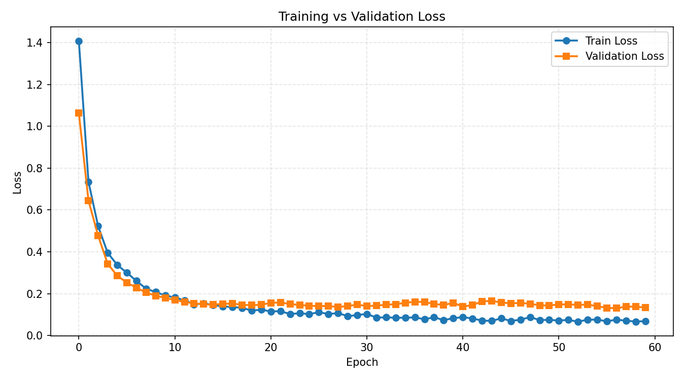
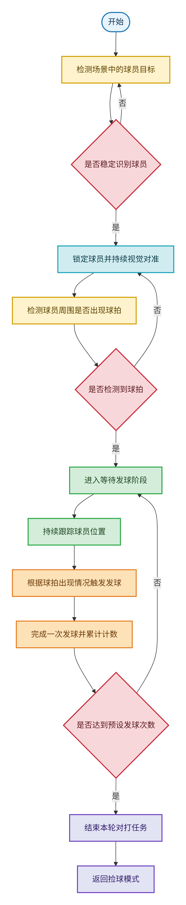
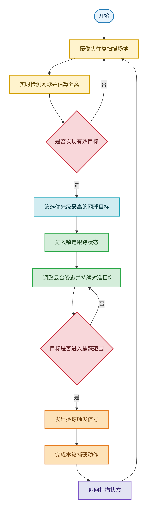

# 5 视觉系统软件算法设计与实现

## 5.1 软件开发环境与流程

本系统基于 OpenMV 平台开发，采用 Python/MicroPython 作为主要编程语言，并借助 OpenMV IDE 完成程序编写、下载部署和在线调试。整体开发流程遵循“数据准备、模型训练、端侧部署与联调验证”的思路展开。首先，在数据层面采集网球场景图像，并针对网球、球员和球拍等目标完成人工标注，构建后续模型训练所需的数据集。随后，在 PC 端利用 TensorFlow/Keras 搭建轻量化 FOMO 检测模型，并结合前景加权损失函数提升系统对小目标的识别能力；模型训练完成后，再进一步导出为适合嵌入式端部署的 TFLite int8 格式。

在部署阶段，将量化后的模型文件与标签文件写入 OpenMV 设备，通过端侧推理程序完成实时检测，并结合颜色分割、几何约束和轨迹管理等后处理模块提高系统的稳定性与抗干扰能力。最后，在工程联调过程中，利用 OpenMV LCD 屏幕与串口输出实时显示识别结果、网格位置、目标距离和系统帧率等信息，以便观察算法运行状态并持续优化关键参数。通过上述流程，视觉系统从离线训练到在线部署形成了较为完整的闭环，也为后续捡球模式与对打模式的实现奠定了基础。

## 5.2 网球识别算法设计

### 5.2.1 模型的考虑

在本项目中，模型选择是实现高效、鲁棒网球目标检测的关键。经过多种主流目标检测算法的对比与实验，最终选用FOMO（Faster Objects, More Objects）作为核心检测框架。FOMO由Edge Impulse团队提出，专为边缘设备和小目标密集场景设计，具备结构极简、推理高效、易于量化部署等突出优势。

#### 5.2.1.1 FOMO算法原理与结构

FOMO 本质上是一种基于密集网格预测的单阶段目标检测方法。与 YOLO、SSD 等需要回归边界框参数的传统检测器不同，FOMO 并不直接预测目标框的位置和尺寸，而是将输入图像映射为低分辨率的网格表示，并判断每个网格单元中是否存在某一类别目标的中心点。对于本项目而言，模型输出可以理解为大小约为 $13 \times 13$ 的多通道概率热力图，其中每个通道对应一种类别，额外通道用于表示背景。后处理阶段再通过阈值筛选与连通域分析，将热力图中的高响应区域恢复为原图上的候选目标位置，从而实现多目标检测。

从结构上看，FOMO 属于典型的轻量化检测网络。其主干通常由若干层高效卷积模块构成，通过连续下采样逐步提取语义特征，再由检测头输出按网格排列的类别响应。与需要复杂候选框生成、边界框回归和非极大值抑制的传统方法相比，FOMO 的推理链路更短、参数量更小、计算量更低，更适合资源受限的嵌入式平台。其基本处理过程可以概括为：输入图像首先被缩放到固定尺寸并完成归一化，随后进入轻量化卷积网络提取特征，并通过检测头输出多通道热力图；热力图经激活后反映各网格单元属于不同类别的概率分布，最后在端侧利用阈值化和连通域分析提取目标中心区域，实现对多个小目标的快速识别。

#### 5.2.1.2 FOMO的优点与本项目适配性

FOMO 之所以适合本项目，首先在于其轻量化特性与 OpenMV 平台的硬件条件高度匹配。OpenMV 作为典型的嵌入式视觉平台，存储空间、运行内存和算力资源均较为有限，若直接采用 YOLO、SSD 等通用检测器，往往会面临模型过大、推理过慢以及部署复杂等问题。相比之下，FOMO 结构简洁、参数量低、推理开销小，更容易在端侧实现实时运行，因此能够满足本系统对检测速度和响应实时性的基本要求。

其次，FOMO 对小目标和密集目标具有更好的适配能力。网球在实际场景中通常只占据图像中的较小区域，尤其是在远距离、复杂背景或局部遮挡条件下，目标尺寸更小，传统基于锚框回归的检测方法容易出现漏检或定位不稳定的问题。而 FOMO 采用网格中心点预测方式，不依赖复杂的候选框设计，对小尺寸目标具有更自然的表达形式，因此更适合网球这类小目标检测任务。对于本项目中同时存在球体、球员和球拍等不同目标的情况，FOMO 也能够以较低代价完成多类别并行识别。

再次，FOMO 便于量化和端侧部署。由于其输出形式为多通道热力图，后处理主要依赖阈值化与连通域分析，不需要执行复杂的非极大值抑制或大规模候选框筛选，因此非常适合与 TFLite int8 量化方案结合使用。量化后的模型不仅体积更小，而且在嵌入式设备上具有更高的运行效率。对于本项目而言，这一特性直接降低了模型迁移到 OpenMV 平台的难度，也使整个系统具备了较好的工程可实现性。

最后，FOMO 与本项目后续的多线索融合策略具有良好的协同性。系统并不要求模型一次性给出完全精确的目标尺度和边界，而是首先利用 FOMO 快速生成高可信度候选区域，再结合颜色分割、边缘检测、圆形约束、半径平滑和轨迹管理等方法进行进一步修正。这种“深度学习初筛 + 传统视觉精修”的结构充分发挥了 FOMO 在实时候选生成方面的优势，也显著提升了系统在复杂光照、反光和遮挡环境下的整体鲁棒性。因此，从平台适配性、目标特征匹配性以及后续工程扩展性三个方面来看，FOMO 都是本项目中较为合适的模型选择。

#### 5.2.1.3 为什么不选用YOLO、SSD等传统检测器？

YOLO、SSD等主流检测器虽然在PC端具备较高精度和通用性，但其网络结构复杂、参数量大、推理延迟高，难以在OpenMV等资源受限设备上流畅运行。此外，锚框机制对小目标和密集目标检测存在天然劣势，容易出现漏检、误检。相比之下，FOMO在嵌入式部署、实时性和小目标检测方面具有不可替代的优势。

#### 5.2.1.4 FOMO在本项目的工程实现

在本项目中，FOMO 模型的工程实现遵循“离线训练、量化压缩、端侧部署、在线修正”的总体思路。首先，在 PC 端构建轻量化检测网络，并将输入图像统一缩放到固定尺寸，通过多层卷积特征提取后输出低分辨率类别热力图。模型训练过程中采用前景加权损失函数，以减弱背景占比过大对训练结果的影响，使网络更加关注网球、球员和球拍等前景目标，从而提升小目标检测能力和整体识别稳定性。

在数据标注方式上，本系统并不直接以边界框回归为目标，而是将目标中心位置映射到对应的网格单元上进行监督，使训练目标与 FOMO 的中心点检测思想保持一致。与此同时，为了增强模型对复杂场景的适应能力，训练阶段还引入了亮度扰动、对比度变化、轻微模糊和噪声干扰等增强策略，以提高模型在实际球场环境中的泛化性能。训练完成后，再将模型导出为适合嵌入式设备运行的整型量化格式，以减小模型体积并提高端侧推理效率。

训练过程中的损失收敛情况如图所示：

如上图所示，模型在训练早期损失下降较快，随后逐渐趋于平稳，说明轻量化 FOMO 结构能够较好适应本项目的数据分布。量化部署后，系统在端侧首先利用模型完成对网球、球员和球拍的初步检测，得到候选目标的类别与大致位置；随后再根据目标类别进入不同的后续处理路径。对于网球目标，系统继续结合颜色、几何和时序信息进行修正，以提高尺度估计和距离估计的稳定性；对于球员与球拍目标，则主要用于后续的人机交互与状态控制。由此可见，FOMO 在本系统中承担的是前端快速感知与候选生成的作用，而更加精细的空间分析与状态判断则由后续模块共同完成。

在实际工程测试中，FOMO 模型在本项目自建数据集上取得了较好的检测性能，最佳 F1 分数达到 0.85，Precision 为 0.97，Recall 为 0.75。上述结果表明，该模型在保证较高精确率的同时，仍然具备较好的召回能力，能够满足网球场景下嵌入式实时检测的基本要求。结合后续颜色、几何与时序模块后，系统在复杂光照、遮挡和反光场景中的鲁棒性进一步提升，从而具备了较强的实际应用价值。

### 5.2.2 基于LAB色彩空间的网球颜色阈值分割

本系统在颜色分割阶段采用 LAB 色彩空间对网球进行辅助识别。与 RGB 空间相比，LAB 将亮度信息与色度信息分离得更加明显，因此在强光、背光、阴影和地面反光等复杂条件下，能够更稳定地描述网球表面的颜色特征。考虑到球场环境中光照变化频繁、背景颜色复杂，若直接使用固定阈值，容易出现误检和漏检，因此系统采用了基于局部区域统计的动态阈值分割方法。

具体而言，系统先利用检测模型给出的候选区域确定网球的大致位置，再在该区域中心提取一块更具代表性的局部区域作为颜色参考。随后，根据该局部区域的亮度与色度统计特征，自适应生成当前帧的颜色阈值范围，并在候选区域内搜索与网球颜色最接近的连通区域。完成颜色分割后，系统并不会仅依据面积大小直接确定目标，而是进一步综合色块位置、形状特征以及与初始检测结果的一致性，选取最符合网球外观特征的候选区域。通过这种方式，颜色信息不再被单独用于最终判决，而是作为后续几何分析和尺度修正的重要辅助依据，从而提高了系统在复杂背景下的稳定性。

### 5.2.3 图像预处理

考虑到 OpenMV 平台的计算资源有限，本系统在图像预处理阶段并未采用复杂的大规模滤波流程，而是坚持轻量化和针对性的设计思路。首先，系统在保证色彩信息完整的前提下选取适中的图像分辨率，以兼顾目标细节表达和实时处理效率。随后，在进入后续分析之前，并不对整幅图像进行统一增强，而是围绕候选目标所在的局部区域展开处理，从而将有限算力集中用于真正可能存在目标的位置。

在具体处理思路上，系统更强调面向任务的局部分析，而不是通用意义上的图像美化。也就是说，系统会先完成初步检测，再围绕候选区域提取亮度、边缘和颜色等信息，用于辅助判断该区域是否符合网球的外观特征。这样的处理方式既减少了无效运算，也能够避免全局增强在复杂场景中带来的额外干扰。总体而言，本系统的图像预处理是一种服务于后续识别与定位任务的轻量化预处理方式，其核心目的在于提高候选区域分析的可靠性，而非单纯追求图像视觉效果的改善。

### 5.2.4 圆形检测与轮廓分析

网球在几何形态上具有较为明显的圆形特征，因此在颜色分割之后，系统进一步引入圆形检测与轮廓分析来增强识别的可靠性。在实际场景中，球体边缘往往会受到运动模糊、局部遮挡、地面纹理和强光反射的影响，仅依赖颜色信息容易造成误判。为此，系统先在候选区域内分析边缘信息和亮度分布，以判断该区域是否具备清晰、连续的轮廓特征；随后，再在合理的尺度范围内寻找与网球几何外观相符的圆形结构。

在这一过程中，系统并不是进行无约束的全图圆形搜索，而是根据前一步检测结果限定分析范围，并结合边缘清晰程度和高亮区域分布自适应调整几何约束条件。这样既能够减少不必要的计算，也有助于抑制地面反光、纹理噪声和非球形干扰物带来的误检。当获得多个圆形候选时，系统会进一步比较其位置一致性、尺度合理性和外观匹配程度，从中选取最符合网球特征的结果。通过颜色信息与几何信息的联合使用，系统能够在复杂场景下获得更稳定的目标尺度估计，为后续距离计算和轨迹分析提供更可靠的基础。

### 5.2.5 多目标识别与干扰物过滤算法

由于真实场景中可能同时出现多个网球、球员以及球拍等不同目标，系统需要具备多目标识别与干扰抑制能力。为此，本系统首先通过检测模型完成多类别目标的初步分离，然后依据目标类别进入不同的分析流程。对于网球目标，系统进一步结合颜色特征、几何特征和空间位置进行再判断，以确保进入后续距离估计与跟踪环节的候选目标具有较高可信度；对于球员和球拍目标，则主要用于支撑交互逻辑与状态切换。

在多网球并存的情况下，系统并不只关注单帧结果，而是通过相邻帧之间的位置连续性对目标进行关联，从而保持对同一目标的稳定识别。这样做可以减轻因瞬时遮挡、光照突变或局部误检所导致的目标丢失与编号混乱。同时，对于短时间内不再出现的目标，系统会及时将其从活动目标集合中移除，以防止旧目标残留影响当前判断。

在干扰物过滤方面，系统采用逐层筛选的思路。首先依据类别概率去除明显不属于网球的候选区域；随后结合颜色分布、轮廓形态和尺度合理性进一步筛除与网球外观不一致的目标；最后，再通过时序连续性和尺度稳定性约束抑制由地面线条、反光斑块或局部噪声引起的瞬时误检。通过这种由粗到细的多层过滤方式，系统在不引入复杂跟踪模型的前提下，仍然能够在多目标场景下保持较好的检测稳定性与工程实用性。

## 5.3 网球空间定位与落点计算

### 5.3.1 相机标定与畸变校正

本系统采用棋盘格标定法获取相机内参与畸变参数，利用OpenMV或PC端工具对采集图像进行畸变校正，保证空间定位的准确性。标定参数用于后续像素坐标到物理坐标的映射。标定流程包括：

- 拍摄多张不同角度的棋盘格图片，提取角点坐标。
- 利用OpenCV等工具拟合相机内参和畸变系数。
- 在OpenMV端或PC端对采集图像进行去畸变处理，确保空间测量的准确性。

### 5.3.2 像素坐标到物理坐标的映射与距离估算

空间定位的核心在于将检测到的网球像素中心点映射为具有物理意义的空间信息。结合当前工程实现，系统主要采用“像素直径反推距离 + 像素中心网格化表达”的方式完成轻量级空间定位。根据成像原理，已知网球真实直径 $D_{real}$、镜头焦距 $f$、传感器宽度 $S_{sensor}$ 和图像宽度 $W_{img}$ 时，可由检测到的像素直径 $d_{pixel}$ 估算网球到摄像头的距离：

$$
D_{cam} = \frac{f \cdot D_{real}}{d_{pixel} \cdot (S_{sensor}/W_{img})}
$$

在本项目中，镜头焦距、传感器尺寸和标准网球直径均采用实际设备参数。为了避免直接使用检测框尺寸带来的不稳定问题，系统并不是简单依据单一观测量估计像素直径，而是先结合颜色信息和几何信息对球体尺度进行修正，再通过多帧观测对尺度结果进行平滑处理，从而减小单帧噪声、局部遮挡和反光干扰对测距结果的影响。随后，在物理成像公式的基础上引入经验修正，以补偿实际成像过程中由边缘模糊、局部包络不完整等因素带来的系统误差，使最终测距结果更加接近真实值。

就当前工程实现而言，系统尚未进一步完成严格意义上的三维重建，而是采用“像素位置 + 区域网格 + 距离估计”的轻量表示方式来描述目标空间状态。也就是说，系统先得到网球在图像中的中心位置，再将其映射到预先划分的场地区域网格中，并同时输出与摄像头之间的距离估计结果。该方法虽然简化了完整的物理空间映射过程，但已经能够满足捡球模式中的目标选择和对打模式中的视觉对准需求，同时也为后续进一步引入透视映射和多帧空间滤波提供了扩展基础。

## 5.6 捡球模式的算法设计

捡球模式采用“扫描搜索 - 锁定跟踪 - 距离触发”的处理策略。系统首先驱动摄像头在设定范围内进行往复扫描，以完成对场地中可见区域的主动观察。在扫描过程中，视觉系统持续执行网球检测与距离估算，并根据检测结果筛选出当前视野中最优先处理的目标。这里的优先级主要依据目标距离和观测稳定性确定，其目的在于优先选择更容易接近且识别更可靠的网球。

当系统确定了目标后，摄像头随即由搜索状态转入锁定跟踪状态，不再进行无目的扫描，而是持续保持对目标的视觉对准。在这一阶段，系统根据目标在图像中的位置偏差不断调整云台姿态，使目标尽量保持在视场中心附近。随着目标距离逐步减小，当系统判断网球已经进入可执行捕获的近距离范围后，即发出捡球触发信号，并在本轮动作结束后重新返回扫描状态，继续寻找下一个目标。由此形成了“发现目标、锁定目标、逼近目标、触发动作、返回搜索”的闭环流程，能够较好地满足自动捡球任务对实时性和稳定性的要求。

图5-1所示为捡球模式的工作流程图。

## 5.7 对打模式的算法设计

对打模式主要围绕球员识别、球拍出现和发球触发三个环节展开。系统首先在场景中检测并锁定球员目标，将其作为后续交互的主要对象，并通过视觉伺服控制使摄像头始终保持对准。当球员被稳定识别后，系统继续观察其周围区域是否出现球拍目标；一旦检测到球拍，系统便认为球员已经进入准备接球状态，从而转入等待发球阶段。

在等待发球阶段，系统仍然保持对球员的连续跟踪，以防止因目标移动而失去视觉锁定。与此同时，系统根据球拍目标的出现情况触发发球事件，并对当前交互轮次进行计数管理。当达到预设的发球次数后，系统结束本轮对打任务，并自动返回捡球模式。由此可以看出，对打模式的核心并不在于复杂的运动预测，而在于多类别目标识别、状态切换和视觉对准之间的协调控制。通过这种方式，系统能够在较低计算负担下实现基本稳定的人机交互流程。

图5-2所示为对打模式的工作流程图。

## 5.8 人机交互页面设计

### 5.8.1 OpenMV LCD屏实时画面与信息叠加显示

系统在 OpenMV LCD 屏上实时显示摄像头画面，并在原始图像基础上叠加目标检测结果、空间位置信息和运行状态信息，从而提高系统的可读性与调试效率。对于不同类别的目标，系统采用不同的可视化标记方式，使使用者能够快速区分网球、球员和球拍，并直观理解它们在当前画面中的分布情况。与此同时，系统还会在目标附近显示网格位置、距离信息和编号等辅助内容，以便在调试和实验过程中快速判断检测结果是否合理。

除目标标记外，系统还在画面中叠加规则划分的辅助网格，用于直观展示目标在场景中的区域位置，并为后续策略分析提供参考。除了 LCD 的实时显示外，系统还通过串口输出检测结果和运行状态信息，以便在上位机端进一步进行性能评估、实验记录和参数分析。整体来看，该人机交互界面虽然实现较为轻量，但已经能够满足嵌入式视觉系统在现场部署、运行监视和实验调试中的基本需求。示意图如下所示：

（如需插入实际检测效果图，可在此处补充图片引用）

### 5.8.2 视觉系统状态指示

系统通过LED、蜂鸣器等外设，直观指示视觉系统的工作状态、识别结果及异常报警，便于现场调试与维护。

---

（注：如需插入流程图、检测效果图等，可在相应章节补充图片引用）
