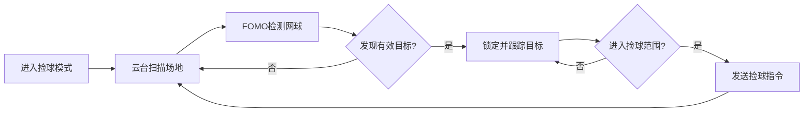
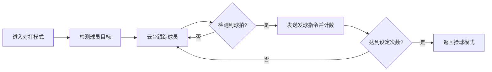
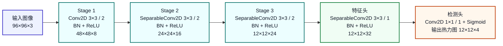

**本科生毕业设计****(****论文)**

** 网球收练一体机设计与制作**

**——****机器视觉****系统设计**

** Design and Production of Tennis Training and Practice Integrated Machine**

   **——Design of Machine Vision System**

| 学   院：  | 工业自动化学院 |
| ---------- | -------------- |
| 专   业：  | 机器人工程     |
| 学生姓名： | 杨心怡         |
| 学   号：  | 220410101337   |
| 指导教师： | 吴明友         |

2026年4月23日

**原创性声明**

本人郑重声明：所呈交的毕业设计（论文），是本人在指导老师的指导下独立进行研究所取得的成果。除文中已经注明引用的内容外，本文不包含任何其他个人或集体已经发表或撰写过的研究成果。对本文的研究做出重要贡献的个人和集体，均已在文中以明确方式标明。

特此申明。

本人签名：杨心怡             日 期： 2026年4月23日

**关于使用授权声明**

本人完全了解北京理工大学珠海学院有关保管、使用毕业设计（论文）的规定，其中包括：①学校有权保管、并向有关部门送交本毕业设计（论文）的原件与复印件；②学校可以采用影印、缩印或其它复制手段复制并保存本毕业设计（论文）；③学校可允许本毕业设计（论文）被查阅或借阅；④学校可以学术交流为目的,复制赠送和交换本毕业设计（论文）；⑤学校可以公布本毕业设计（论文）的全部或部分内容。

本人签名：杨心怡            日 期：2026年 4月23日

指导老师签名：                      日 期：     年   月   日

**[ 网球收练一体机设计与制作]()**

**——****机器视觉****系统设计**

**摘　要**

网球训练过程中，重复发球与人工捡球长期是两个彼此割裂的环节，训练节奏容易被频繁中断，单次训练中的有效击球时间也因此受到影响。针对这一问题，课题将机器视觉模块引入网球收练一体机，在原有机械结构和控制系统基础上，完成了面向网球识别任务的视觉子系统设计。系统硬件选用 OpenMV Cam H7 Plus，软件采用 MicroPython 进行开发，并结合 FOMO 轻量化目标检测方法对场地中的网球目标进行识别。考虑到室内外光照变化、地面颜色干扰以及目标尺寸较小等因素，识别过程中又引入了 HSV 颜色信息、图像预处理和霍夫圆边缘检测，对检测结果进行辅助筛选和修正。

在系统实现中，视觉模块并不单独作为识别单元存在，而是与捡球模式和对打模式的执行逻辑共同工作。一方面，系统需要在画面中完成网球目标的检测，并依据图像位置关系计算出目标所在区域；另一方面，还要配合云台跟踪、串口通信等功能，为设备后续动作提供输入信息。调试结果表明，该方案能够在嵌入式平台上较稳定地完成网球识别与基本定位，满足课题对视觉部分的设计要求。由此可见，轻量化机器视觉方法用于此类小型智能训练设备具有一定可行性，也为后续功能扩展提供了基础。

**关键词：****目标检测；****OpenMV；FOMO；网球识别**

**[Design and Production of Tennis Training and Practice Integrated Machine]()**

   **——Design of Machine Vision System**

**Abstract**

In the process of tennis training, repeated ball serving and manual ball picking have long been separated from each other. The training rhythm is easily interrupted frequently, which affects the effective hitting time in a single training session. In order to solve this problem, this project introduces a machine vision module into the tennis training and collecting integrated machine, and completes the design of a vision subsystem for tennis ball recognition based on the original mechanical structure and control system. The system uses OpenMV Cam H7 Plus as the hardware platform, and the software is developed by MicroPython. At the same time, the lightweight FOMO object detection method is used to recognize tennis balls on the court. Considering the influence of indoor and outdoor light changes, ground color interference, and the small size of the target, HSV color information, image preprocessing, and circular feature analysis are also introduced in the recognition process to assist the screening and correction of detection results.

In the system implementation, the vision module does not work alone as a separate recognition unit, but works together with the execution logic of the ball-picking mode and rally mode. On the one hand, the system needs to detect tennis ball targets in the image and determine the area where the target is located according to the image position relationship. On the other hand, it also needs to cooperate with pan-tilt tracking and serial communication to provide input information for the following actions of the device. The debugging results show that this scheme can complete tennis ball recognition and basic localization on the embedded platform in a relatively stable way, and can meet the design requirements of the visual part of this project. It can be seen that the lightweight machine vision method is feasible for this kind of small intelligent training equipment, and it also provides a basis for later function expansion.

**Key Words:** **Object detection;OpenMV; FOMO;** **T****ennis ball recognition**

# **目  录**

[摘　要 ](#_Toc17860 )

[Abstract ](#_Toc15273 )

[目  录 ](#_Toc28776 )

[第1章 前言 ](#_Toc19474 )

[1.1研究背景 ](#_Toc21455 )

[1.1.1本课题研究背景 ](#_Toc4891 )

[1.1.2本课题研究意义 ](#_Toc7585 )

[1.2国内外研究现状 ](#_Toc257 )

[1.2.1国内研究现状 ](#_Toc31092 )

[1.2.2国外研究现状 ](#_Toc26129 )

[1.3本课题的研究内容和意义 ](#_Toc9547 )

[第2章 机器视觉设计方案 ](#_Toc923 )

[2.1视觉系统总体方案设计 ](#_Toc21285 )

[2.1.1 视觉系统功能需求分析 ](#_Toc10697 )

[2.1.2 视觉系统硬件选型与方案论证 ](#_Toc2050 )

[2.1.3 视觉系统软件框架设计 ](#_Toc28952 )

[第3章 关键技术介绍 ](#_Toc27651 )

[3.1OpenMv硬件平台 ](#_Toc21616 )

[3.2MicroPython ](#_Toc23693 )

[3.3数字图像处理基础 ](#_Toc22840 )

[3.3.1色彩空间 ](#_Toc22689 )

[3.3.2阈值分割 ](#_Toc7387 )

[3.3.3形态学操作 ](#_Toc24767 )

[3.4特征提取与目标识别算法 ](#_Toc7058 )

[3.5坐标变换与空间定位原理 ](#_Toc28427 )

[第4章 视觉系统硬件设计与搭建 ](#_Toc25207 )

[4.1硬件选型与参数 ](#_Toc4506 )

[4.1.1OpenMv Cam H7 Plus 核心模块特性 ](#_Toc12072 )

[4.1.2镜头的选择与视野计算 ](#_Toc16391 )

[4.2视觉模块机械结构设计 ](#_Toc20867 )

[4.2.1摄像头云台固定与调节机构 ](#_Toc3771 )

[第5章 视觉系统软件算法设计与实现 ](#_Toc2112 )

[5.1软件开发环境与流程 ](#_Toc13722 )

[5.1.1数据集构建与类别划分 ](#_Toc13723 )

[5.1.2训练环境与参数设置 ](#_Toc13724 )

[5.1.3模型导出与部署流程 ](#_Toc13725 )

[5.2网球识别算法设计 ](#_Toc6012 )

[5.2.1.1 FOMO算法原理与结构 ](#_Toc19698 )

[5.2.2 基于LAB色彩空间的自适应颜色辅助分割 ](#_Toc4207 )

[5.2.3图像预处理与边缘辅助 ](#_Toc31438 )

[5.2.4圆形检测与轮廓分析 ](#_Toc15321 )

[5.2.5多目标识别与干扰物过滤算法 ](#_Toc23600 )

[5.3网球空间定位与落点计算 ](#_Toc25847 )

[5.3.1相机标定与畸变校正 ](#_Toc4275 )

[5.3.2从小像素坐标到物理坐标的映射模型建立 ](#_Toc28921 )

[5.4捡球模式的算法设计 ](#_Toc17574 )

[5.5对打模式的算法设计 ](#_Toc20307 )

[5.6人机交互页面设计 ](#_Toc13476 )

[5.6.1OpenMv LCD屏实时画面与信息叠加显示 ](#_Toc29018 )

[第6章 软硬件联调 ](#_Toc16171 )

[6.1自动避障程序的调试 ](#_Toc11279 )

[6.2手势识别程序的调试 ](#_Toc31691 )

[6.3捡球模式程序的调试 ](#_Toc15627 )

[6.4对打模式程序的调试 ](#_Toc19678 )

[结论 ](#_Toc13277 )

[参考文献 ](#_Toc18408 )

[附　录 ](#_Toc19300 )

[附录A：代码 ](#_Toc29197 )

[致　谢 ](#_Toc23270 )

# 第1章 **前言**

## **[1.1]()****研究背景**

### **[1.1.1]()****本课题研究背景**

网球运动兼具竞技性与健身性，近年来在我国的参与人数持续增长。然而，网球训练的高成本与低效率问题始终制约着这项运动的普及与发展。一方面，传统的网球训练依赖教练现场指导和人工捡球，训练过程中运动员大量时间耗费在捡拾散落的网球上，训练连贯性差；另一方面，现有的网球发球机虽然能够实现自动化发球，但普遍存在“只发不收”的功能缺陷，且缺乏对运动员击球效果的数据反馈。

随着嵌入式视觉技术和轻量化深度学习算法的发展，赋予训练设备“感知”能力成为可能。特别是近年来，边缘计算平台如OpenMV、K210、Jetson Nano等的性能不断提升，使得在低功耗、低成本硬件上部署实时目标检测算法成为现实。FOMO（Faster Objects, More Objects）算法作为一种专为资源受限型嵌入式设备设计的轻量化目标检测框架，能够在保持较高检测精度的同时实现极低的推理延迟，为网球这类高速运动目标的实时识别提供了可行的技术方案。

在此背景下，本课题提出设计一款集发球、收球与视觉分析功能于一体的“网球收练一体机”，并将基于OpenMV平台与FOMO算法的机器视觉系统作为核心子系统进行深入研究，旨在解决传统网球训练设备“无感知、无反馈、无回收”的痛点。

### **1.1.2****本课题研究意义**

本课题的研究意义主要体现在三个方面。首先，在解决训练中断问题、提升训练连续性方面，本课题通过视觉系统实时识别网球在场地中的位置，引导收球机构自主完成网球的拾取与归集，使发球与收球形成完整的闭环流程。运动员在整个训练过程中无需频繁中断节奏进行捡球，有效提升了单位时间内的有效击球次数，实现了真正意义上的单人高效训练。其次，在探索轻量化视觉算法在体育场景的工程应用方面，本课题采用OpenMV嵌入式视觉平台结合FOMO目标检测算法，在资源受限的硬件环境下实现网球的实时检测与定位。相比于依赖高性能GPU的传统深度学习方案，本方案具有成本低、功耗小、响应快的显著优势，为边缘计算在智能体育装备领域的应用提供了可复现的工程范例。最后，在为后续智能分析功能奠定视觉基础方面，机器视觉系统不仅承担收球引导的功能，更是整个一体机的“眼睛”。通过对网球的识别与位置解算，本系统可为后续的击球轨迹分析、落点统计、击球频率监测等高级功能提供底层数据支撑，推动网球训练从“盲目重复”向“数据量化”转变。

## **1.2****国内外研究现状**

### **1.2.1****国****内研究现状**

在国内，网球训练设备的智能化研究主要集中在高校实验室与少数体育科技企业。在发球机领域，以“斯波阿斯”、“派尼尔”为代表的国产产品技术较为成熟，能够实现多角度、多速度的发球模式，部分机型具备遥控功能和简单的集球网兜，但缺乏基于视觉的自主收球能力。

在机器视觉应用于网球检测方面，国内学者进行了大量研究。早期研究多采用传统图像处理方法，如背景差分法、霍夫圆变换等，实现对网球的追踪；近年来，随着深度学习的发展，基于YOLO、SSD等目标检测网络的研究逐渐增多，在检测精度上取得了显著提升。然而，这些研究大多运行在PC端或高性能嵌入式平台Jetson TX2，成本较高、功耗较大，难以直接集成到面向大众市场的便携式训练设备中。

值得注意的是，随着国产嵌入式AI芯片（如K210）和轻量化算法的成熟，部分研究者开始尝试在低算力平台上部署目标检测任务。FOMO算法因其在资源受限设备上的优异表现，逐渐受到关注，但目前将OpenMV与FOMO结合用于网球检测并驱动收球机构的系统性研究仍较为少见。

### **1.2.2****国外研究现****状**

国外在智能网球训练设备领域起步较早，技术积累更为深厚，以美国的PlaySight、以色列的Tennibot等为代表的企业已推出具备视觉分析或自动收球功能的商业化产品。其中，PlaySight通过多摄像头阵列构建球场“鹰眼”系统，能够实时追踪运动员动作和网球轨迹，提供多维度的数据统计与视频回放，但其系统架构复杂、成本高昂，主要面向专业训练机构和职业赛事；而Tennibot则是一款基于视觉的自动捡球机器人，能够在网球场地上自主识别并捡拾网球，其视觉系统采用传统图像处理与深度学习相结合的方式，实现了较高的捡球效率，但其功能仅限于收球，未与发球系统集成。在学术研究层面，国外学者对网球轨迹预测、击球动作识别等方向有较深入的探索。此外，在嵌入式视觉方面，TensorFlow Lite Micro、Edge Impulse等平台的出现，大大降低了在微控制器上部署神经网络的门槛，特别是FOMO算法正是由Edge Impulse团队针对资源极度受限的设备（如Cortex-M内核MCU）提出的轻量化目标检测方案，其在帧率和内存占用方面的优势已得到广泛验证，为网球检测算法的边缘端部署提供了成熟的技术路径。

## **1.3****本课题的研究内容和意义**

本课题以“网球收练一体机”中的机器视觉系统为研究对象，基于OpenMV嵌入式视觉平台，结合FOMO轻量化目标检测算法，实现网球的实时识别与定位。具体研究内容包括以下几个方面：

1、数据集构建与模型训练：采集不同光照条件、不同背景环境下的网球图像样本，构建自采集数据集，并对图像中的网球、球员和球拍进行人工标注。标注完成后，先将原始标注整理为统一的数据描述文件，再通过本地脚本转换为训练所需的标签格式，在PC端基于TensorFlow完成FOMO轻量化模型训练与量化导出，最终生成适用于OpenMV平台部署的模型文件。

2、视觉系统硬件平台搭建：以OpenMV 为核心视觉处理单元，配置合适的分辨率与帧率参数，选配广角或普通镜头以适应网球场地的视场范围。设计视觉系统的安装支架与防护结构，确保相机在室外或半室外环境下的稳定运行。

3、网球检测与定位算法实现：将训练好的FOMO模型部署至OpenMV，实现网球的实时检测。结合相机的成像几何模型，计算网球在图像坐标系中的位置，并通过坐标变换或标定方法，将图像坐标映射至实际场地坐标系，为收球机构的运动控制提供目标位置信息。

4、系统集成与性能测试：将视觉系统与收练一体机的控制单元进行通信集成，实现“检测—定位—引导—收球”的闭环控制流程。在真实网球场地环境下，对视觉系统的检测准确率、检测帧率、定位精度以及在复杂光照条件下的鲁棒性进行测试与评估。

# 第2章 **机器视觉设计方案**

## **2.1****视觉系统总体方案设计**

### **2.1.1** **视觉系统功能需求分析**

视觉系统作为网球收练一体机的核心感知单元，承担着环境感知、目标识别与定位引导的关键任务。根据网球收练一体机的整体功能定位，视觉系统需要满足以下核心功能需求：

（1）网球检测与定位功能：视觉系统需要能够实时识别场地中的网球，并准确计算其位置坐标。这是实现自动收球功能的基础，要求系统具备较高的检测准确率和定位精度，能够在不同光照条件、不同背景环境下稳定工作。

（2）球拍识别功能：在对打模式下，视觉系统需要能够识别运动员手中的球拍，作为触发发球动作的开关信号。当检测到球拍出现在指定区域或完成特定动作时，系统应能够及时响应并通知发球机构执行发球操作。

（3）人体追踪功能：在对打模式下，视觉系统需要能够识别并跟踪运动员的位置。通过二维舵机云台带动相机实时跟随运动员移动，确保运动员始终处于图像视野的中心区域，为后续的发球定位提供准确的目标位置信息。

（4）多目标检测与路径规划功能：在捡球模式下，视觉系统需要能够扫描场地区域，检测并记录所有散落网球的位置坐标。系统应具备多目标管理能力，能够根据检测结果规划最优的捡球路径，并将路径信息发送给电控系统执行。

（5）人机交互与状态显示功能：视觉系统需要具备图像显示功能，能够在显示屏上实时标注检测到的目标位置、工作模式等信息，便于调试与状态监控。

（6）实时性与可靠性要求：视觉系统作为实时控制系统的一部分，需要满足较高的处理帧率要求，确保目标检测与追踪的实时性。同时，系统应具备较强的环境适应性，能够在室外光照变化条件下保持稳定运行。

### **2.1.2**** [视觉系统硬件选型与方案论证]()**

为满足所需要的功能需求，视觉系统硬件选型主要围绕图像采集单元、图像处理单元、云台执行单元三个核心部分展开。

1、图像采集单元方案论证

图像采集单元的核心是摄像头模组。本课题对比了以下几种方案：

表1图像采集单元方案论证

| 方案             | 优点                                            | 缺点                                       | 适用性评估                         |
| ---------------- | ----------------------------------------------- | ------------------------------------------ | ---------------------------------- |
| USB摄像头        | 成本低，分辨率高，选择多样                      | 需要搭配上位机或开发板，体积较大，功耗较高 | 不适用于嵌入式小型化应用           |
| 树莓派Camera     | 成像质量好，与树莓派集成度高                    | 树莓派整体功耗较高，启动时间较长           | 适合复杂视觉任务，但功耗与体积偏大 |
| OpenMV集成摄像头 | 一体化设计，体积小，功耗低，MicroPython开发便捷 | 算力相对有限                               | 适合本课题轻量化检测需求           |

综合考虑功耗、体积、开发便捷性以及FOMO算法部署需求，本课题选用OpenMV Cam H7 Plus作为图像采集与处理的一体化平台。该平台集成OV5640图像传感器，具备500万像素分辨率，能够满足网球检测的成像质量要求。

2、图像处理单元方案论证

图像处理单元是视觉系统的核心计算部件，负责运行目标检测算法并输出决策结果。本课题对比了以下几种方案：

表2图像处理单元方案论证

| 方案           | 优点                                              | 缺点                           | 适用性评估                         |
| -------------- | ------------------------------------------------- | ------------------------------ | ---------------------------------- |
| 树莓派         | 算力强，支持复杂深度学习模型                      | 功耗高（约5W），体积大，启动慢 | 性能有余但资源浪费                 |
| Jetson Nano    | GPU算力强大，支持CUDA加速                         | 成本高，功耗较高，散热要求高   | 性能过剩，成本偏高                 |
| OpenMV H7 Plus | 功耗低（约1W），体积小，支持TensorFlow Lite Micro | 算力有限，仅支持轻量化模型     | 满足本课题需求，成本与功耗优势明显 |

本课题采用FOMO轻量化目标检测算法，该算法针对ARM Cortex-M内核进行了优化，能够在OpenMV H7 Plus平台上实时运行。因此，选择OpenMV Cam H7 Plus作为图像处理单元，既能满足性能需求，又能兼顾低功耗与小型化要求。

3、云台执行单元方案论证

为实现相机对运动员的实时追踪以及场地扫描功能，视觉系统需要配备二维舵机云台。本课题对比了以下几种云台驱动方案：

表3云台执行单元方案论证

| 方案            | 优点                         | 缺点                                 | 适用性评估                   |
| --------------- | ---------------------------- | ------------------------------------ | ---------------------------- |
| 直流电机+编码器 | 转速快，连续旋转             | 控制复杂，需要闭环控制，定位精度较低 | 不适用于精确定位需求         |
| 步进电机        | 定位精度高，开环控制简单     | 体积较大，功耗较高，易失步           | 适用于高精度定位，但体积偏大 |
| 舵机            | 控制简单，定位准确，集成度高 | 转角范围有限（通常180°）            | 满足本课题云台旋转范围需求   |

综合考虑控制简便性、定位精度与体积因素，本课题选用MG996R数字舵机作为云台驱动单元。该舵机扭矩大、响应速度快，能够稳定带动相机模块进行水平与俯仰运动，且采用PWM信号控制，与OpenMV平台接口兼容性好。

### **2.1.3**** [视觉系统软件框架设计]()**

根据本课题的设计思路，视觉系统需要支持两种工作模式：捡球模式与对打模式。两种模式的核心功能均基于FOMO目标检测算法实现，但检测目标与执行逻辑有所不同。整体软件框架采用模块化设计，主要包括图像采集模块、目标检测模块、坐标变换模块、云台控制模块、通信模块以及模式管理模块。

1、捡球模式

捡球模式的目标是扫描场地、识别所有散落的网球，并规划捡球路径。该模式的工作流程如下：首先，系统进入捡球模式后，云台控制模块启动场地扫描程序。云台按照预设的轨迹进行运动，水平舵机从左至右逐行扫描，俯仰舵机按照分层方式逐级调节角度，确保相机能够覆盖整个场地区域。在云台运动过程中，图像采集模块实时采集图像，目标检测模块调用FOMO模型对网球进行检测识别。

当检测到网球时，系统将网球的图像坐标通过坐标变换模块转换为场地实际坐标，并存储于位置记录列表中。同时，系统在显示屏上实时标注检测到的网球位置，以可视化方式反馈给用户，便于调试与确认。场地扫描完成后，系统对所有记录到的网球位置进行整理与排序，根据各位置点的分布情况规划最优捡球路径。路径规划遵循最短路径原则，综合考虑各点之间的直线距离与收球机构的运动特性，生成有序的捡球点序列。

最后，系统将规划好的路径信息通过通信模块发送给电控系统，电控系统根据路径信息驱动收球机构依次前往各目标点完成捡球动作。

图2-1 捡球模式工作流程图

2、对打模式

对打模式的目标是识别运动员位置并实现跟随，同时根据球拍触发信号控制发球。该模式的工作流程如下：系统进入对打模式后，首先启动球拍检测功能。目标检测模块持续检测图像中是否存在球拍，当检测到球拍时，系统进入发球准备状态。在未检测到球拍时，系统处于待机观察状态。

当系统进入发球准备状态后，启动人体追踪功能。目标检测模块对运动员进行识别与定位，云台控制模块根据运动员在图像中的位置偏差，实时计算水平舵机与俯仰舵机的目标角度，并通过PID控制算法驱动云台跟随运动员移动，确保运动员始终处于图像视野的中心区域。这一视觉伺服闭环控制保证了追踪的连续性与稳定性。

在云台稳定跟随运动员的同时，系统持续检测运动员的位置信息，并将其实时坐标通过坐标变换转换为场地坐标系下的发球目标位置。当系统判定运动员已正确定位（位置偏差在允许范围内）且发球条件满足时，系统将发球目标位置信息通过通信模块发送给电控系统。

电控系统接收到位置信息后，控制发球机构按照目标位置进行瞄准与发球，完成对打训练中的一次发球动作。发球完成后，系统继续维持跟随状态，等待下一次球拍触发信号，形成连续的对打训练循环。

图2-2 对打模式工作流程图

3、软件模块划分

视觉系统软件采用模块化设计，各模块功能如下：

表4模块功能

| 模块名称     | 主要功能                                             |
| ------------ | ---------------------------------------------------- |
| 图像采集模块 | 配置摄像头参数，获取实时图像帧                       |
| 目标检测模块 | 加载FOMO模型，执行目标检测与识别                     |
| 坐标变换模块 | 将图像坐标转换为场地实际坐标                         |
| 云台控制模块 | 控制水平与俯仰舵机运动，实现扫描与追踪               |
| 通信模块     | 与电控系统进行串口通信，收发控制指令与位置数据       |
| 显示模块     | 在显示屏上实时标注检测结果与系统状态                 |
| 模式管理模块 | 管理系统工作状态，实现捡球模式与对打模式的切换与调度 |

# 第3章 **关键技术介绍**

## **3.1****OpenMv硬件平台**

OpenMV是一款专为机器视觉应用设计的嵌入式微控制器平台，其核心采用Microchip公司的ARM Cortex-M系列处理器，主频可达数百兆赫兹，具备较强的图像处理能力。OpenMV Cam集成了图像传感器、微处理器、存储单元以及丰富的外设接口，能够在低功耗条件下完成图像采集、处理和输出。

本课题选用OpenMV Cam H7 Plus作为视觉系统的核心处理单元。该型号搭载STM32H7系列处理器，主频高达480MHz，配备1MB RAM和2MB Flash，支持OV5640图像传感器，最高可采集500万像素的彩色图像。OpenMV Cam H7 Plus的突出优势在于其能够直接运行MicroPython脚本，开发者无需搭建复杂的交叉编译环境，即可快速实现图像处理算法的开发与验证。此外，该平台提供了丰富的机器视觉库，涵盖图像滤波、特征检测、目标识别等多种功能模块，并支持TensorFlow Lite Micro等轻量化神经网络框架，为部署FOMO目标检测算法提供了底层支撑。

在实际应用中，OpenMV Cam H7 Plus还具备灵活的I/O接口，包括UART、I2C、SPI、GPIO等，便于与收练一体机的控制单元进行通信。视觉系统检测到的网球位置信息可通过串口实时发送给下位机，引导收球机构完成自主拾取动作。

## **3.2****MicroPython**

MicroPython是Python 3编程语言的精简高效实现，专门针对微控制器和嵌入式系统进行了优化。与标准Python相比，MicroPython在保留核心语法和数据结构的基础上，大幅降低了内存占用和运行开销，使其能够在资源受限的嵌入式平台上高效运行。

OpenMV Cam采用MicroPython作为其主要的开发语言，这一设计选择带来了显著的开发优势。首先，Python语言语法简洁、易读易写，开发者无需深入底层C语言细节即可快速实现图像处理算法的原型验证。其次，MicroPython提供了交互式REPL环境，开发者可以通过串口连接实时执行代码指令，极大方便了算法的调试与参数优化。再者，OpenMV在MicroPython基础上封装了专门的机器视觉模块，如sensor模块用于图像传感器配置、image模块提供图像处理函数、pyb模块用于外设控制等，使得复杂的视觉任务可以简化为几行代码调用。

本课题利用MicroPython的易用性优势，在OpenMV平台上快速实现了图像采集、FOMO模型加载与推理、目标位置解算以及串口通信等核心功能模块。MicroPython的实时性与简洁性为视觉系统的快速迭代与功能验证提供了有力保障。

## **3.3****数字图像处理基础**

### **3.3.1****色彩空间**

色彩空间是描述颜色的数学模型，不同的色彩空间适用于不同的应用场景。常见的色彩空间包括RGB、HSV、Lab等。RGB色彩空间是最基础的色彩表示方式，通过红、绿、蓝三个通道的强度组合来描述颜色。然而，RGB空间对光照变化较为敏感，且三个通道之间存在较强的相关性，不利于进行颜色分割。HSV色彩空间则将颜色分解为色调（Hue）、饱和度（Saturation）和明度（Value）三个独立分量。其中色调H表示颜色的本质属性，饱和度S表示颜色的纯度，明度V表示颜色的亮度。HSV空间的最大优势在于将颜色信息与亮度信息解耦，使得目标分割可以主要依赖于色调分量，从而有效降低光照变化对检测结果的影响。

本课题中，虽然主要采用FOMO深度学习算法进行网球检测，但在数据采集和图像预处理阶段，仍需要借助色彩空间转换来增强图像的对比度与特征表达能力。例如，在标注训练数据时，可结合HSV空间对网球特有的荧光黄绿色进行特征增强，以提高模型的泛化能力。

### **3.3.2****阈值分割**

阈值分割是一种基于像素灰度值或颜色分量的图像二值化方法，其基本原理是将图像中满足特定阈值条件的像素点标记为目标，其余像素标记为背景。阈值分割包括全局阈值和自适应阈值两种形式。

全局阈值适用于目标与背景灰度分布差异明显的场景，通过设定一个固定的灰度阈值即可完成分割。自适应阈值则根据图像局部区域的灰度特征动态计算阈值，能够更好地处理光照不均的情况。

在本课题中，阈值分割技术主要应用于辅助环节，如网球检测前的图像预处理、目标区域的快速定位等。尽管FOMO算法本身能够端到端地完成目标检测，但在模型训练前的数据清洗与标注阶段，阈值分割可以用于快速筛选出包含网球的有效图像区域，提高数据标注效率。

### **3.3.3****形态学操作**

形态学操作是一组基于图像形状的非线性图像处理技术，主要应用于二值图像或灰度图像的后处理。常见的形态学操作包括腐蚀、膨胀、开运算和闭运算。

腐蚀操作通过消除目标区域的边缘像素，能够去除微小的噪声点和分离粘连的目标；膨胀操作则通过扩张目标区域边缘，能够填充目标内部的空洞和连接相邻的目标。开运算（先腐蚀后膨胀）常用于去除噪点，闭运算（先膨胀后腐蚀）则用于填充空洞和平滑边界。

在本课题中，形态学操作用于优化网球检测的后续结果。当FOMO模型输出网球的候选区域后，可能存在一些离散的误检点或检测框边缘不连续的情况。通过适当的形态学处理，可以对检测结果进行滤波和优化，提升定位的准确性。此外，在收球机构引导过程中，形态学操作还可用于计算网球区域的质心位置，为运动控制提供更稳定的目标坐标。

## **3.4****特征提取与目标识别算法**

特征提取与目标识别是机器视觉系统的核心环节，其目的是从图像中提取出能够表征目标本质属性的信息，并基于这些信息对目标进行分类与定位。

传统的目标识别方法依赖于人工设计的特征描述子，如方向梯度直方图（HOG）、尺度不变特征变换（SIFT）、局部二值模式（LBP）等。这些特征描述子通过对图像局部区域的结构信息进行编码，能够在一定程度上抵抗光照变化和视角变换的影响。随后，结合支持向量机（SVM）、AdaBoost等分类器完成目标识别任务。传统方法的优势在于计算量相对较小，但其特征设计依赖于专业经验，且对于复杂场景下的目标识别泛化能力有限。

近年来，基于深度学习的目标识别方法取得了突破性进展。卷积神经网络（CNN）能够自动从大量标注数据中学习层次化的特征表示，从边缘、纹理等底层特征到物体的语义信息，实现了端到端的目标检测。以YOLO、SSD为代表的一阶段目标检测算法在精度和速度之间取得了良好平衡。

本课题采用FOMO（Faster Objects, More Objects）算法作为核心检测方案。FOMO是Edge Impulse团队提出的轻量化目标检测框架，其核心思想不是直接回归目标边界框，而是将输入图像划分为低分辨率网格，让每个网格单元判断其中心是否属于某一类目标，再结合连通域分析恢复目标中心位置。相比于标准YOLO或SSD模型，FOMO模型的参数量和计算量显著降低，更适合部署在OpenMV这类资源受限的嵌入式平台上完成实时目标检测与定位。

## **3.5****坐标变换与空间定位原理**

坐标变换与空间定位是实现视觉引导收球的关键技术环节。视觉系统获取的网球位置信息最初是以图像坐标系的形式存在，而收球机构的运动控制需要基于实际场地坐标系。因此，需要建立图像坐标系与场地坐标系之间的映射关系。

图像坐标系通常以像素为单位，原点位于图像的左上角，横轴为u轴，纵轴为v轴。相机坐标系以相机光心为原点，光轴方向为Z轴，X轴和Y轴分别与图像坐标系的u轴和v轴平行。世界坐标系则描述实际场地中的空间位置，通常选择场地地面为XOY平面，垂直方向为Z轴。

坐标变换的核心在于相机标定，即求解相机的内参数矩阵和外参数矩阵。内参数描述相机本身的成像特性，包括焦距、主点坐标、畸变系数等；外参数描述相机坐标系相对于世界坐标系的旋转与平移关系。通过张正友标定法等成熟算法，可以利用棋盘格标定板计算出相机参数。

在网球检测应用中，由于收球机构在二维地面运动，且网球被视为位于地面上的点，因此可以采用简化的单应性变换（Homography）建立图像点到场地点的映射关系。具体而言，通过选取场地上的四个及以上参考点，测量其图像坐标和实际场地坐标，即可求解出单应性矩阵H。对于任意检测到的网球图像坐标，通过单应性变换即可计算出其在场地坐标系中的实际位置，进而引导收球机构运动至目标点完成拾取。

本课题在OpenMV平台上实现了相机标定与坐标变换算法，将FOMO检测输出的网球像素坐标实时转换为场地坐标，并通过串口将坐标数据发送给收球机构控制单元，实现了视觉感知与运动执行的无缝衔接。

# 第4章 **视觉系统硬件设计与搭建**

## **4.1****硬件选型与参数**

### **4.1.1****OpenMv Cam H7 Plus 核心模块特性**

OpenMV Cam H7 Plus是本课题视觉系统的核心处理单元，其选型主要基于以下几方面的考量：首先，在计算性能方面，OpenMV Cam H7 Plus搭载STM32H750微控制器，该芯片采用ARM Cortex-M7内核，主频高达480MHz，具备双精度浮点运算单元（FPU）和数字信号处理器（DSP）指令集，能够高效处理图像数据。同时，该芯片内置1MB RAM和2MB Flash，其中RAM容量对于运行神经网络模型尤为关键，足以容纳FOMO模型的计算图与中间变量。

其次，在图像采集能力方面，该模块配备OV5640图像传感器，有效像素为500万，最高支持2592×1944分辨率。在实际应用中，考虑到检测帧率与精度的平衡，本课题将分辨率配置为320×240（QVGA）或640×480（VGA），这两种分辨率能够在保证网球检测精度的同时，使帧率达到30帧/秒以上，满足实时性要求。OV5640传感器还支持自动曝光、自动白平衡等功能，能够在一定程度上适应室外光照变化。

再次，在深度学习支持方面，OpenMV Cam H7 Plus原生支持TensorFlow Lite Micro框架，能够加载并执行经过量化的轻量化神经网络模型。FOMO算法模型经过量化后，其模型大小可压缩至几十KB至几百KB，完全能够在片上RAM中运行，无需频繁访问外部存储，保证了推理速度的稳定性。最后，在接口与扩展性方面，该模块提供了UART、I2C、SPI、GPIO等多种通信接口，本课题利用UART串口将检测到的网球坐标实时传输至收球机构的主控制器。此外，模块还具备SD卡插槽，可用于存储图像数据与日志文件，便于实验数据的记录与分析。

      

图OpenMv Cam H7 Plus

表4-1 OpenMV Cam H7 Plus主要技术参数

| 参数项       | 规格                             |
| ------------ | -------------------------------- |
| 处理器       | STM32H750，ARM Cortex-M7，480MHz |
| 内存         | 1MB RAM，2MB Flash               |
| 图像传感器   | OV5640，500万像素                |
| 最大分辨率   | 2592×1944                       |
| 接口类型     | UART、I2C、SPI、GPIO、USB等      |
| 供电电压     | 3.6V~5V                          |
| 工作电流     | 约250mA                          |
| 深度学习支持 | TensorFlow Lite Micro            |

### **4.1.2** **镜头的选择与视野计算**

镜头的选择直接影响视觉系统的视场范围、成像清晰度以及检测距离，是确保网球能够被有效识别与定位的关键因素。本课题在镜头选型时主要考虑了焦距、视场角、光圈以及畸变控制等参数。

本课题选配了焦距为2.8mm的广角镜头，其视场角（FOV）约为120°。选择广角镜头的主要原因在于网球场地范围较大，视觉系统需要在较近的安装距离下覆盖足够宽的场地区域，以确保收球机构能够检测到散落在不同位置的网球。2.8mm焦距的镜头在保证广视角的同时，也能够保持边缘区域的合理分辨率，满足网球检测的最低像素要求。

视野计算是确定镜头选型是否合理的重要依据。本课题中，视觉系统计划安装在收练一体机的机身前端，距离地面高度约为H=0.5m，镜头俯角约为30°。根据几何光学原理，在给定镜头焦距和图像传感器尺寸（OV5640传感器尺寸为1/4英寸，对角线约4.5mm）的情况下，水平视场角 和垂直视场角可按以下公式估算：

其中w和h分别为图像传感器的宽度和高度。经计算，在2.8mm焦距下，水平视场角约为110°，垂直视场角约为80°。在实际安装高度0.5m、俯角30°的条件下，视觉系统能够覆盖前方约0.5m至3.0m范围内的地面区域，覆盖宽度约为2.5m，基本满足收球机构在移动过程中对网球的检测需求。

表4-2镜头主要参数

| 参数项   | 规格  |
| -------- | ----- |
| 焦距     | 2.8mm |
| 现场角   | 120° |
| 光圈     | F2.0  |
| 镜头接口 | M12   |
| 畸变     | ＜5%  |

## **4.2****视觉模块机械结构设计**

### **4.2.1****摄像头云台固定与调节机构**

为了使得OpenMV视觉系统能够具备更灵活的目标追踪能力，本课题为其配备了二维舵机云台。该云台采用双自由度结构设计，分别由水平舵机与俯仰舵机构成，可实现视觉模块在水平方向与垂直方向上的独立旋转运动。水平舵机负责云台的左右偏转，使相机能够在水平面内实现0°至180°的连续旋转，从而扩大视觉系统的横向扫描范围；俯仰舵机则负责云台的上下俯仰，使相机能够在垂直面内实现0°至90°的角度调节，以适应不同距离目标的成像需求。通过两个舵机的协同控制，OpenMV相机可以实现对运动目标的实时追踪，使视觉系统不仅能够静态检测场地中的网球，还能在收练一体机移动过程中动态追踪运动员的位置或跟随特定目标进行运动。

在结构设计方面，二维舵机云台采用3D打印件作为主体框架，以保证足够的刚性与轻量化。水平舵机固定于底座之上，其输出轴与上层转台连接，实现整体结构的水平旋转；俯仰舵机安装于上层转台的两侧支架之间，其输出轴与相机固定架相连，实现相机模块的上下俯仰。相机固定架专为OpenMV Cam H7 Plus设计，采用T形结构将相机模块与LCD拓展板进行固定，并用螺丝进行固定，确保图像采集的稳定性。

在控制策略方面，视觉系统通过检测目标在图像坐标系中的位置偏差，实时计算水平舵机与俯仰舵机的目标角度，并通过PWM信号驱动舵机执行相应的旋转动作，形成视觉伺服闭环控制。当目标偏离图像中心区域时，云台自动调整角度将目标重新置于视野中央，从而实现对运动目标的持续跟踪。这一功能不仅有助于收练一体机在移动过程中保持对网球的检测视野，也为后续实现人机交互、跟随运动员进行辅助训练等功能奠定了硬件基础。

             图3、二维舵机云台
# 第5章 **视觉系统软件算法设计与实现**

## **5.1****软件开发环境与流程**

本系统的软件开发由“PC端训练评估”和“OpenMV端部署运行”两部分组成。PC端主要完成数据整理、模型训练、量化导出和离线评估，OpenMV端主要完成模型加载、目标检测、结果可视化与云台跟踪控制。开发中使用的主要工具包括Python、TensorFlow、OpenCV和OpenMV IDE。

### **5.1.1 数据集构建与类别划分**

本课题所使用的数据集为自行采集的数据集。采集过程中围绕网球收练一体机的应用场景，拍摄了不同距离、不同角度、不同光照条件下的场地图像，并人工标注了图像中的目标信息。为便于后续端侧部署，最终类别设置与OpenMV部署文件 `ei-tennis-openmv-v6/labels.txt` 保持一致，具体包括 `background`、`Tennis`、`Tennis player` 和 `Tennis racket` 四类，其中 `background` 为训练时自动生成的背景通道，并不需要人工单独标注。

按照当前本地训练流程，数据集共包含622张图像，其中训练集485张，测试集137张。三类前景目标的标注框数量统计如表5-1所示。

表5-1 自采集数据集类别分布

| 类别 | 训练集标注框数量 | 测试集标注框数量 | 总标注框数量 |
| ---- | ---------------- | ---------------- | ------------ |
| Tennis | 541 | 156 | 697 |
| Tennis player | 183 | 57 | 240 |
| Tennis racket | 62 | 40 | 102 |

从统计结果可以看出，当前数据集中网球类别占比最高，球员和球拍样本相对较少。因此，本阶段论文的实验重点主要放在网球目标检测链路是否能够正确建立，以及OpenMV端是否能够稳定输出识别结果和中心位置信息。

### **5.1.2 训练环境与参数设置**

本课题采用本地TensorFlow训练流程完成FOMO风格轻量化网络的搭建与训练。训练脚本固定采用OpenMV导向的小型网络结构，输入图像尺寸为96×96，输出网格尺寸为12×12，主干通道配置为 `[8,16,24]`，检测头通道数为32。训练过程中采用前景加权Focal损失函数，以缓解前景网格稀疏和类别不均衡问题；同时使用EarlyStopping和ReduceLROnPlateau机制抑制过拟合并自动调整学习率。

本阶段所采用的主要训练参数如表5-2所示。

表5-2 模型训练参数设置

| 参数项 | 数值 |
| ------ | ---- |
| 输入尺寸 | 96×96 |
| 输出网格 | 12×12 |
| 训练轮数 | 80 |
| 批大小 | 16 |
| 初始学习率 | 1×10^-3^ |
| 背景权重 | 0.25 |
| 前景权重 | 2.0 |
| Focal参数γ | 2.0 |
| 数据增强方式 | 亮度、对比度、Gamma扰动、噪声与轻度模糊 |

考虑到FOMO检测任务的标签是由目标中心映射到网格单元得到的，如果直接进行大幅旋转、裁剪等几何增强，容易引起网格标签偏移，因此当前训练流程主要采用光度增强方式来提高模型对光照变化和图像噪声的适应性。

### **5.1.3 模型导出与部署流程**

训练完成后，系统会同时导出 `fomo_like.keras`、`fomo_like_float32.tflite`、`fomo_like_int8.tflite` 和 `labels.txt` 四类文件。其中，`keras` 文件用于继续训练与调试，`float32 tflite` 文件用于本地推理分析，`int8 tflite` 文件用于OpenMV端部署，`labels.txt` 用于保持类别顺序与模型输出一致。当前导出文件中，`float32 tflite` 模型大小为13728字节，`int8 tflite` 模型大小为11504字节，能够满足嵌入式端存储与加载要求。

综上，本系统的软件实现流程可概括为以下四个步骤：

① 数据采集与人工标注：采集网球场景图像，完成 `Tennis`、`Tennis player` 和 `Tennis racket` 三类目标标注。

② 数据整理与模型训练：利用本地脚本整理标签与数据配置文件，在PC端训练FOMO轻量化检测模型。

③ 模型量化与结果评估：导出 `float32` 与 `int8` 两种TFLite模型，并在测试集上完成离线评估。

④ 端侧部署与调试：将 `int8 tflite` 模型和 `labels.txt` 部署至OpenMV，结合后处理脚本完成目标显示、类别区分和云台跟踪调试。

## **5.2****网球识别算法设计**

**5.2.1 模型的考虑**

本课题的视觉系统最终部署在OpenMV平台上，因此模型选择首先要满足两个条件：一是能够在资源受限的硬件上运行，二是对小目标有一定识别能力。网球在画面中通常尺寸较小，且场景中可能同时出现多个目标，如果直接采用YOLO、SSD或Faster R-CNN等常见检测器，虽然在高算力平台上效果较好，但模型体积和计算量都偏大，不利于在OpenMV端实现稳定运行。

综合硬件条件和任务特点，本课题选择FOMO（Faster Objects, More Objects）作为核心检测方法。FOMO将目标检测转化为低分辨率网格上的分类问题，不再直接回归目标边界框，因此模型结构更紧凑，部署链路也更简单。从实际使用角度看，这种方法更适合当前“小目标识别 + 嵌入式部署”的需求，因此被作为本系统的主要检测框架。

### **5.2.1.1 FOMO算法原理与结构**

FOMO本质上是一种基于密集网格（Dense Grid）的单阶段目标检测方法。与传统的YOLO、SSD等检测器不同，FOMO摒弃了对目标边界框（Bounding Box）参数的回归，转而采用一种更为高效的检测思路。该思路为：将输入图像采样为一个低分辨率的二维网格（本课题训练配置为12×12），每个网格单元仅需判断其中心点是否属于某一类别的目标。这样，模型的输出不再是边界框集合，而是一个形如[grid_h, grid_w, num_classes+1]的多通道概率热力图（Probability Heatmap），每个通道分别对应不同类别及背景的概率分布。

在推理阶段，FOMO通过对热力图进行阈值化处理，筛选出高置信度的目标响应区域。随后，利用连通域分析（Connected Component Analysis）等后处理技术，进一步聚合相邻的响应单元，最终恢复出每个目标的中心点坐标，实现对场景中多个目标的精准检测。这种方法极大地简化了检测流程，尤其适合小目标密集分布的场景，如网球目标检测等。

FOMO的网络结构设计非常轻量，通常采用MobileNet、Depthwise Separable Convolution（深度可分离卷积）等高效主干网络作为特征提取器。相比YOLOv5、Faster R-CNN等主流检测模型，FOMO的参数量和计算量大幅降低，显著提升了推理速度和资源利用率，非常适合在算力受限的边缘设备上部署。FOMO的端到端检测流程主要包括以下几个步骤：

①图像预处理：输入图像首先被自动缩放至固定尺寸（本课题为96×96），并进行归一化处理，以适应网络输入要求。

②特征提取与热力图生成：经过主干网络提取特征后，通过1×1卷积层输出多通道概率热力图，每个通道对应一个类别的响应。

③概率激活：对热力图应用sigmoid激活函数，将每个网格单元的输出映射为属于各类别的概率值。

④目标提取：对概率热力图进行阈值化处理，再结合连通域分析，提取出所有目标的中心点坐标，从而实现多目标检测。

⑤后处理筛选：根据目标的面积、置信度等信息，进一步筛选和优化检测结果，去除噪声和冗余响应，从而提升检测精度。

结合本课题当前本地训练脚本，所采用的FOMO风格网络结构可以具体表示为表5-3。该结构采用“浅层卷积下采样 + 深度可分离卷积特征提取 + 1×1卷积检测头”的设计思路，在保证输出分辨率的同时尽可能压缩参数量，便于后续进行int8量化并部署到OpenMV端。

表5-3 FOMO轻量化模型结构

| 层次 | 操作类型 | 核大小/步长 | 输出尺寸 |
| ---- | -------- | ----------- | -------- |
| Input | 输入层 | - | 96×96×3 |
| Stage1 | Conv2D + BN + ReLU | 3×3 / 2 | 48×48×8 |
| Stage2 | SeparableConv2D + BN + ReLU | 3×3 / 2 | 24×24×16 |
| Stage3 | SeparableConv2D + BN + ReLU | 3×3 / 2 | 12×12×24 |
| Head | SeparableConv2D + BN + ReLU | 3×3 / 1 | 12×12×32 |
| Detect | Conv2D + Sigmoid | 1×1 / 1 | 12×12×4 |

其中，输出层的4个通道分别对应 `background`、`Tennis`、`Tennis player` 和 `Tennis racket`。网络在前三个阶段完成3次下采样，使96×96输入图像最终映射到12×12检测网格；最后通过1×1卷积将每个网格位置映射为多类别概率输出，从而满足FOMO对小目标中心检测的要求。

图5-1 FOMO轻量化模型架构图

**5.2.1.2 FOMO的优点与本项目适配性**

对于本课题而言，FOMO的适配性主要体现在三个方面。第一，模型结构较轻，便于在OpenMV这类资源有限的平台上部署。第二，FOMO采用网格输出方式，更适合处理画面中尺寸较小的网球目标。第三，FOMO的输出结果比较容易和端侧后处理模块衔接，后续无论是做颜色辅助、圆形检测，还是做轨迹管理，接口都比较直接。综合这些因素，FOMO更符合本课题当前的硬件条件和任务要求。

**5.2.1.3 不选用YOLO、SSD等传统检测器****的原因**

YOLO、SSD等方法在通用目标检测中应用广泛，但它们更适合算力较高的平台。对于本课题所使用的OpenMV平台来说，这类模型通常存在体积偏大、推理开销高、部署过程复杂等问题。除此之外，网球目标本身较小，锚框式检测方法在这类场景下往往还需要更细致的参数调整，否则容易出现漏检。

因此，本课题并不是否定YOLO、SSD这类方法本身的效果，而是基于硬件条件、部署难度和实际任务做出取舍。在当前阶段，选择结构更轻、部署更直接的FOMO更符合系统实现需求。

**5.2.1.4 FOMO在本项目的工程实现**

本项目的FOMO模型训练与部署流程主要包括四个步骤：数据整理、模型训练、量化导出和端侧部署。训练阶段在PC端利用TensorFlow完成，损失函数采用前景加权Focal损失；数据增强以亮度、对比度、Gamma扰动、噪声和轻度模糊为主，目的是提高模型对光照变化的适应能力。训练结束后，再将模型导出为 `float32 tflite` 与 `int8 tflite` 两种格式，分别用于本地分析和OpenMV端运行。

训练过程中损失曲线的变化情况如图5-2所示。随着迭代次数增加，训练损失与验证损失整体呈下降趋势，说明当前模型已经能够完成基本收敛。

图5-2 训练与验证损失曲线

模型导出后，采用本地评估脚本对训练集和测试集进行离线验证。需要说明的是，当前评估采用的是FOMO常用的网格级统计方式，因此表中的Accuracy表示网格单元分类准确率，而更能反映检测效果的指标主要是Precision、Recall和F1值。当前测试集评估结果如表5-4所示。

表5-4 测试集评估结果

| 类别 | Precision | Recall | F1 |
| ---- | --------- | ------ | -- |
| Overall | 0.600 | 0.059 | 0.108 |
| Tennis | 0.600 | 0.096 | 0.166 |
| Tennis player | 0.000 | 0.000 | 0.000 |
| Tennis racket | 0.000 | 0.000 | 0.000 |

由表5-4可见，当前模型已经能够对 `Tennis` 类别产生一定识别能力，但 `Tennis player` 和 `Tennis racket` 两类的识别效果仍较弱，说明该多类别模型目前仍处于初步验证阶段。因此，在论文现阶段的视觉算法描述中，重点放在“网球检测主链路是否打通”和“端侧能否稳定输出结果”这两个方面，而球员与球拍类别后续还需要进一步补充样本和优化训练策略。

端侧部署流程如下：

① OpenMV端实时采集图像，并按模型输入要求完成缩放与预处理。

② 将图像输入FOMO模型，得到多通道概率热力图输出。

③ 对热力图结果进行阈值筛选和连通域分析，恢复候选目标中心点。

④ 根据不同类别调用不同的后处理逻辑，其中网球类别进一步叠加颜色辅助、圆形检测与半径平滑策略。

⑤ 将检测结果实时叠加到OpenMV IDE或LCD显示画面中，并输出目标类别、中心位置和距离等信息，辅助后续调试。

需要强调的是，当前 `ei-tennis-openmv-v6/main.py` 中已经实现的端侧后处理并不只是简单的连通域提取，而是围绕网球类别构建了一整套工程增强链路，主要包括以下几个方面：

① 类别分离阈值：对 `Tennis`、`Tennis player` 和 `Tennis racket` 分别设置不同置信度阈值，避免统一阈值下的误检放大。

② 坐标还原与候选框生成：在FOMO输出热力图上进行blob搜索，并根据输入ROI缩放关系把检测框恢复到原图坐标系。

③ 网球专用后处理：仅对 `Tennis` 类别调用颜色辅助、圆形检测、半径融合、距离估算与轨迹管理，从而减少无关类别干扰。

④ 多类别联动：对 `Tennis player` 和 `Tennis racket` 保留独立检测结果，并将其作为后续对打模式状态切换和云台控制的输入条件。

因此，当前系统的部署逻辑可以概括为“FOMO热力图检测提供候选目标，`main.py` 的后处理模块负责候选验证、尺寸修正、时序稳定与模式联动”，两部分共同组成了完整的端侧视觉算法实现。

### **5.2.2 基于LAB色彩空间的自适应颜色辅助分割**

在当前工程实现中，颜色辅助并不是以HSV固定阈值的方式独立完成检测，而是作为FOMO检测之后的辅助验证手段参与网球目标筛选。具体做法是：先以FOMO给出的网球候选中心为参考，在其附近截取局部ROI，再对该区域的LAB颜色统计量进行分析，根据L、A、B三个通道的均值和标准差自适应生成阈值区间，随后调用 `find_blobs` 完成局部颜色分割。

在 `main.py` 中，该过程由 `build_tennis_color_threshold()` 与 `estimate_color_blob()` 两个函数完成。前者先从候选框中心截取种子区域，计算LAB三通道均值与标准差，再按照“基础容差 + 自适应容差”的方式生成动态阈值；后者则在ROI内搜索所有候选色块，并综合考虑色块面积、色块中心与FOMO中心的距离、长宽比接近正方形的程度以及是否覆盖参考中心点等因素，对候选色块进行打分，最终选出最可能对应网球的颜色区域。

采用LAB而不是RGB固定阈值的主要原因在于：LAB颜色空间对亮度与色度的分离更明确，在强光、阴影和局部反光条件下具有更好的适应性。通过对候选区域重新计算动态阈值，系统能够避免“同一组阈值在不同光照环境下失效”的问题。颜色辅助模块并不直接决定目标类别，而是与FOMO输出共同用于估计网球的等效直径和位置，进而提高后续圆形检测和距离估计的稳定性。

### **5.2.3****图像预处理与边缘辅助**

为了提升小球在复杂场景中的可分离性，当前系统并未采用大规模的全图均衡化或复杂滤波流程，而是优先在候选区域内进行轻量化预处理。具体而言，系统首先依据FOMO输出构建局部ROI，只在该范围内进行边缘检测和高亮区域分析，从而降低全图处理带来的额外计算开销。随后，利用Canny边缘提取目标轮廓，并结合高亮像素比例判断地面反光对边缘质量的影响。

在 `main.py` 中，边缘与高亮分析分别由 `estimate_edge_strength()` 和 `estimate_glare_ratio_pct()` 完成。前者对ROI灰度图执行Canny边缘检测，并以边缘图像亮度均值作为边缘强度指标；后者统计ROI内高亮像素所占比例，用于判断当前区域是否受到强光反射干扰。边缘强度和高亮比例不仅决定后续霍夫圆检测的阈值设定，也会影响最终直径融合时对异常大圆的抑制策略。

在时序层面，系统还引入了半径平滑和半径锁定机制。对于同一网球目标，程序会记录最近若干帧的半径估计结果，采用去极值平均与跳变约束的方法抑制抖动。当检测结果受反光或遮挡影响出现异常突变时，系统优先保持上一时刻的平滑半径，而不是直接使用当前帧结果。这样可以在不明显增加运算量的前提下，提高网球尺寸估计和距离估计的连续性。

### **5.2.4****圆形检测与轮廓分析**

网球作为一种典型的圆形目标，其在图像中的几何特征高度稳定，具有较高的圆度和有限的半径范围。然而，单纯依赖颜色分割进行检测，往往容易受到背景复杂、光照变化、地面反光以及球体部分遮挡等因素的干扰，导致误检和漏检现象频发。为此，本项目在颜色分割的基础上，进一步引入了Canny边缘检测与Hough圆变换等几何特征分析方法，实现对圆形目标的精准定位。

具体而言，Canny边缘检测因其对噪声的强抑制能力和对目标边缘的高精度提取效果，成为提取网球边缘的首选算法，为后续的圆形拟合提供了可靠的边缘信息。Hough圆变换则能够在一定噪声和边缘缺损的情况下，鲁棒地检测出完整或部分圆形目标，极大提升了系统对网球的识别能力。为了进一步提升检测的准确率和效率，系统采用了动态ROI调整策略，即以FOMO检测框为中心，适当扩展感兴趣区域，仅在高置信度区域内进行边缘和圆形检测，从而有效减少全图搜索带来的误检和计算负担。

在 `main.py` 中，霍夫圆检测由 `estimate_hough_circle()` 实现。该函数会根据边缘强度和高亮比例动态调整霍夫变换阈值，并围绕参考半径设置搜索上下界：当高亮比例较高时，系统会自动收紧可接受的圆半径上限，避免地面反光形成的伪圆被误认为网球。圆检测完成后，程序还会依据圆心与FOMO参考中心的距离、圆半径与预估半径的偏差等因素，对多个候选圆进行综合评分并选取最优结果。

此外，系统并不是简单使用霍夫圆输出，而是通过 `estimate_tennis_diameter()` 将颜色分割结果和霍夫圆结果进行多线索直径融合：当两种线索接近时取加权平均；当两种线索差异较大时取较稳妥的一侧结果；如果两种辅助线索都不可用，则回退到基于检测框尺寸的保守估计。之后再通过 `fuse_tennis_radius()` 和 `smooth_ball_radius()` 对半径进行最终修正和平滑。与仅用 `find_blobs` 等基于连通域的检测方法相比，单一方法容易受到背景杂色、地面线条等干扰，难以区分圆形与非圆形目标；而仅用Hough变换则易受噪声和边缘断裂影响，且计算量较大，实时性不足。综上所述，通过颜色、边缘、圆形等多线索的融合检测方法，能够兼顾检测的实时性与鲁棒性，并且特别适合于OpenMV等资源受限平台的工程应用，为网球目标的高效、稳定检测提供了坚实的技术保障。

### **5.2.5****多目标识别与干扰物过滤算法**

在实际应用场景中，画面中往往会同时出现多个网球以及各类干扰物，如球拍、地面标线、观众等，单一目标的检测方法已无法满足对复杂场景的需求。为此，本项目专门设计了多目标识别与干扰物过滤算法，以实现对多个网球的准确检测和持续跟踪。多目标识别的需求主要来源于网球比赛和训练过程中，场地上常常会有多个球同时出现，系统必须能够对每一个球进行独立检测和跟踪，确保后续的行为分析和统计的准确性。同时，场景中的干扰物如球拍、地面杂物、光斑等极易被误检为网球，因此需要有效的过滤机制来提升检测的可靠性。

在 `main.py` 中，多目标管理并不是仅靠单帧排序完成，而是通过 `match_tennis_track()` 和 `age_and_prune_tracks()` 形成了一个轻量级轨迹维护机制。当前帧检测到的网球目标会与历史轨迹按最近邻原则进行匹配，匹配门限会根据目标尺寸动态调整；若某个轨迹在连续若干帧中都未被匹配到，则系统自动将其清除，从而避免轨迹数量无限增长。与此同时，程序还对不同类别的目标分别使用不同的显示和处理策略：网球类别进入轨迹与距离估计流程，球员类别保留中心位置用于云台跟踪，球拍类别则作为对打模式中发球触发条件的一部分。

与仅依赖单帧检测的方法相比，本项目能够较好地区分目标身份，避免了ID频繁跳变和目标丢失的问题。而与Kalman滤波、SORT、DeepSORT等复杂跟踪算法相比，这种基于最近邻匹配与丢失计数的轻量级方法实现简单、计算开销小，更适合OpenMV等资源受限平台。综合来看，本系统采用的多目标检测与轨迹管理算法，能够在保证工程可实现性的前提下，为后续的捡球模式和对打模式提供稳定的视觉输入。

## **5.3****网球空间定位与落点计算**

### **5.3.1****相机标定与畸变校正**

本系统采用棋盘格标定法获取相机内参与畸变参数，利用OpenMV工具对采集图像进行畸变校正，从而保证空间定位的准确性。标定参数用于后续像素坐标到物理坐标的映射。标定流程包括：

1、拍摄多张不同角度的棋盘格图片，提取角点坐标。

2、利用OpenCV等工具拟合相机内参和畸变系数。

3、在OpenMV端对采集图像进行去畸变处理，确保空间测量的准确性。

|  |
| - |
|  |

图 1棋盘格标定

### **5.3.2****从小像素坐标到物理坐标的映射模型建立**

空间定位的核心在于将检测到的网球像素中心点映射为具有物理意义的空间信息。本系统主要采用了“像素直径反推距离 + 像素中心网格化表达”的方式完成轻量级空间定位。根据成像原理，已知网球真实直径 、镜头焦距、传感器宽度和图像宽度时，可由检测到的像素直径估算网球到摄像头的距离：

在本系统中，镜头焦距、传感器尺寸和标准网球直径均采用实际设备参数。为了避免直接使用检测框尺寸带来的不稳定问题，系统不是简单依据单一观测量估计像素直径，而是先结合颜色信息和几何信息对球体尺度进行修正，再通过多帧观测对尺度结果进行平滑处理，从而减小单帧噪声、局部遮挡和反光干扰对测距结果的影响。随后，在物理成像公式的基础上引入经验修正，以补偿实际成像过程中由边缘 模糊、局部包络不完整等因素带来的系统误差，使最终测距结果更加接近真实值。

就当前系统实现而言，系统尚未进一步完成严格意义上的三维重建，而是采用“像素位置 + 区域网格 + 距离估计”的轻量表示方式来描述目标空间状态。也就是说，系统先得到网球在图像中的中心位置，再将其映射到预先划分的场地区域网格中，并同时输出与摄像头之间的距离估计结果。该方法虽然简化了完整的物理空间映射过程，但已经能够满足捡球模式中的目标选择和对打模式中的视觉对准需求，同时也为后续进一步引入透视映射和多帧空间滤波提供了扩展基础。

## **5.4****捡球模式的算法设计**

捡球模式采用“扫描、锁定、跟踪、触发”的基本流程。系统进入该模式后，云台先在设定范围内往复扫描，视觉模块在扫描过程中持续执行网球检测和距离估算，并记录当前画面中可用的候选目标。若同一时刻检测到多个网球，则优先保留距离较近且观测较稳定的目标，以降低后续跟踪和捕获的难度。

当目标被选中后，系统由扫描状态切换到锁定跟踪状态。此时云台不再进行大范围搜索，而是根据目标中心与图像中心的偏差实时调整水平和俯仰角度，使目标尽量保持在画面中央。随着距离逐步减小，当系统判断目标已进入可执行范围后，向下位机发送捡球指令；本轮动作结束后，系统再返回扫描状态，继续寻找下一目标。整体上，该模式实现的是一个较为明确的闭环：先发现目标，再锁定目标，最后完成触发。

捡球模式的工作流程图

## **5.5** **对打模式的算法设计   **

对打模式主要围绕球员识别、球拍检测和发球触发三个环节展开。系统进入该模式后，首先持续检测画面中的球员和球拍目标。球员用于确定云台需要跟踪的主体，球拍则作为发球触发的重要条件。只有在检测到球员并完成稳定锁定后，系统才进入后续的跟随和发球准备阶段。

在运行过程中，云台根据球员在图像中的位置偏差进行实时调整，使球员尽量保持在视场中央；与此同时，程序持续检测球拍是否出现。当球拍被识别到时，系统认为当前轮次满足发球条件，并向控制端发送发球指令，同时完成一次计数。若尚未达到设定次数，则继续保持对球员的跟踪并等待下一次触发；若已达到设定次数，则退出对打模式并返回捡球模式。该模式的重点不在于复杂的轨迹预测，而在于球员、球拍和状态切换三者之间的配合。

对打模式的工作流程图

## **5.6****人机交互页面设计**

### **5.6.1****OpenMv LCD屏实时画面与信息叠加显示**

系统在 OpenMV的 LCD 屏上实时显示摄像头画面，并在原始图像基础上叠加目标检测结果、空间位置信息和运行状态信息，从而提高系统的可读性与调试效率。对于不同类别的目标，系统采用不同的可视化标记方式，使使用者能够快速区分网球、球员和球拍，并直观理解它们在当前画面中的分布情况。与此同时，系统还会在目标附近显示网格位置、距离信息等辅助内容，以便在调试和实验过程中快速判断检测结果是否合理。

除目标标记外，系统还在画面中叠加规则划分的辅助网格，用于直观展示目标在场景中的区域位置，并为后续策略分析提供参考。除了 LCD 的实时显示外，系统还通过串口输出检测结果和运行状态信息，以便在上位机端进一步进行性能评估、实验记录和参数分析。整体来看，该人机交互界面虽然实现较为轻量，但已经能够满足嵌入式视觉系统在现场部署、运行监视和实验调试中的基本需求。示意图如下所示：

# 第6章 **软硬件联调**

## **6.1****自动避障程序的调试**

## **6.2****手势识别程序的调试**

## **6.3****捡球模式程序的调试**

## **6.4****对打模式程序的调试**

# **结论**

# **参考文献**

[1] 张永刚. 中国网球运动与捷克网球运动发展的对比研究[J]. 当代体育科技, 2015, 5(1): 11-12.

[2] 刘玲, 靳伍银, 王洪建. 基于STM32自动网球拾取机器人设计[J]. 南京信息工程大学学报(自然科学版), 2020, 12(5): 609-613.

[3] 肖华, 黄河, 谢模焱. 全方位移动式网球机器人的研究与设计[J]. 机电工程, 2015, 32(4): 509-515.

[4] 汪洋. 网球技术训练的要点分析[J]. 拳击与格斗, 2025(2): 59-61.

[5] 夏胜杰, 杨昊, 艾伟清. 基于Arduino单片机和OpenMV的颜色目标定位与跟踪小车的设计与实现[J]. 常熟理工学院学报, 2021, 35(5): 59-64.

[6] 李加定, 缪文南. 基于OpenMV的智能送药小车的设计[J]. 电子设计工程, 2024, 32(2): 162-166.

[7] 黄家驹, 陆江华, 张睿哲, 等. 基于OpenMV的口罩检测系统设计与实现[J]. 电子制作, 2023, 31(17): 65-68.

[8] 刘义亭, 董梦超, 黄家才, 等. 基于OpenMV的目标跟踪系统设计[J]. 南京工程学院学报(自然科学版), 2019, 17(1): 39-44.

# **附　录**

[附录A：]()代码

# **[致　谢]()**
