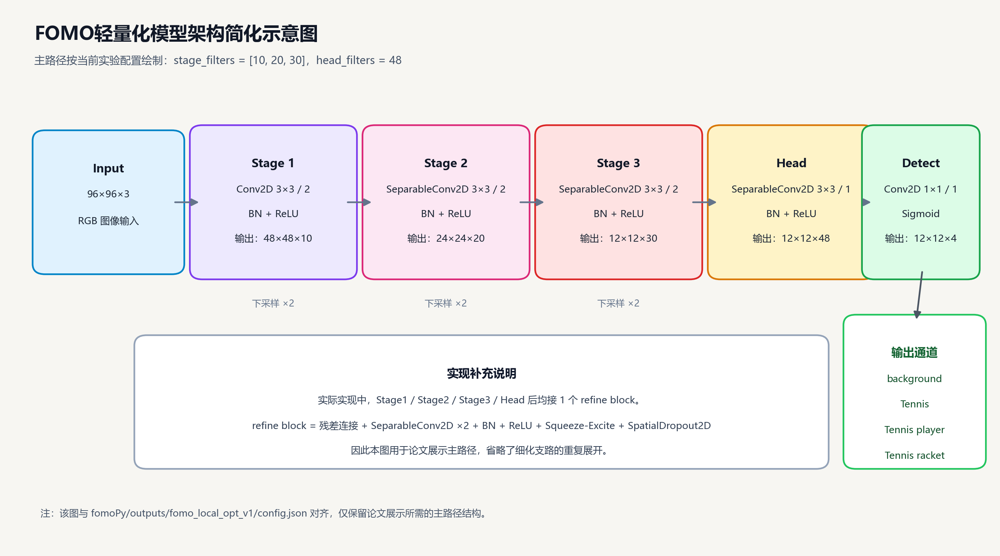

**本科生毕业设计****(****论文)**

**网球收练一体机设计与制作**

**——****机器视觉****系统设计**

** Design and Production of Tennis Training and Practice Integrated Machine**

**——Design of Machine Vision System**

| 学   院：  | 工业自动化学院 |
| ---------- | -------------- |
| 专   业：  | 机器人工程     |
| 学生姓名： | 杨心怡         |
| 学   号：  | 220410101337   |
| 指导教师： | 吴明友         |

2026年4月23日

**原创性声明**

本人郑重声明：所呈交的毕业设计（论文），是本人在指导老师的指导下独立进行研究所取得的成果。除文中已经注明引用的内容外，本文不包含任何其他个人或集体已经发表或撰写过的研究成果。对本文的研究做出重要贡献的个人和集体，均已在文中以明确方式标明。

特此申明。

本人签名：杨心怡             日 期： 2026年4月23日

**关于使用授权声明**

本人完全了解北京理工大学珠海学院有关保管、使用毕业设计（论文）的规定，其中包括：①学校有权保管、并向有关部门送交本毕业设计（论文）的原件与复印件；②学校可以采用影印、缩印或其它复制手段复制并保存本毕业设计（论文）；③学校可允许本毕业设计（论文）被查阅或借阅；④学校可以学术交流为目的,复制赠送和交换本毕业设计（论文）；⑤学校可以公布本毕业设计（论文）的全部或部分内容。

本人签名：杨心怡            日 期：2026年 4月23日

指导老师签名：                      日 期：     年   月   日

**[网球收练一体机设计与制作]()**

**——****机器视觉****系统设计**

**[摘　要]()**

在网球训练过程中，重复发球与人工捡球长期是两个彼此割裂的环节，训练节奏容易被频繁中断，单次训练中的有效击球时间也因此受到影响。针对这一问题，本文将机器视觉模块引入网球收练一体机，在原有机械结构和控制系统基础上，完成了面向网球识别任务的视觉子系统设计。系统硬件选用 OpenMV Cam H7 Plus，软件采用 MicroPython 进行开发，并结合 FOMO 轻量化目标检测方法对场地中的网球目标进行识别。考虑到室内外光照变化、地面颜色干扰以及目标尺寸较小等因素，识别过程中又引入了 LAB 色彩空间、图像预处理和霍夫圆检测，对检测结果进行辅助筛选和修正。

在系统实现中，视觉模块并不单独作为识别单元存在，而是与“网球收练一体机”的捡球模式和对打模式的执行逻辑共同工作。一方面，系统需要在画面中完成网球目标的检测，并依据图像位置关系计算出目标所在区域；另一方面，还要配合云台跟踪、串口通信等功能，为设备后续动作提供输入信息。调试结果表明，该方案能够在嵌入式平台上较稳定地完成网球识别与基本定位，满足“网球收练一体机”对视觉部分的设计要求。由此可见，轻量化机器视觉方法用于此类小型智能训练设备具有一定可行性，也为后续功能扩展提供了基础。

**关键词：****目标检测；****OpenMV；FOMO；网球识别**

**[Design and Production of Tennis Training and Practice Integrated Machine]()**

**——Design of Machine Vision System**

**[Abstract]()**

In the process of tennis training, repeated ball serving and manual ball picking have long been separated from each other. The training rhythm is easily interrupted frequently, which affects the effective hitting time in a single training session. In order to solve this problem, this project introduces a machine vision module into the Tennis Training and Practice Integrated Machine, and completes the design of a vision subsystem for tennis ball recognition based on the original mechanical structure and control system. The system uses OpenMV Cam H7 Plus as the hardware platform, and the software is developed by MicroPython. At the same time, the lightweight FOMO object detection method is used to recognize tennis balls on the court. Considering the influence of indoor and outdoor light changes, ground color interference, and the small size of the target, LAB color information, image preprocessing, and circular feature analysis are also introduced in the recognition process to assist the screening and correction of detection results.

In the system implementation, the vision module does not work alone as a separate recognition unit, but works together with the execution logic of the ball-picking mode and rally mode of the Tennis Training and Practice Integrated Machine. On the one hand, the system needs to detect tennis ball targets in the image and determine the area where the target is located according to the image position relationship. On the other hand, it also needs to cooperate with pan-tilt tracking and serial communication to provide input information for the following actions of the device. The debugging results show that this scheme can complete tennis ball recognition and basic localization on the embedded platform in a relatively stable way, and can meet the design requirements of the visual part of the Tennis Training and Practice Integrated Machine. It can be seen that the lightweight machine vision method is feasible for this kind of small intelligent training equipment, and it also provides a basis for later function expansion.

**Key Words:** **Object detection;OpenMV; FOMO;** **Tennis**** ball recognition**

# **[目  录]()**

[第1章 前言 ](#_Toc29802 )

[1.1研究背景 ](#_Toc13873 )

[1.1.1本课题研究背景 ](#_Toc3099 )

[1.1.2本课题研究意义 ](#_Toc15123 )

[1.2国内外研究现状 ](#_Toc21687 )

[1.2.1国内研究现状 ](#_Toc10774 )

[1.2.2国外研究现状 ](#_Toc16715 )

[1.3本课题的研究内容和意义 ](#_Toc31523 )

[第2章 机器视觉设计方案 ](#_Toc16098 )

[2.1视觉系统总体方案设计 ](#_Toc4288 )

[2.1.1 视觉系统功能需求分析 ](#_Toc12553 )

[2.1.2 视觉系统硬件选型与方案论证 ](#_Toc1779 )

[2.1.3 视觉系统软件框架设计 ](#_Toc14227 )

[第3章 关键技术介绍 ](#_Toc19081 )

[3.1 OpenMv硬件平台 ](#_Toc12119 )

[3.2 MicroPython ](#_Toc17229 )

[3.3 数字图像处理基础 ](#_Toc11772 )

[3.3.1色彩空间 ](#_Toc28973 )

[3.3.2阈值分割 ](#_Toc30995 )

[3.3.3形态学操作 ](#_Toc7014 )

[3.4特征提取与目标识别算法 ](#_Toc15116 )

[3.5像素坐标与距离估算原理 ](#_Toc27179 )

[第4章 视觉系统硬件设计与搭建 ](#_Toc3275 )

[4.1硬件选型与参数 ](#_Toc18019 )

[4.1.1 OpenMv Cam H7 Plus 核心模块特性 ](#_Toc24805 )

[4.1.2 镜头的选择与视野计算 ](#_Toc30830 )

[4.2视觉模块机械结构设计 ](#_Toc1490 )

[4.2.1摄像头云台固定与调节机构 ](#_Toc1563 )

[第5章 视觉系统软件算法设计与实现 ](#_Toc24209 )

[5.1软件开发环境与流程 ](#_Toc4397 )

[5.1.1 数据集构建与类别划分 ](#_Toc11667 )

[5.1.2 训练环境与参数设置 ](#_Toc17183 )

[5.1.3 模型导出与部署流程 ](#_Toc27632 )

[5.2 网球识别算法设计 ](#_Toc30736 )

[5.2.1 模型选型考虑 ](#_Toc14118 )

[5.2.2 基于LAB色彩空间的自适应颜色辅助分割 ](#_Toc10744 )

[5.2.3图像预处理与边缘辅助 ](#_Toc29173 )

[5.2.4圆形检测与轮廓分析 ](#_Toc26260 )

[5.2.5多目标识别与干扰物过滤算法 ](#_Toc22817 )

[5.3网球空间定位与距离估算 ](#_Toc11695 )

[5.3.1相机标定与畸变校正 ](#_Toc4882 )

[5.3.2从小像素坐标到物理坐标的映射模型建立 ](#_Toc17072 )

[5.4捡球模式的算法设计 ](#_Toc14769 )

[5.5 对打模式的算法设计 ](#_Toc5011 )

[5.6人机交互页面设计 ](#_Toc6129 )

[5.6.1 OpenMv LCD屏实时画面与信息叠加显示 ](#_Toc10425 )

[第6章 软硬件联调 ](#_Toc24809 )

[6.1模型加载与推理程序的调试 ](#_Toc27702 )

[6.2 LCD 显示与串口输出的调试 ](#_Toc5221 )

[6.3捡球模式程序的调试 ](#_Toc19587 )

[6.4对打模式程序的调试 ](#_Toc9561 )

[结论 ](#_Toc7609 )

[参考文献 ](#_Toc22688 )

[附　录 ](#_Toc30153 )

[致　谢 ](#_Toc18147 )

# 第1章 **[前言]()**

## **[1.1]()****研究背景**

### **[1.1.1]()****本课题研究背景**

近年来，参与网球运动的人逐渐增多，但日常训练中一直存在一个比较实际的问题，就是发繁打断，击球节奏就很难保持，单次训练的有效时间也会受到影响。市面上的发球可以依靠发球机完成，捡球却大多还是靠人工。训练一旦被频球机虽然已经比较成熟，但多数产品仍然以发球功能为主，对场地中散落网球的识别和回收支持不够。

另一方面，嵌入式视觉平台和轻量化检测算法的发展，也为小型训练设备加入目标识别功能提供了条件。像 OpenMV 这类平台体积较小、功耗较低，比较适合安装在设备上；FOMO 模型结构相对轻，部署难度也更低，适合在算力有限的硬件上完成基础检测任务。

基于以上背景，本文围绕网球收练一体机的机器视觉系统展开设计，希望让设备不仅能够发球，还能够在一定程度上识别场地中的网球，为后续收球、定位和模式切换提供依据。

### **[1.1.2]()****本课题研究意义**

本课题的研究意义主要体现在以下三个方面。第一，通过视觉系统识别场地中的网球位置，引导设备完成后续收球动作，可以减少训练过程中反复捡球带来的中断，提高单人训练的连续性。第二，本课题尝试在 OpenMV 这类低成本、低功耗的平台上完成网球识别，能够对轻量化视觉方案在实际设备中的可用性进行验证。第三，视觉系统是后续功能继续扩展的基础，后面如果要做落点统计、轨迹分析或训练辅助，都需要先把识别和定位这一步做好。虽然当前系统还比较基础，但这部分工作对整机后续完善是有意义的。

## **[1.2]()****国内外研究现状**

### **[1.2.1]()****国****内研究现状**

从目前国内公开资料来看，和网球训练设备相关的研究大致可以分成两类：一类是以发球机为主的产品开发，另一类是面向网球识别的视觉算法研究。前者已经有一定的产业基础，以“斯波阿斯”“派尼尔”等品牌为代表的发球设备在发球速度、角度调节和基础控制方面做得比较成熟，能够满足一般训练需要。不过这类产品多数还是以发球功能为主，对于场地内散落网球的自主识别与回收，整体上还不够完善。

就视觉识别这一方向来看，国内真正开始系统做网球检测也是近几年的事。早些时候更常见的是颜色分割、背景差分、霍夫圆变换这类传统办法，这些方法写起来不难，但一旦遇到光照变化、背景杂乱或者地面反光，效果就容易波动。后来深度学习方法逐渐普及之后，才有更多工作开始尝试用 YOLO、SSD 之类的网络来提升检测效果。

但从工程应用角度看，国内不少研究仍然更多停留在 PC 端或者较高算力的平台上，真正面向小型、低功耗设备的方案还不算多。近几年随着 K210、OpenMV 这类嵌入式平台逐渐被更多人使用，轻量化部署开始受到重视，FOMO 这样的算法也因此有了实际应用价值。不过，把轻量化视觉检测、网球识别和收球机构控制结合起来做成一套完整系统的研究，当前仍然比较少见。

|  |
| - |
|  |

图1-1 国内代表性网球发球机产品示意图

### **[1.2.2]()****国外研究现****状**

相比之下，国外在智能网球训练设备方面起步更早，商业化程度也更高。一些产品已经不只是完成单一发球或收球功能，而是开始把视觉识别、数据统计和训练辅助结合起来。以 PlaySight 为例，其系统通过多摄像头对球场进行跟踪和分析，能够记录网球轨迹、运动员动作以及训练数据，整体功能比较完整，不过这类系统结构复杂、价格较高，通常更适合专业训练机构使用。

另一类比较有代表性的产品是 Tennibot。它更侧重于自动收球这一具体场景，能够在球场内自主移动并识别、捡拾网球。从这一点可以看出，国外在“视觉识别+移动执行”这一方向已经有了比较明确的产品落地。不过 Tennibot 的重点仍然是收球，本身并没有和发球系统直接做成一体化设备，因此在功能上和本课题关注的收练一体机还有一定区别。

从研究内容来看，国外除了做网球检测本身，也更重视轨迹预测、动作分析和训练数据反馈这些延伸方向。近几年，TensorFlow Lite Micro、Edge Impulse 这类工具逐步成熟，轻量化模型放到微控制器上运行也比以前更方便了。FOMO 就是在这样的背景下被更多人拿来做端侧检测的，它比较突出的特点是更适合低算力设备实时运行。总体上看，国外在这个方向上无论产品还是研究都更成熟，不过如果继续往低成本、小体积和收发一体化方向做，还是有改进空间。

|  |
| - |
|  |

图1-2 PlaySight Tennis SmartCourt示意图

|  |
| - |
|  |

图1-3 Tennibot 智能训练与收球设备示意图

## **[1.3]()****本课题的研究内容和意义**

本课题以网球收练一体机中的机器视觉系统为研究对象，重点完成网球识别、定位和端侧部署相关工作。本文的主要内容如下：

1、数据集构建与模型训练：采集不同光照和不同背景下的网球图像，完成网球、球员和球拍的人工标注；再将标注结果整理并转换为训练所需格式，在 PC 端完成 FOMO 轻量化模型训练和量化导出。

2、视觉系统硬件搭建：以 OpenMV 作为核心视觉处理单元，结合镜头选型、安装位置和支架结构设计，完成视觉模块的基本硬件搭建。

3、网球检测与定位算法实现：将训练好的模型部署到 OpenMV 端，实现网球目标的实时检测，并输出目标中心位置、网格区域和距离估计信息，为后续收球和模式切换提供输入。

4、系统集成与联调测试：将视觉系统与整机控制部分连接起来，在实际场地环境下完成程序调试，验证视觉模块在捡球模式和对打模式中的基本可用性。

# 第2章 **[机器视觉设计方案]()**

## **[2.1]()****视觉系统总体方案设计**

### **[2.1.1]()** **视觉系统功能需求分析**

视觉系统可以看作整机的“眼睛”，它不仅负责看见目标，还要把结果转成控制端能直接使用的信息。结合收练一体机的工作方式，本文认为视觉系统至少要满足以下几项需求：

1、网球检测与定位：系统需要能够较稳定地识别场地中的网球，并给出目标在画面中的位置。这是自动收球能够成立的前提。

2、球拍识别：在对打模式下，球拍并不是主要目标，但它可以作为发球触发的辅助条件，因此系统需要能够识别球拍是否出现在有效区域内。

3、人体追踪：在对打模式下，系统还要能够识别球员位置，并驱动二维云台让球员尽量保持在画面中心，便于后续发球控制。

4、多目标管理：在捡球模式下，场地里往往不止一个网球，系统需要对多个候选目标进行记录和筛选，并把相对更有价值的目标优先交给控制端处理。

5、状态显示与调试：视觉系统需要把识别结果、工作模式和部分位置信息显示出来，方便调试时直接观察系统是否运行正常。

6、实时性与稳定性：整机运行时不能等待过长时间，因此视觉部分需要兼顾处理速度和结果稳定性，并尽量适应室外光照变化带来的影响。

### **[2.1.2]()**** 视觉系统硬件选型与方案论证**

结合整机体积、供电条件和开发周期，视觉系统的硬件选择主要围绕图像采集单元、图像处理单元和云台执行单元三部分展开。

1、图像采集单元方案论证

图像采集部分首先要确定的是使用哪一种相机方案，前期主要比较了以下几种方案：

表2-1图像采集单元方案论证

| 方案             | 优点                                            | 缺点                                       | 适用性评估                         |
| ---------------- | ----------------------------------------------- | ------------------------------------------ | ---------------------------------- |
| USB摄像头        | 成本低，分辨率高，选择多样                      | 需要搭配上位机或开发板，体积较大，功耗较高 | 不适用于嵌入式小型化应用           |
| 树莓派Camera     | 成像质量好，与树莓派集成度高                    | 树莓派整体功耗较高，启动时间较长           | 适合复杂视觉任务，但功耗与体积偏大 |
| OpenMV集成摄像头 | 一体化设计，体积小，功耗低，MicroPython开发便捷 | 算力相对有限                               | 适合本课题轻量化检测需求           |

综合比较之后，本文最终选择 OpenMV Cam H7 Plus 作为图像采集和处理一体化平台。它集成了 OV5640 图像传感器，在功耗、体积和开发便捷性方面更符合本课题的需要，也能满足网球检测的基本成像要求。

2、图像处理单元方案论证

除了相机本身，还要确定由哪一个硬件模块来运行检测算法并输出结果。围绕这一点，本文比较了以下几种方案：

表2-2图像处理单元方案论证

| 方案           | 优点                                              | 缺点                           | 适用性评估                         |
| -------------- | ------------------------------------------------- | ------------------------------ | ---------------------------------- |
| 树莓派         | 算力强，支持复杂深度学习模型                      | 功耗高（约5W），体积大，启动慢 | 性能有余但资源浪费                 |
| Jetson Nano    | GPU算力强大，支持CUDA加速                         | 成本高，功耗较高，散热要求高   | 性能过剩，成本偏高                 |
| OpenMV H7 Plus | 功耗低（约1W），体积小，支持TensorFlow Lite Micro | 算力有限，仅支持轻量化模型     | 满足本课题需求，成本与功耗优势明显 |

由于本课题采用的是 FOMO 轻量化检测算法，对算力的要求没有高性能平台那样高，因此选择 OpenMV Cam H7 Plus 作为图像处理单元更合适。这样既能保证基本性能，也能兼顾低功耗和小型化。

3、云台执行单元方案论证

为了让相机既能扫描场地，也能跟随球员移动，视觉系统需要配备二维云台。围绕这一点，本文对比了以下几种驱动方案：

表2-3云台执行单元方案论证

| 方案            | 优点                         | 缺点                                 | 适用性评估                   |
| --------------- | ---------------------------- | ------------------------------------ | ---------------------------- |
| 直流电机+编码器 | 转速快，连续旋转             | 控制复杂，需要闭环控制，定位精度较低 | 不适用于精确定位需求         |
| 步进电机        | 定位精度高，开环控制简单     | 体积较大，功耗较高，易失步           | 适用于高精度定位，但体积偏大 |
| 舵机            | 控制简单，定位准确，集成度高 | 转角范围有限（通常180°）            | 满足本课题云台旋转范围需求   |

综合考虑控制方式、定位精度和安装空间，本文最终选用 MG996R 数字舵机作为云台驱动单元。该舵机扭矩较大，响应也比较快，能够带动相机完成水平和俯仰运动，而且 PWM 控制方式和 OpenMV 的接口兼容性较好。

### **[2.1.3]()**** 视觉系统软件框架设计**

按照本课题的设计思路，视觉系统主要要支持两种工作模式，即捡球模式和对打模式。两种模式都以 FOMO 检测结果为基础，但处理对象和执行逻辑并不一样。实际实现时，软件部分主要分为图像采集、目标检测、局部后处理、位置信息估算、云台控制、通信和模式管理几个模块。

1、捡球模式

捡球模式的主要任务是扫描场地、识别散落网球，并给控制端提供可用于执行的目标信息。系统进入该模式后，云台会按预设轨迹进行扫描，水平舵机负责左右摆动，俯仰舵机负责分层调整角度，使相机尽量覆盖前方场地。在扫描过程中，图像采集模块持续取图，检测模块同步完成网球识别。

当系统检测到网球时，并不会马上把它转换成完整场地坐标，而是先记录目标在图像中的中心位置、所在网格以及依据像素直径估算得到的距离。同时，显示模块会把这些结果叠加到画面上，方便调试时直接观察。扫描结束后，系统会从候选目标中选出更值得优先处理的对象，并通过通信模块把结果交给控制部分。

控制端接收到目标信息后，再驱动收球机构完成后续动作。也就是说，视觉部分在这里更像是先完成“发现目标”和“给出依据”，而不是直接负责整个路径执行。

|  |
| - |
|  |

图2-1 捡球模式工作流程图

2、对打模式

对打模式更关注球员跟随和发球触发。系统进入该模式后，会先持续检测画面中是否存在球员和球拍。当球员被识别到以后，云台控制模块根据目标在画面中的偏差调整水平和俯仰角度，让球员尽量保持在画面中央。

在跟随球员的同时，系统还会继续检测球拍。当球员处于有效视野内，且球拍满足触发条件时，视觉系统就通过通信模块向控制端发送发球指令。也就是说，在这一模式下，视觉部分主要负责“跟踪主体”和“给出触发条件”，而不是去做完整的场地坐标解算。

控制端收到信号后再完成发球动作。发球结束后，系统继续保持跟随状态，等待下一次触发，形成连续的对打训练过程。

|  |
| - |
|  |

图2-2 对打模式工作流程图

3、软件模块划分

为了便于后续修改和联调，软件部分采用了模块化设计，各模块功能如下：

表2-4模块功能

| 模块名称     | 主要功能                                             |
| ------------ | ---------------------------------------------------- |
| 图像采集模块 | 配置摄像头参数，获取实时图像帧                       |
| 目标检测模块 | 加载FOMO模型，执行目标检测与识别                     |
| 坐标变换模块 | 将图像坐标转换为场地实际坐标                         |
| 云台控制模块 | 控制水平与俯仰舵机运动，实现扫描与追踪               |
| 通信模块     | 与电控系统进行串口通信，收发控制指令与位置数据       |
| 显示模块     | 在显示屏上实时标注检测结果与系统状态                 |
| 模式管理模块 | 管理系统工作状态，实现捡球模式与对打模式的切换与调度 |

# 第3章 **[关键技术介绍]()**

## **[3.1]()****OpenMv硬件平台**

OpenMV可以看作是一种面向机器视觉应用的嵌入式平台，它把图像采集、图像处理和常用外设接口集中在一个较小的模块上，比较适合放在体积受限的设备里使用。对于本课题这种小型训练设备来说，它比传统“摄像头+上位机”的方案更容易集成。

本文选用的是 OpenMV Cam H7 Plus。该型号搭载 STM32H7 系列处理器，主频可达 480MHz，配有 1MB RAM 和 2MB Flash，并支持 OV5640 图像传感器。它的一个明显优点是可以直接运行 MicroPython 脚本，不需要额外搭建复杂的交叉编译环境，这对前期开发和调试都比较友好。同时，平台本身也提供了较多图像处理接口，并支持 TensorFlow Lite Micro，为后续部署 FOMO 模型提供了条件。

在整机应用中，OpenMV Cam H7 Plus 还提供 UART、I2C、SPI、GPIO 等常用接口，便于与控制系统连接。视觉模块识别到的目标信息可以通过串口实时发送给下位机，作为后续收球或发球控制的输入。

## **[3.2]()****MicroPython**

MicroPython是针对微控制器做过精简的 Python 实现。和标准 Python 相比，它保留了比较常用的语法和数据结构，同时把运行开销控制在较低水平，因此能在资源有限的嵌入式平台上运行。

OpenMV 选择 MicroPython 作为主要开发语言，这也是本文采用它的重要原因之一。对于本科阶段的项目来说，Python 上手相对容易，不需要一开始就深入到底层驱动，也可以先把图像采集、模型调用和串口通信这些关键功能搭起来。MicroPython 还提供交互式 REPL 环境，调试参数和排查问题时会方便很多。

另外，OpenMV 在 MicroPython 基础上已经封装了不少常用接口，例如 sensor、image 和 pyb 等。很多视觉相关操作都可以直接调用现成函数完成，这对前期验证很有帮助。本文也正是利用这一点，在较短时间内完成了图像采集、FOMO 模型加载、目标位置解算和串口发送等功能。虽然 MicroPython 的性能不如更底层的实现方式，但对本课题目前的任务规模来说已经够用。

## **[3.3]()****数字图像处理基础**

### **[3.3.1]()****色彩空间**

色彩空间本质上是描述颜色的一种方式，不同色彩空间适合处理的问题也不一样。常见的 RGB、HSV 和 LAB 都可以用于图像分析，但各自关注的重点不同。RGB 更接近原始图像输入，HSV 常用于颜色分割，LAB 则把亮度和色度分得更开，在光照变化比较明显时往往更方便做局部分析。

结合当前系统的实现，系统在模型输入端使用的仍然是原始 RGB 图像，而在候选目标的后处理阶段，主要使用的是 LAB 色彩空间。程序会先围绕 FOMO 给出的网球候选中心截取局部 ROI，再通过 build_tennis_color_threshold() 统计该区域的 LAB 信息，得到动态阈值范围。这样做不是为了替代神经网络检测，而是希望在复杂光照下给后续的颜色验证、直径估计和误检过滤提供更稳定的辅助依据。

图3-1

|  |
| - |
|  |

色彩空间示意图

### **[3.3.2]()****阈值分割**

阈值分割是一种比较常见的图像分离方法，简单理解就是把满足条件的像素留下来，把其余像素视为背景。按使用方式来看，阈值可以是固定的，也可以根据局部统计结果动态调整。固定阈值实现简单，但遇到光照波动时容易失效；自适应阈值虽然稍复杂一些，但在实际场景里通常更稳。

在本课题中，阈值分割并不是拿来做整幅图的独立检测，而是放在候选区域里做局部验证。对网球类别，程序先根据 FOMO 给出的参考中心和检测框生成局部 ROI，再调用 build_tennis_color_threshold() 得到 LAB 动态阈值，随后利用 find_blobs() 搜索符合颜色特征的色块。对于强反光区域，则通过亮度阈值统计高亮像素比例，用来判断当前区域是否受到明显干扰。

|  |
| - |
|  |

所以，本文中的阈值分割更多承担的是“辅助确认”和“辅助估计”这两个作用，而不是单独作为一个检测器去使用。它可以帮助系统更快判断局部区域里是否真的存在网球色块，也能给后续的直径估计和几何验证提供参考。

图3-2 网球阈值分割示意图

### **[3.3.3]()****形态学操作**

在实际场地里，影响网球识别的并不只有背景颜色，地面线条、阴影和局部反光也会带来不少干扰。因此，系统除了做颜色辅助之外，还加入了边缘检测和高亮抑制两个局部分析步骤。边缘检测主要用来判断候选区域里是否存在比较清晰的圆形边界，高亮抑制则是为了避免强光反射造成伪圆或者大面积误检。

程序中，estimate_edge_strength() 会先对 ROI 做灰度化，再执行 EDGE_CANNY 边缘提取，并把边缘图像亮度均值作为边缘强度指标；estimate_glare_ratio_pct() 则统计高亮像素比例，用来判断当前区域受反光影响的程度。随后，这两个量会一起参与霍夫圆检测阈值和半径范围的调整。

因此，从当前实现方式来看，本课题在这一环节更重视的是“局部候选验证”和“轻量化几何分析”，而不是去做一整套传统形态学处理流程。这样更符合 OpenMV 平台的算力条件，也更贴近本课题的实际需要。

## **[3.4]()****特征提取与目标识别算法**

特征提取和目标识别是机器视觉里的核心环节，简单来说，就是要从图像里找出能够把目标和背景区分开的信息，再根据这些信息完成分类和定位。

较早的识别方法通常依赖人工设计特征，比如 HOG、SIFT、LBP 等，再配合 SVM 或 AdaBoost 这类分类器完成识别。这类方法计算量相对小，但对特征设计经验依赖比较强，遇到背景复杂、目标变化较大的情况时，往往不够稳定。

随着深度学习方法逐渐成熟，卷积神经网络开始在目标识别里占据主流位置。和传统依赖人工特征的方法相比，CNN 能够直接从标注数据中学习更合适的特征表示，因此在复杂场景下通常会更稳一些。YOLO、SSD 这类一阶段检测算法就是比较典型的代表。

不过，本课题最终并没有直接采用这类较重的检测器，而是选择了 FOMO 作为核心检测方案。FOMO 的思路不是直接回归目标边界框，而是把图像划分为较低分辨率的网格，让每个网格去判断其中心位置属于哪一类目标，再结合后处理恢复目标中心。这样做虽然表达能力不如大模型丰富，但参数量更小，更适合部署到 OpenMV 这类资源有限的平台上。

需要说明的是，在本系统里，FOMO 并不是最后一步。程序实际采用的是“FOMO 先给出候选目标，后面再接局部验证”的做法。具体来说，系统会先对 Tennis、Tennis player 和 Tennis racket 设置不同阈值；对网球类别再继续叠加 LAB 颜色验证、find_blobs() 色块筛选、边缘分析、霍夫圆检测、半径融合和平滑跟踪等步骤，以提高网球识别的稳定性。球员和球拍类别则主要保留类别和中心位置，作为云台跟踪和模式切换的输入。

|  |
| - |
|  |

图3-3 网球检测与后处理简化流程图

## **[3.5]()****像素坐标与距离估算原理**

视觉系统最先得到的目标信息其实只是图像里的像素坐标，但控制端真正关心的是两个更直接的问题：目标大概在画面的哪一块区域，以及它离摄像头有多远。结合当前系统的实现可以看出，本文并没有在 OpenMV 端去建立完整世界坐标系，而是采用了一种更轻量的表达方式：先提取目标中心，再换算所在网格，最后根据目标像素直径估算距离。

在位置表达上，程序通过检测框中心或者融合后的圆心得到目标像素坐标 (x, y)，然后调用 get_grid_position() 把它映射到预设网格 (row, col) 中。这样做虽然不能直接给出绝对场地坐标，但足以让控制逻辑快速判断目标大概处在左、中、右和远、近哪个区域。

在距离估算上，程序采用的是基于成像几何关系的单目近似方法。已知标准网球直径、镜头焦距、传感器宽度和图像宽度后，就可以先根据像素直径换算出目标在传感器上的成像尺寸，再反推出目标到摄像头的大致距离。为了让结果更稳，输入的像素直径并不是直接拿检测框宽高，而是综合颜色、边缘和霍夫圆等线索融合后得到。

因此，更准确地说，本文采用的是“像素坐标 + 网格位置 + 单目距离估算”的轻量化空间表达，而不是完整的场地坐标映射。这套表达方式虽然简单，但已经能够满足捡球模式和对打模式对位置信息的基本需求。

|  |
| - |
|  |

图3-4 位置与距离估算简化流程图

# 第4章 **[视觉系统硬件设计与搭建]()**

## **[4.1]()****硬件选型与参数**

### **[4.1.1]()****OpenMv Cam H7 Plus 核心模块特性**

OpenMV Cam H7 Plus 是本文视觉系统的核心模块。选择它的原因并不复杂，主要是它在体积、功耗、开发难度和基本算力之间比较均衡，比较适合本课题这种小型设备。该模块搭载 STM32H750 微控制器，采用 ARM Cortex-M7 内核，主频为 480MHz，同时带有 FPU 和 DSP 指令集，能够完成基础图像处理以及轻量化模型推理。芯片自带 1MB RAM 和 2MB Flash，这一点对量化后 FOMO 模型的运行比较关键。

在图像采集这部分，OpenMV Cam H7 Plus 使用的是 OV5640 图像传感器，最高分辨率可到 2592×1944。考虑到本课题更在意实时性而不是单纯追求高分辨率，实际运行时主要使用 320×240 和 640×480 两种配置。这样既能兼顾识别效果，也能把处理速度控制在可接受范围内。

另外，该模块原生支持 TensorFlow Lite Micro，能够直接加载量化后的轻量化模型，这也是本文能够把 FOMO 部署到端侧的重要前提。接口方面，OpenMV Cam H7 Plus 提供 UART、I2C、SPI 和 GPIO 等常用接口，本文主要使用 UART 与主控系统交换数据；模块自带的 SD 卡插槽也方便保存图像和调试日志，便于后续排查问题。

      

图4-1 OpenMv Cam H7 Plus

表4-1 OpenMV Cam H7 Plus主要技术参数

| 参数项       | 规格                             |
| ------------ | -------------------------------- |
| 处理器       | STM32H750，ARM Cortex-M7，480MHz |
| 内存         | 1MB RAM，2MB Flash               |
| 图像传感器   | OV5640，500万像素                |
| 最大分辨率   | 2592×1944                       |
| 接口类型     | UART、I2C、SPI、GPIO、USB等      |
| 供电电压     | 3.6V~5V                          |
| 工作电流     | 约250mA                          |
| 深度学习支持 | TensorFlow Lite Micro            |

### **[4.1.2]()** **镜头的选择与视野计算**

镜头的选择会直接影响视场范围、成像清晰度以及检测距离。对本课题来说，镜头不能只看分辨率，还要考虑整机安装空间、场地覆盖范围以及网球在画面中的最小成像尺寸。因此，在选型时重点参考了焦距、视场角、光圈和畸变这几个参数。

最终选用的是焦距为 2.8mm 的广角镜头，其视场角约为 120°。这样选择的原因很直接：收练一体机与地面的距离有限，如果视角太窄，前方场地覆盖不够；如果视角足够大，系统就更容易在较近安装距离下看到分散在不同位置的网球。2.8mm 焦距在保证视野较宽的同时，也能让目标在画面中保留基本的可识别尺寸。

为了判断该镜头是否适合本系统，还需要结合安装方式估算其实际覆盖范围。本文中，视觉模块计划安装在机身前端，距离地面高度约为 H=0.5m，镜头俯角约为 30°。根据几何光学原理，在给定镜头焦距  和图像传感器尺寸（OV5640传感器尺寸为1/4英寸，对角线约4.5mm）的情况下，水平视场角  和垂直视场角 可按以下公式估算：

其中 w 和 h 分别表示图像传感器的宽度和高度。按上述参数估算，在 2.8mm 焦距条件下，水平视场角约为 110°，垂直视场角约为 80°。在安装高度 0.5m、俯角 30° 的情况下，视觉系统能够覆盖前方约 0.5m 到 3.0m 的地面区域，宽度约为 2.5m，基本能够满足收球过程中对散球的观察需求。

表4-2镜头主要参数

| 参数项   | 规格  |
| -------- | ----- |
| 焦距     | 2.8mm |
| 现场角   | 120° |
| 光圈     | F2.0  |
| 镜头接口 | M12   |
| 畸变     | ＜5%  |

## **[4.2]()****视觉模块机械结构设计**

### **[4.2.1]()****摄像头云台固定与调节机构**

为了让 OpenMV 视觉模块既能扫描场地，也能跟随目标移动，本文为其设计了二维舵机云台。云台由水平舵机和俯仰舵机组成，分别负责左右转动和上下俯仰。水平舵机主要扩大横向扫描范围，俯仰舵机则根据目标远近调整拍摄角度。通过两个舵机配合，相机不仅能观察场地中的静态网球，也能在对打模式下持续跟随球员。

在结构上，云台主体采用 3D 打印件制作，以兼顾刚性和重量。水平舵机固定在底座位置，带动上层转台左右转动；俯仰舵机安装在上层支架两侧，负责相机固定架的上下摆动。相机固定架按照 OpenMV Cam H7 Plus 和 LCD 拓展板的尺寸进行设计，并通过螺丝固定，尽量保证图像采集过程中的稳定性。

在控制方式上，系统会根据目标相对图像中心的位置偏差，实时计算水平和俯仰两个方向需要调整的角度，再通过 PWM 信号驱动舵机动作。当目标偏离画面中心时，云台就自动进行修正，使目标重新回到视野中心附近。这一结构对捡球模式下的场地扫描和对打模式下的球员跟随都很重要。

图4-2 二维舵机云台

# 第5章 **[视觉系统软件算法设计与实现]()**

## **[5.1]()****软件开发环境与流程**

本系统的软件部分可以分成两端来看：一端是 PC 端训练与评估，另一端是 OpenMV 端部署与运行。PC 端主要负责数据整理、模型训练、量化导出和离线分析；OpenMV 端则主要负责模型加载、目标检测、结果显示以及云台控制。开发过程中使用的主要工具包括 Python、TensorFlow、OpenCV 和 OpenMV IDE。

### **[5.1.1 数据集构建与类别划分]()**

本课题所用数据集由本人结合实际场景自行采集。采集时尽量覆盖收练一体机可能遇到的拍摄条件，包括不同距离、不同角度以及不同光照下的场地图像，再对其中的目标做人工标注。为了方便后续端侧部署，类别划分与 OpenMV 端 labels.txt 保持一致，即 background、Tennis、Tennis player 和 Tennis racket 四类，其中 background 由训练流程自动生成。

按当前的数据整理结果统计，数据集一共包含 622 张图像，其中训练集 485 张，测试集 137 张。三类前景目标的标注框数量见表5-1。

表5-1 自采集数据集类别分布表

| 类别          | 训练集标注框数量 | 测试集标注框数量 | 总标注框数量 |
| ------------- | ---------------- | ---------------- | ------------ |
| Tennis        | 541              | 156              | 697          |
| Tennis player | 183              | 57               | 240          |
| Tennis racket | 62               | 40               | 102          |

从统计结果可以看出，当前数据集中网球类别数量明显更多，球员和球拍样本相对偏少。因此，现阶段实验的重点还是放在网球主检测链路能否跑通，以及 OpenMV 端能否稳定输出识别结果和中心位置信息。

### **[5.1.2 训练环境与参数设置]()**

本文采用本地 TensorFlow 训练流程完成 FOMO 风格轻量化网络的搭建与训练。当前实验对应的输出目录为 `fomoPy/outputs/fomo_local_opt_v1`，其配置文件表明：输入图像尺寸为 96×96，输出网格尺寸为 12×12，主干通道配置为 `[10,20,30]`，检测头通道数为 48，训练上限为 90 轮，批大小为 16。优化器采用 AdamW，初始学习率为 `1.2×10^-3^`，权重衰减为 `2×10^-4^`。损失函数采用加权 Focal BCE，并叠加 Dice 项；其中背景权重为 0.18，前景基础权重为 3.0，Focal 参数 γ 为 1.75，Dice 权重为 0.15，同时开启自动类别权重，以缓解前景网格稀疏和类别不均衡带来的影响。

本阶段采用的主要训练参数如表5-2所示。

表5-2 模型训练参数设置

| 参数项       | 数值                                              |
| ------------ | ------------------------------------------------- |
| 输入尺寸     | 96×96                                               |
| 输出网格     | 12×12                                               |
| 主干通道     | `[10,20,30]`                                       |
| 检测头通道   | 48                                                  |
| 训练轮数上限 | 90                                                  |
| 批大小       | 16                                                  |
| 优化器       | AdamW                                               |
| 初始学习率   | `1.2×10^-3^`                                        |
| 权重衰减     | `2×10^-4^`                                          |
| 背景权重     | 0.18                                                |
| 前景权重     | 3.0                                                 |
| Focal参数γ   | 1.75                                                |
| Dice权重     | 0.15                                                |
| 标签模式     | `soft-box`                                          |
| 自动类别权重 | 开启                                                |
| 数据增强倍率 | 2                                                   |
| 水平翻转概率 | 0.5                                                 |
| 数据增强方式 | 水平翻转、亮度、对比度、Gamma扰动、噪声与轻度模糊   |

考虑到 FOMO 的标签仍以目标中心映射到网格为基础，当前实现未采用大幅旋转、随机裁剪等强几何增强，而是以光度增强为主，仅保留不会破坏网格对应关系的水平翻转。同时，本实验使用 `soft-box` 标签模式，将目标中心及其邻域网格共同纳入监督，以增强模型对小目标中心区域的学习能力。

|  |
| - |
|  |

图5-1 训练过程学习率变化图

从 `training_history.json` 的记录还能看出，学习率并不是全程固定不变，而是随着验证损失变化逐步下降：第 1 至 11 轮保持 `1.2×10^-3^`，第 12 至 20 轮降为 `6×10^-4^`，第 21 至 24 轮进一步降为 `3×10^-4^`，第 25 至 28 轮降为 `1.5×10^-4^`。这种分阶段降学习率的做法，有利于模型前期较快收敛，并在后期以更小步长稳定细化参数。

### **[5.1.3 模型导出与部署流程]()**

训练完成后，系统会在指定输出目录中生成模型文件及相关辅助文件，用于后续训练、离线分析、本地推理调试以及嵌入式端部署。其中，不同格式的模型文件分别服务于继续训练、调试验证和设备部署等需求，标签文件则用于保证类别顺序与模型输出保持一致。根据当前实验结果统计，各导出文件体积整体较小，能够满足嵌入式端在存储与加载方面的要求。

综上，本系统的软件实现流程可概括为以下四个步骤：

① 数据采集与人工标注：采集网球场景图像，完成 Tennis、Tennis player 和 Tennis racket 三类目标标注。

② 数据整理与模型训练：利用本地脚本整理标签与数据配置文件，在 PC 端训练FOMO轻量化检测模型。

③ 模型量化与结果评估：导出 float32 与 int8 两种 TFLite 模型，并在测试集上完成离线评估。

|  |
| - |
|  |

④ 端侧部署与调试：将 int8 tflite 模型和 labels.txt 部署至 OpenMV ，结合后处理脚本完成目标显示、类别区分和云台跟踪调试。

图5-3 模型训练与部署流程图

## **[5.2]()****网球识别算法设计**

### **[5.2.1 模型]()****选型****考虑**

由于视觉系统最终要部署在 OpenMV 平台上，因此模型选择首先要考虑两个问题：一是能不能在资源有限的硬件上稳定运行，二是对画面中的小目标是否有基本识别能力。网球在图像里通常不大，场景中还可能同时出现多个目标。如果直接采用 YOLO、SSD 或 Faster R-CNN 这类常见检测器，虽然在高算力平台上效果不错，但模型体积和计算量都偏大，不适合当前端侧条件。

综合硬件条件和任务特点，本文最终选择 FOMO 作为核心检测方法。FOMO 把目标检测转成低分辨率网格上的分类问题，不再直接回归边界框，因此模型结构更紧凑，部署过程也更简单。对本课题这种“小目标识别 + 嵌入式部署”的任务来说，它更符合实际需求。

**5.2.1.1 FOMO算法原理与结构**

FOMO本质上是一种基于低分辨率网格的单阶段检测方法。和 YOLO、SSD 这类直接回归目标框的方法不同，FOMO 的思路更简单一些：先把输入图像映射成较小的二维网格，再让每个网格去判断自己的中心位置属于哪一类目标。本课题的训练配置为 12×12 网格，因此模型最后输出的是一个多通道热力图，而不是一组完整边界框。

在推理阶段，程序会先对热力图做阈值筛选，找出置信度较高的响应区域，再通过连通域分析把相邻响应合并，恢复出目标的中心位置。对网球这种在画面里通常比较小的目标来说，这种方法在结构上会更轻，也更方便放到 OpenMV 端运行。

结合当前训练脚本，本课题采用的 FOMO 风格网络结构如表5-3所示。为便于论文展示，表5-3给出的是当前模型的主路径简化结构示意：先通过几层卷积和深度可分离卷积完成下采样，再用 1×1 卷积得到最终的类别热力图；而在实际实现中，各阶段后还额外接入了残差细化模块，并引入了 squeeze-excite 与 SpatialDropout2D。这样的结构能够在保证基本输出分辨率的同时，把模型参数尽量压缩下来，便于后续做 int8 量化并部署到端侧。

从处理流程上看，FOMO 在本课题中的主要步骤可以概括为以下几项：

① 图像预处理。输入图像先统一缩放到固定尺寸，本课题使用的是 96×96。

② 特征提取与热力图输出。经过主干网络提取特征后，通过检测头得到多通道热力图。

③ 概率筛选。对热力图结果进行激活和阈值筛选，保留置信度较高的区域。

④ 中心恢复。结合连通域分析，把候选区域转换为目标中心点。

⑤ 后处理修正。再根据类别、面积和局部几何特征，对候选结果继续筛选。

表5-3 FOMO轻量化模型结构

| 层次   | 操作类型                    | 核大小/步长 | 输出尺寸   |
| ------ | --------------------------- | ----------- | ---------- |
| Input  | 输入层                      | -           | 96×96×3   |
| Stage1 | Conv2D + BN + ReLU          | 3×3 / 2     | 48×48×10  |
| Stage2 | SeparableConv2D + BN + ReLU | 3×3 / 2     | 24×24×20  |
| Stage3 | SeparableConv2D + BN + ReLU | 3×3 / 2     | 12×12×30  |
| Head   | SeparableConv2D + BN + ReLU | 3×3 / 1     | 12×12×48  |
| Detect | Conv2D + Sigmoid            | 1×1 / 1     | 12×12×4   |

其中，输出层的 4 个通道分别对应 `background`、`Tennis`、`Tennis player` 和 `Tennis racket`。表 5-3 仅列出了便于说明的主干与检测头主路径，未展开每个阶段后附加的残差细化模块、通道注意力和空间丢弃层。网络在前三个阶段完成 3 次下采样，使 96×96 输入图像最终映射到 12×12 检测网格；最后通过 1×1 卷积将每个网格位置映射为多类别概率输出，从而满足 FOMO 对小目标中心检测的要求。

图5-1 FOMO轻量化模型架构简化示意图

**5.2.1.2 FOMO的优点与本项目适配性**

结合当前硬件条件，FOMO 更适合作为本系统的检测算法。它的模型规模相对小，部署到 OpenMV 端更容易；输出方式又是网格形式，对画面中占比较小的网球目标更友好；而且它给出的候选结果也便于继续接入颜色辅助、圆形检测和轨迹管理等后处理模块。从工程实现角度看，FOMO 和本课题现阶段的需求是比较匹配的。

**5.2.1.3 不选用YOLO、SSD等传统检测器****的原因**

YOLO、SSD 等方法在通用目标检测任务中确实很常见，但对本课题当前使用的 OpenMV 平台来说并不是最合适的选择。主要原因在于这类模型通常更大、计算量更高，部署过程也更复杂。再加上网球目标本身较小，如果继续采用锚框式检测，往往还需要更细的参数调整和更多算力支持。

因此，本文并不是否定 YOLO、SSD 这类方法本身，而是根据当前硬件条件做了更实际的取舍。相比之下，结构更轻、部署更直接的 FOMO 更符合本课题这一阶段的实现目标。

**5.2.1.4 FOMO在本项目的工程实现**

本项目中，FOMO 的工程实现大致分为四步：先整理数据，再完成模型训练，随后导出量化模型，最后部署到 OpenMV 端。训练阶段在 PC 端使用 TensorFlow 完成，优化器采用 AdamW，损失函数为加权 Focal BCE 并叠加 Dice 项；数据增强包含水平翻转、亮度、对比度、Gamma 扰动、噪声和轻度模糊。当前实验结果保存在 fomoPy/outputs/fomo_local_opt_v1 目录中，训练上限设为 90 轮，但在 EarlyStopping 作用下提前结束。训练完成后导出 keras、float32 tflite 与 int8 tflite 等格式，分别用于离线分析和端侧运行。

训练损失曲线如图5-2所示。结合 training_history.json 的记录可以看到，本次实验虽然按 90 轮配置，但在 EarlyStopping 作用下实际于第 28 轮停止。训练损失由 0.2553 下降到 0.1088，验证损失由 0.3066 下降到 0.1766；最佳验证损失出现在第 16 轮，为 0.1713。由于 EarlyStopping 开启了 restore_best_weights，最终导出的模型会回退到最佳验证损失对应的权重。整体来看，训练损失和验证损失均呈先快后缓的下降趋势，说明当前模型已经基本收敛。

|  |
| - |
|  |

图5-2 训练与验证损失曲线

模型导出后，本文主要结合训练损失变化和端侧联调效果来判断模型是否可用。由于当前数据集中球员和球拍样本相对较少，分类别离线指标的波动比较大，因此这里不再单独展开列出相关评估表，而把重点放在模型能否顺利部署到端侧，以及对网球主目标的识别是否稳定。

从训练过程看，损失曲线整体下降，说明模型已经收敛到较稳定的状态；从部署效果看，当前模型已经能够在 OpenMV 端完成网球的基本识别，并与后续颜色辅助、圆形检测和轨迹管理模块配合工作。对本课题来说，现阶段更重要的是先把“能检测、能定位、能联动”这条主链路建立起来，后面再继续补充样本并提高复杂场景下的稳定性。

端侧部署流程如下：

① OpenMV端实时采集图像，并按模型输入要求完成缩放与预处理。

② 将图像输入FOMO模型，得到多通道概率热力图输出。

③ 对热力图结果进行阈值筛选和连通域分析，恢复候选目标中心点。

④ 根据不同类别调用不同的后处理逻辑，其中网球类别进一步叠加颜色辅助、圆形检测与半径平滑策略。

⑤ 将检测结果实时叠加到OpenMV IDE或LCD显示画面中，并输出目标类别、中心位置和距离等信息，辅助后续调试。

需要说明的是，当前系统中的端侧后处理并不只是简单的连通域提取，而是围绕网球类别额外做了一套工程增强链路，主要包括以下几个部分：

① 类别分离阈值：对 Tennis、Tennis player 和 Tennis racket 分别设置不同置信度阈值，避免统一阈值下的误检放大。

② 坐标还原与候选框生成：在FOMO输出热力图上进行blob搜索，并根据输入ROI缩放关系把检测框恢复到原图坐标系。

③ 网球专用后处理：仅对 Tennis 类别调用颜色辅助、圆形检测、半径融合、距离估算与轨迹管理，从而减少无关类别干扰。

④ 多类别联动：对 Tennis player 和 Tennis racket 保留独立检测结果，并将其作为后续对打模式状态切换和云台控制的输入条件。

因此，当前系统的部署逻辑可以概括为：FOMO 热力图检测负责提供候选目标，系统中的后处理模块再完成候选验证、尺寸修正、时序稳定和模式联动，两者合起来才构成完整的端侧视觉实现。

### **[5.2.2 基于LAB色彩空间的自适应颜色辅助分割]()**

在当前实现中，颜色辅助不是拿来单独做检测的，而是放在 FOMO 检测之后做局部验证。具体做法是先以 FOMO 给出的网球候选中心为参考，在附近截取局部 ROI，再对该区域的 LAB 颜色统计量进行分析，根据 L、A、B 三个通道的均值和标准差生成动态阈值，随后调用 find_blobs 完成局部颜色分割。

在系统中，这一过程主要由 build\_tennis\_color\_threshold() 和 estimate_color_blob() 两个函数完成。前者用来生成动态阈值，后者则在 ROI 内搜索候选色块，并结合面积、中心距离、长宽比以及是否覆盖参考中心等条件做综合判断，从中挑出更接近网球特征的区域。

之所以选用 LAB 而不是固定的 RGB 或 HSV 阈值，主要还是因为 LAB 对亮度和色度的分离更清楚，在强光、阴影和局部反光条件下更容易做自适应调整。需要强调的是，颜色辅助模块并不直接决定目标类别，它更多是和 FOMO 输出一起参与网球直径和位置的估计，从而提高后续圆形检测和距离估算的稳定性。

### **[5.2.3]()****图像预处理与边缘辅助**

为了让小球在复杂场景里更容易被分离出来，系统并没有采用很重的全图预处理，而是优先在候选区域里做轻量化分析。程序会先根据 FOMO 输出构建局部 ROI，只在这一小块区域内进行边缘检测和高亮分析，这样既能减少额外计算，也更贴合端侧平台的处理能力。

在系统中，边缘和高亮分析分别由 estimate_edge_strength() 和 estimate_glare_ratio_pct() 完成。前者对 ROI 灰度图执行 Canny 边缘检测，并把边缘图像亮度均值作为边缘强度指标；后者统计 ROI 中高亮像素所占比例，用于判断当前区域是否存在明显反光。边缘强度和高亮比例随后会共同影响霍夫圆检测的阈值设置，以及直径融合时对异常大圆的抑制策略。

为了减少连续帧之间的抖动，系统还加入了半径平滑和半径锁定机制。对于同一个网球目标，程序会记录最近若干帧的半径估计结果，并通过去极值平均和跳变约束来抑制突变。当检测结果受反光或遮挡影响出现异常波动时，系统更倾向于保持上一时刻的平滑结果，而不是直接采用当前帧数值。这样能够在不明显增加运算量的情况下，提高尺寸估计和距离输出的连续性。

### **[5.2.4]()****圆形检测与轮廓分析**

网球本身具有比较明显的圆形特征，因此在颜色分割之外，引入几何特征分析是有必要的。单靠颜色信息时，背景杂色、地面反光和局部遮挡都可能导致误检或漏检；如果再加入边缘和圆形信息，识别结果通常会更稳一些。

在本系统中，Canny 边缘检测主要用来提取候选区域中的边缘轮廓，而霍夫圆变换（Hough Circle Transform）则负责在这些边缘信息基础上继续寻找更符合网球特征的圆形结构。为了减少不必要的计算，程序不会在整幅图上直接搜索，而是以 FOMO 候选框为中心适当扩展 ROI，只在更可能存在网球的区域里做边缘和圆形分析。

在系统中，霍夫圆变换由 estimate_hough_circle() 实现。该函数会根据边缘强度和高亮比例动态调整阈值，并围绕参考半径设置搜索范围。当高亮比例偏高时，系统会自动收紧可接受的半径上限，以减少反光造成的伪圆。检测到多个候选圆后，程序还会结合圆心与参考中心的距离、圆半径和预估半径之间的偏差等信息进行综合评分，从中选出更可靠的结果。

另外，程序并不是直接拿霍夫圆的结果当最终直径，而是通过 estimate_tennis_diameter() 把颜色分割和霍夫圆两条线索进一步融合：两者接近时取加权结果，差异较大时取更稳妥的一侧，如果都不可用则退回到基于检测框尺寸的保守估计。之后再通过 fuse_tennis_radius() 和 smooth_ball_radius() 对结果继续修正和平滑。这样做的目的，就是尽量在实时性和稳定性之间取得平衡。

### **[5.2.5]()****多目标识别与干扰物过滤算法**

在实际场景里，画面中经常不只出现一个网球，还可能混有球拍、地面标线、光斑等干扰物。单纯依赖单帧检测结果，往往很难在复杂场景下保持稳定。因此，本系统在检测之后还加入了多目标管理和干扰过滤机制。

在系统中，多目标处理并不是靠单帧排序完成，而是通过 match_tennis_track() 和 age_and_prune_tracks() 维护一个轻量级轨迹集合。当前帧检测到的网球会和历史轨迹按照最近邻原则进行匹配，匹配门限还会根据目标尺寸动态调整；如果某条轨迹在连续若干帧里都没有再匹配到目标，系统就把它清除掉，避免轨迹数量不断累积。

与此同时，程序对不同类别目标采用了不同策略：网球类别进入轨迹维护和距离估算流程，球员类别主要保留中心位置用于云台跟踪，球拍类别则作为对打模式中发球触发的一部分。和只依赖单帧检测的方法相比，这种做法能更好地区分目标身份，也能减少 ID 频繁跳变的问题。虽然它不像 Kalman 滤波、SORT 或 DeepSORT 那样复杂，但实现简单、计算开销小，更适合当前 OpenMV 平台的条件。

|  |
| - |
|  |

图5-4 网球后处理流程图

## **[5.3]()****网球空间定位与****距离估算**

### **[5.3.1]()****相机标定与畸变校正**

严格来说，相机标定通常包括内参、畸变系数以及安装姿态等内容。但从当前系统的实现来看，本文在 OpenMV 端并没有加入完整的棋盘格标定和实时畸变校正，而是采用了更轻量的办法：固定镜头参数、固定安装姿态，并统一输入窗口尺寸，以保证像素测量和距离估算过程尽量保持一致。

当前程序中直接参与空间估算的关键参数主要包括镜头焦距 FOCAL_LENGTH_MM = 2.8 mm、标准网球直径 TENNIS_DIAMETER_MM = 67 mm、OV5640 传感器宽度 SENSOR_WIDTH_MM = 4.896 mm，以及 240×240 的输入窗口尺寸。也就是说，系统在工程实现上采用的是“已知镜头参数 + 固定安装条件”的简化标定思路，而不是在每次运行时重新进行相机求参。

虽然当前版本没有在端侧实现完整畸变校正，但对本课题来说，这种处理方式是可以接受的。原因在于，视觉系统主要输出的是目标中心、网格位置和近似距离，而不是高精度的三维测量结果；同时，相机安装位置和姿态基本固定，也能够减小额外误差。如果后续确实需要提高测距精度或建立更完整的场地映射关系，还可以在此基础上补充离线棋盘格标定流程。

### **[5.3.2]()****从小像素坐标到物理坐标的映射模型建立**

空间定位的关键，是把检测得到的网球像素信息转成更有物理意义的表达。当前系统采用的不是完整世界坐标系，而是一种更轻量的办法：先得到目标中心，再换算成所在网格，最后利用像素直径估算距离。换句话说，系统更关注“球在画面哪个区域”和“球离摄像头大概多远”。

在位置表达上，程序先通过 FOMO 检测框或融合后的圆心位置得到目标中心 (x, y)，然后调用 get_grid_position() 将其映射到预设的 9×12 网格中。这样控制端就不需要直接处理连续像素坐标，而是可以利用 (row, col) 更方便地判断目标位于画面的左、中、右和远、近区域。

在距离估算上，程序通过 estimate_distance() 按照成像几何关系进行单目近似计算。基本思路是先根据传感器宽度和图像宽度求得单像素对应的物理尺寸，再由目标像素直径换算出其在传感器上的成像尺寸，最后结合焦距和标准网球真实直径反推出摄像头到网球的距离。为了让结果更稳定，程序不会直接拿检测框宽高作为最终直径，而是先由 estimate_tennis_diameter() 融合颜色、边缘和霍夫圆等线索，再通过 fuse_tennis_radius()、smooth_ball_radius() 和 correct_tennis_distance() 做进一步修正。

因此，从实现方式来看，本文已经建立起“中心位置提取 - 网格映射 - 直径估算 - 距离修正”这一整套轻量链路。虽然它还不是严格意义上的高精度测量系统，但对捡球模式下的目标筛选和对打模式下的视线对准来说，已经具有实际使用价值。

|  |
| - |
|  |

图5-5 网球空间信息计算流程图

## **[5.4]()****捡球模式的算法设计**

捡球模式的基本流程可以概括为“先扫描，再锁定，然后跟踪，最后触发”。结合系统的状态机来看，这一模式内部又分成 PICK\_SCAN 和 PICK_TRACK 两个子状态：前者负责主动搜索目标，后者负责对已经选中的目标进行持续跟踪和居中控制。系统上电后默认进入 MODE_PICK，并先从扫描状态开始运行。

在 PICK\_SCAN 状态下，水平云台按照 scan_direction 和 scan_speed 的设定来回摆动，摄像头则在扫描过程中持续完成 FOMO 推理、网球后处理和距离估算。扫描期间，程序会在所有检测到的网球中挑选当前更值得优先处理的候选目标。结合代码实现，优先级主要参考目标距离和轨迹稳定性：如果同一时刻出现多个网球，系统会更倾向保留距离较近、中心更稳定的那个，并把它记录为 best_scan_tennis。

当扫描到边界且候选目标已经比较明确时，系统就会把相应轨迹 ID 记为 locked_tennis_id，并从 PICK_SCAN 切换到 PICK_TRACK。进入跟踪状态后，云台不再继续大范围搜索，而是根据目标中心与图像中心的偏差，通过 PID 持续调整水平和俯仰角度，让网球尽量停留在画面中央。当前 PID 参数设置相对保守，主要是为了优先保证跟踪过程稳定，减少目标因为过冲而丢失。

随着跟踪持续进行，程序会根据当前估计距离判断目标是否已经进入可执行范围；如果满足条件，就通过控制标志向下位机发送捡球触发信息。本轮动作完成后，系统清空当前锁定目标，再重新回到扫描状态，继续寻找下一个网球。可以看出，捡球模式并不是简单地“看见球就去捡”，而是通过状态切换把搜索、筛选和触发这几个过程串联起来。

|  |
| - |
|  |

图5-6 捡球模式的工作流程图

## **[5.5]()** **对打模式的算法设计**

对打模式主要围绕球员识别、球拍检测和发球触发展开。结合当前程序结构，该模式对应 MODE\_PLAY，内部又分成 PLAY_TRACK_PLAYER 和 PLAY_WAIT_SERVE 两个子状态。前者负责寻找并锁定球员主体，后者则是在完成跟踪之后等待球拍触发发球。

系统进入对打模式后，会先在当前帧所有 Tennis player 检测结果中筛出更适合作为跟踪主体的对象。当前实现中，程序优先选择更接近图像中心的球员目标，并把它的中心位置作为云台跟踪参考。随后，水平和俯仰舵机通过 PID 进行微调，让球员尽量保持在画面中央。这样的做法实现相对简单，也更适合当前 OpenMV 平台下的嵌入式视觉伺服。

在 PLAY\_TRACK\_PLAYER 状态下，如果球员被连续检测到并完成基本跟踪，系统就继续观察当前帧中是否出现 Tennis racket。当球拍被识别到时，程序会把它作为发球触发的辅助信号，并进入等待发球或直接触发发球的流程。同时，系统还利用 balls_served 和 target_balls 对当前轮次的发球次数进行计数。若尚未达到设定次数，则继续保持跟踪并等待下一次触发；若已达到设定上限，则切回捡球模式，开始下一轮任务。

所以，对打模式的关键并不在于复杂动作识别，而是在于“球员提供跟踪主体，球拍提供触发条件，状态机负责切换逻辑”这一配合关系。对当前实验系统来说，这已经能够把从人物锁定到发球控制的基本链路打通。

|  |
| - |
|  |

图5-7 对打模式的工作流程图

## **[5.6]()****人机交互页面设计**

### **[5.6.1]()****OpenMv LCD屏实时画面与信息叠加显示**

系统会在 OpenMV 的 LCD 屏上实时显示摄像头画面，并在原始图像上叠加检测结果、空间位置信息和当前运行状态。这样做的目的主要不是为了展示界面效果，而是为了在调试时能直接看出系统是否工作正常。不同类别目标会采用不同的可视化标记方式，便于快速区分网球、球员和球拍。

从系统的实现来看，几类目标的显示分工比较明确。对 Tennis 类别，系统根据融合后的球心和半径绘制圆形标记，同时显示网格编号和距离估计；对 Tennis player 类别，系统使用固定大小圆圈来突出其“跟踪主体”的作用；对 Tennis racket 类别，则绘制矩形框，用来强调它在对打模式里主要承担触发条件的角色。这样的显示方式虽然简单，但在联调时已经足够清晰。

除了目标标记外，系统还在画面中叠加辅助网格，用来帮助观察目标处于画面哪个区域。与此同时，串口会输出 kind、id、g_id 和 distance_cm 等结构化数据，方便上位机记录和分析。实际使用时，LCD 和串口并不是彼此独立的两个通道，而是形成了“现场观察 + 数据校验”的双重反馈：LCD 适合快速判断画面显示和跟踪是否正常，串口则更适合做连续结果记录和离线排查。

# 第6章 **[软硬件联调]()**

## **[6.1]()****模型加载与推理程序的调试**

模型加载与推理调试首先要解决模型能否在 OpenMV 端正常运行，其次才是输出结果是否稳定。调试时，先把模型文件、标签文件和脚本文件部署到设备中，确认 OpenMV 能够正确加载 fomo_like_int8.tflite 和 labels.txt；随后再在 IDE 中实时观察检测结果，逐项检查类别阈值是否生效、类别顺序是否和训练端一致，以及输入窗口设置是否和训练配置保持统一。

这一阶段主要排查的问题包括模型加载失败、类别顺序错乱、候选目标中心偏移以及阈值过高导致的漏检。通过反复对比本地分析结果和端侧显示效果，并对 Tennis、Tennis player 和 Tennis racket 的阈值做逐步调整，最后确定了更适合当前部署版本的参数配置。调试结果说明，量化后的 int8 tflite 模型已经能够在 OpenMV 端稳定完成推理，并输出后续后处理模块可用的候选目标信息。

在这一阶段，还确认了两个不能忽视的问题：一是量化模型的类别顺序必须和 labels.txt 一一对应，否则即便模型能跑，类别解释也会出错；二是输入窗口设置必须和训练时保持一致，尤其 240×240 的裁剪窗口与 96×96 模型输入之间的缩放关系不能随意改动，不然候选框映射回原图时就容易产生偏差。

## **[6.2]()****LCD****显示与串口输出的调试**

在模型推理能够稳定运行之后，继续对 LCD 显示和串口输出进行联调。LCD 部分主要检查图像显示是否流畅、目标标记是否越界、不同类别的绘制方式是否正确，以及网格编号、距离信息和状态信息能否稳定叠加到画面上。串口部分则重点验证检测结果能否按约定格式发送给控制端，并观察在连续检测、多目标切换和模式切换过程中是否存在乱码、丢帧或明显延迟。

从实际联调过程来看，LCD 和串口输出并不只是单纯“把结果显示出来”，它们其实是整个视觉系统最直接的观察窗口。通过屏幕上的圆圈、矩形框、网格坐标和距离文本，可以比较快地判断后处理是否稳定；通过串口输出的结构化数据，则可以进一步确认视觉模块是否已经能够向下位机持续提供有效控制信息。调试结果表明，这一信息输出链路已经能够较稳定地支撑后续的捡球模式和对打模式联调。

## **[6.3]()****捡球模式程序的调试**

## **[6.4]()****对打模式程序的调试**

# **[结论]()**

本文围绕网球收练一体机中的机器视觉系统完成了数据采集、模型训练、模型量化、端侧部署以及整机联调等工作。系统以 OpenMV Cam H7 Plus 为硬件平台，以 FOMO 轻量化检测算法为主要识别方法，并结合 LAB 颜色辅助、边缘检测、圆形特征分析和轨迹维护等处理手段，基本搭建起一条适合嵌入式平台运行的网球识别流程。

从实际调试情况来看，当前系统已经能够在 OpenMV 端完成网球目标的基本检测，并输出目标位置、网格区域和距离估计等信息，同时能够与捡球模式、对打模式形成基本联动。对于本科毕业设计而言，能够把模型训练、端侧部署和整机调试完整串起来，说明本课题的视觉部分已经达到了预期的设计目标。

当然，系统还有一些不足。比如在复杂背景、强反光和多目标同时出现的情况下，识别结果还不够稳定；目前的空间表达也还是以像素坐标和距离估算为主，后续还可以继续完善场地坐标映射方法。另外，数据集规模仍然有限，后面如果继续补充样本并优化参数，系统效果还有进一步提升的空间。

总体来看，本课题验证了轻量化视觉算法在 OpenMV 这类低功耗平台上的应用可行性，也为网球收练一体机后续继续完善提供了基础。通过这次设计，我对嵌入式视觉系统从训练到部署的完整流程有了较为直观的认识，这也说明边缘端机器视觉在小型体育训练设备中具有一定的工程应用价值。

# **[参考文献]()**

[1] 张永刚. 中国网球运动与捷克网球运动发展的对比研究[J]. 当代体育科技, 2015, 5(1): 11-12.

[2] 刘玲, 靳伍银, 王洪建. 基于STM32自动网球拾取机器人设计[J]. 南京信息工程大学学报(自然科学版), 2020, 12(5): 609-613.

[3] 肖华, 黄河, 谢模焱. 全方位移动式网球机器人的研究与设计[J]. 机电工程, 2015, 32(4): 509-515.

[4] 汪洋. 网球技术训练的要点分析[J]. 拳击与格斗, 2025(2): 59-61.

[5] 夏胜杰, 杨昊, 艾伟清. 基于Arduino单片机和OpenMV的颜色目标定位与跟踪小车的设计与实现[J]. 常熟理工学院学报, 2021, 35(5): 59-64.

[6] 李加定, 缪文南. 基于OpenMV的智能送药小车的设计[J]. 电子设计工程, 2024, 32(2): 162-166.

[7] 黄家驹, 陆江华, 张睿哲, 等. 基于OpenMV的口罩检测系统设计与实现[J]. 电子制作, 2023, 31(17): 65-68.

[8] 刘义亭, 董梦超, 黄家才, 等. 基于OpenMV的目标跟踪系统设计[J]. 南京工程学院学报(自然科学版), 2019, 17(1): 39-44.

[9] Yang W, Lu L, Li Q, Zhang X, Zhao Y. Deep Learning-Based Algorithm for Recognizing Tennis Balls[J]. Applied Sciences, 2022, 12(23): 12116.

[10] Zhao Y, Lu L, Yang W, Li Q, Zhang X. Lightweight Tennis Ball Detection Algorithm Based on Robomaster EP[J]. Applied Sciences, 2023, 13(6): 3461.

[11] Rocha S, Pinto M F, Biundini I Z, Melo A G, Marcato A L M. Analysis of tennis games using TrackNet-based neural network and computer vision[J]. Signal, Image and Video Processing, 2022, 17: 827-835.

[12] 林广茂, 王天雷, 招展鹏, 陈文德, 林海斌. 基于视觉识别的全自动网球拾取机器人设计[J]. 机电工程技术, 2017, 46(3): 80-84.

[13] 庄琼云. 基于OpenMV的智能寻迹小车设计与实现[J]. 黎明职业大学学报, 2018(4): 80-84.

[14] 刘义亭, 董梦超, 黄家才, 范子霄, 宗文锦, 郭婧. 基于OpenMV的目标跟踪系统设计[J]. 南京工程学院学报(自然科学版), 2019, 17(1): 39-44.

[15] 蒋恋华, 甘朝晖, 蒋旻. 多目标跟踪综述[J]. 计算机系统应用, 2010, 19(12): 271-275.

[16] 陈旭, 孟朝晖. 基于深度学习的目标视频跟踪算法综述[J]. 计算机系统应用, 2019, 28(1): 1-9.

[17] 韩晓微, 王雨薇, 谢英红, 齐晓轩. 基于深度学习的客流量统计方法[J]. 计算机系统应用, 2020, 29(4): 24-31.

[18] 陆峰, 刘华海, 黄长缨, 杨艳, 谢禹, 刘财喜. 基于深度学习的目标检测技术综述[J]. 计算机系统应用, 2021, 30(3): 1-13.

[19] 秦泽宇, 黄进, 杨旭, 郑思宇, 付国栋. 基于注意力机制和卡尔曼滤波的多目标跟踪[J]. 计算机系统应用, 2021, 30(12): 128-138.

[20] 付苗苗, 邓淼磊, 张德贤. 深度神经网络图像目标检测算法综述[J]. 计算机系统应用, 2022, 31(7): 35-45.

[21] 党媛媛, 华侨, 陈兆学. 基于灰度积分投影与霍夫圆变换算法的人眼瞳距自动检测[J]. 计算机系统应用, 2022, 31(7): 259-264.

[22] 陈云芳, 吴懿, 张伟. 基于孪生网络结构的目标跟踪算法综述[J]. 计算机工程与应用, 2020, 56(6): 10-18.

[23] 张瑶, 卢焕章, 张路平, 胡谋法. 基于深度学习的视觉多目标跟踪算法综述[J]. 计算机工程与应用, 2021, 57(13): 55-66.

[24] 杨锋, 丁之桐, 邢蒙蒙, 丁波. 深度学习的目标检测算法改进综述[J]. 计算机工程与应用, 2023, 59(11): 1-15.

[25] 苗宗成, 高世严, 贺泽民, 欧渊. 基于孪生网络的目标跟踪算法[J]. 液晶与显示, 2023, 38(2): 256-266.

[26] Huang Y C, Liao I N, Chen C H, Ik T U, Peng W C. TrackNet: A Deep Learning Network for Tracking High-speed and Tiny Objects in Sports Applications[EB/OL]. arXiv:1907.03698, 2019. DOI: 10.48550/arXiv.1907.03698.

[27] Smeulders A W M, Chu D M, Cucchiara R, Calderara S, Dehghan A, Shah M. Visual Tracking: An Experimental Survey[J]. IEEE Transactions on Pattern Analysis and Machine Intelligence, 2014, 36(7): 1442-1468. DOI: 10.1109/TPAMI.2013.230.

# **[附　录]()**

附录A：代码

# **[致　谢]()**
